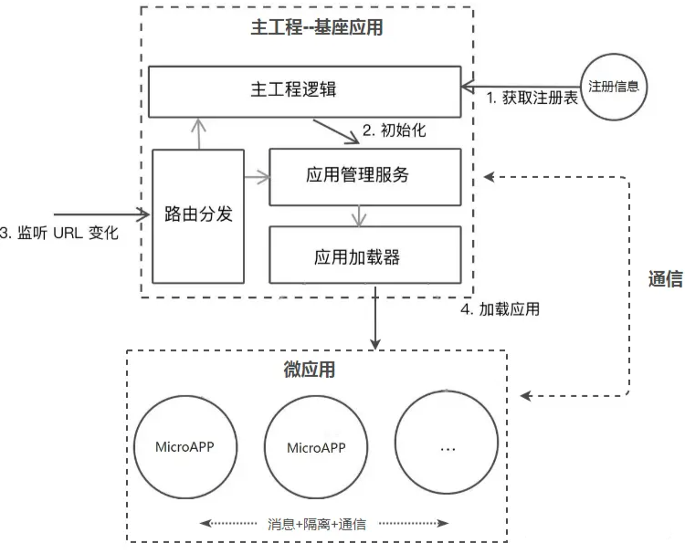
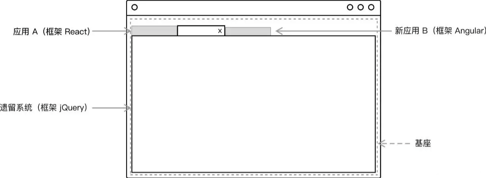

## 微前端

### 什么是微前端？

**微前端（Micro-Frontends）**是一种类似于微服务的架构，它将微服务的理念应用于浏览器端，即将 Web 应用由单一的单体应用转变为多个小型前端应用聚合为一的应用。各个前端应用还可以独立运行、独立开发、独立部署。**微前端不是单纯的前端框架或者工具，而是一套架构体系**。

### 微前端的解决了什么？

任何新技术的产生都是为了解决现有场景和需求下的技术痛点，微前端也不例外。

#### 拆分和细化

当下前端领域，单页面应用（SPA）是非常流行的项目形态之一，而随着时间的推移以及应用功能的丰富，单页应用变得不再单一而是越来越庞大也越来越难以维护，往往是改一处而动全身，由此带来的发版成本也越来越高。微前端的意义就是将这些庞大应用进行拆分，并随之解耦，每个部分可以**单独进行维护和部署，提升效率**。

#### 整合历史系统

在不少的业务中，或多或少会存在一些历史项目，这些项目大多以采用老框架类似（Backbone.js，Angular.js 1）的B端管理系统为主，介于日常运营，这些系统需要结合到新框架中来使用还不能抛弃，对此我们也没有理由浪费时间和精力重写旧的逻辑。而微前端可以将这些系统进行整合，在基本不修改来逻辑的同时来同时**兼容新老两套系统并行运行**。

### 微前端架构

当下微前端主要采用的是组合式应用路由方案，该方案的核心是“主从”思想，即包括一个基座（MainApp）应用和若干个微（MicroApp）应用，基座应用大多数是一个前端 SPA 项目，主要负责应用注册、路由映射、消息下发等，而微应用是独立前端项目，这些项目不限于采用 React，Vue，Angular 或者 JQuery 开发，每个微应用注册到基座应用中，由基座进行管理，但是如果脱离基座也是可以单独访问，基本的流程如下图所示：

当整个微前端框架运行之后，给用户的体验就是类似下图所示：

简单描述下就是基座应用中有一些菜单项，点击每个菜单项可以展示对应的微应用，这些应用的切换是纯前端无感知的，所以，基于目前的方案来说，一个微前端的基座框架需要解决以下问题：

1. 路由切换的分发问题
2. 主微应用的隔离问题
3. 通信问题

### 微前端方案

如下方案中，每种都有自己的优劣，最原始的 Nginx 配置反向代理是从接入层的角度来将系统进行分离，但是需要运维配置；而 iframe嵌套是最简单和最快速的方案，但是 iframe 的弊端也是无法避免的；而 Web Components 的方案则需要大量的改造成本，最后的组合式应用路由分发方案改造成本中等并且能满足大部分需求，也不影响各前端应用的体验，是当下各个业务普遍采用的一种方案：

| 方案               | 描述                                                         | 优点                                               | 缺点                                                         |
| ------------------ | ------------------------------------------------------------ | -------------------------------------------------- | ------------------------------------------------------------ |
| Nginx路由转发      | 通过Nginx配置反向代理来实现不同路径映射到不同应用，例如www.abc.com/app1对应app1，www.abc.com/app2对应app2，这种方案本身并不属于前端层面的改造，更多的是运维的配置。 | 简单，快速，易配置                                 | 在切换应用时会触发浏览器刷新，影响体验                       |
| iframe嵌套         | 父应用单独是一个页面，每个子应用嵌套一个iframe，父子通信可采用postMessage或者contentWindow方式 | 实现简单，子应用之间自带沙箱，天然隔离，互不影响   | iframe的样式显示、兼容性等都具有局限性；太过简单而显得low    |
| Web Components     | 每个子应用需要采用纯Web Components技术编写组件，是一套全新的开发模式 | 每个子应用拥有独立的script和css，也可单独部署      | 对于历史系统改造成本高，子应用通信较为复杂易踩坑             |
| 组合式应用路由分发 | 每个子应用独立构建和部署，运行时由父应用来进行路由管理，应用加载，启动，卸载，以及通信机制 | 纯前端改造，体验良好，可无感知切换，子应用相互隔离 | 需要设计和开发，由于父子应用处于同一页面运行，需要解决子应用的样式冲突，变量对象污染，通信机制等技术点 |

### 微前端路由分发

作为微前端的基座应用，是整个应用的入口，负责承载当前微应用的展示和对其他路由微应用的转发，对于当前微应用的展示，一般是由以下几步构成：

1. 作为一个SPA的基座应用，本身是一套纯前端项目，要想展示微应用的页面除了采用iframe之外，要能先拉取到微应用的页面内容， 这就需要**远程拉取机制**。

2. 远程拉取机制通常会采用fetch API来首先获取到微应用的HTML内容，然后通过解析将微应用的JavaScript和CSS进行抽离，采用eval方法来运行JavaScript，并将CSS和HTML内容append到基座应用中留给微应用的展示区域，当微应用切换走时，同步卸载这些内容，这就构成的当前应用的展示流程。

3. 当然这个流程里会涉及到CSS样式的污染以及JavaScript对全局对象的污染，这个涉及到隔离问题会在后面讨论，而目前针对远程拉取机制这套流程，已有现成的库来实现，可以参考 [import-html-entry](https://link.juejin.cn?target=https%3A%2F%2Fwww.npmjs.com%2Fpackage%2Fimport-html-entry) 和 [system.js](https://link.juejin.cn?target=https%3A%2F%2Fwww.npmjs.com%2Fpackage%2Fsystem.js)。

对于路由分发而言，以采用vue-router开发的基座SPA应用来举例，主要是下面这个流程：

1. 当浏览器的路径变化后，vue-router会监听hashchange或者popstate事件，从而获取到路由切换的时机。
2. 最先接收到这个变化的是基座的router，通过查询注册信息可以获取到转发到那个微应用，经过一些逻辑处理后，采用修改hash方法或者pushState方法来路由信息推送给微应用的路由，微应用可以是手动监听hashchange或者popstate事件接收，或者采用React-router，vue-router接管路由，后面的逻辑就由微应用自己控制。

### 微前端的应用隔离

应用隔离问题主要分为主应用和微应用，微应用和微应用之间的JavaScript执行环境隔离，CSS样式隔离。

**CSS隔离**：当主应用和微应用同屏渲染时，就可能会有一些样式会相互污染，如果要彻底隔离CSS污染，可以采用CSS Module 或者命名空间的方式，给每个微应用模块以特定前缀，即可保证不会互相干扰，可以采用 webpack 的 postcss 插件，在打包时添加特定的前缀。

而对于微应用与微应用之间的CSS隔离就非常简单，在每次应用加载时，将该应用所有的 link 和 style 内容进行标记。在应用卸载后，同步卸载页面上对应的 link 和 style 即可。

**JavaScript隔离**：每当微应用的JavaScript被加载并运行时，它的核心实际上是对全局对象Window的修改以及一些全局事件的改变，例如jQuery这个js运行后，会在Window上挂载一个`window.$`对象，对于其他库React，Vue也不例外。为此，需要在加载和卸载每个微应用的同时，尽可能消除这种冲突和影响，最普遍的做法是采用沙箱机制（SandBox）。

沙箱机制的核心是让局部的JavaScript运行时，对外部对象的访问和修改处在可控的范围内，即无论内部怎么运行，都不会影响外部的对象。通常在Node.js端可以采用vm模块，而对于浏览器，则需要结合with关键字和window.Proxy对象来实现浏览器端的沙箱。

### 微前端的消息通信

应用间通信有很多种方式，当然，要让多个分离的微应用之间要做到通信，本质上仍离不开中间媒介或者说全局对象。所以对于消息订阅（pub/sub）模式的通信机制是非常适用的，在基座应用中会定义事件中心Event，每个微应用分别来注册事件，当被触发事件时再有事件中心统一分发，这就构成了基本的通信机制。

### 微前端框架

基于上述对微前端整体概念和理论的阐述，目前业界已经有不少框架来帮助开发者轻松的集成微前端架构，例如下面这些：

- [Mooa](https://link.juejin.cn?target=https%3A%2F%2Fwww.npmjs.com%2Fpackage%2Fmooa)：基于Angular的微前端服务框架

- [Single-Spa](https://link.juejin.cn?target=https%3A%2F%2Fwww.npmjs.com%2Fpackage%2Fsingle-spa)：最早的微前端框架，兼容多种前端技术栈。

- [Qiankun](https://link.juejin.cn?target=https%3A%2F%2Fwww.npmjs.com%2Fpackage%2Fqiankun)：基于Single-Spa，阿里系开源微前端框架。

- [Icestark](https://link.juejin.cn?target=https%3A%2F%2Fwww.npmjs.com%2Fpackage%2Ficestark)：阿里飞冰微前端框架，兼容多种前端技术栈。

- [Ara Framework](https://link.juejin.cn?target=https%3A%2F%2Fwww.npmjs.com%2Fpackage%2Fhttps%3A%2F%2Fara-framework.github.io%2Fwebsite%2Fdocs%2Fquick-start)：由服务端渲染延伸出的微前端框架。

- Module Federation 以及 EMP