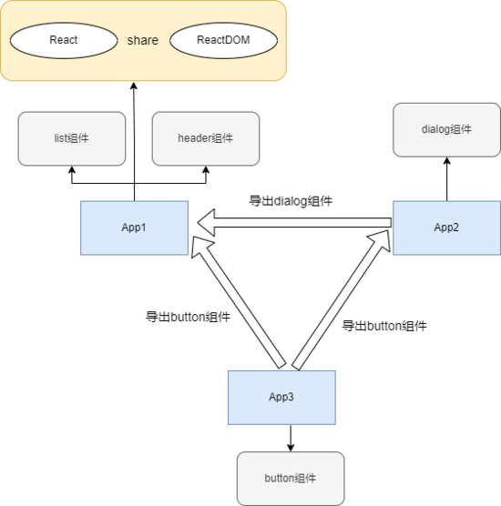

## Module Federation 模块联邦

### 技术背景

Module Federation 是由 Zack Jackson 提出的用于解决应用程序之间模块共享问题的一种 JavaScript 架构。具有更好的自适应性与动态性，不需要单独下载代码和依赖项，更加优雅的实现了跨应用指甲的代码共享。


### Webpack 5 中的 MF

Webpack5 实现了 Module Federation 技术，用来解决多个应用之间代码共享的问题，可以更加优雅的实现跨应用的代码共享，使用这个方法也可以实现微前端 。

这个方案中有两个主体： Remote 和 Host ，可以把 Remote 理解为想要引入的子应用，把 Host 理解为主应用（但是一个应用既可以是Remote 也可以是 Host，并不矛盾）。

Module Federation 的核心在于 ModuleFederationPlugin 这个插件：

```javascript
new ModuleFederationPlugin({
 name: "App1",
 library: { type: "var", name: "App1" },
 filename: "remoteEntry.js",
 remotes: {
   app_02: 'App2',
   app_03: 'App3',  
 },
 exposes: {
   antd: './src/antd',
   button: './src/button',  
 },
 shared: ['react', 'react-dom'],
});
```

- name，必须，唯一ID，作为输出的模块名，使用的时通过 name/{expose} 的方式使用；
- library，必须，其中这里的name为作为 umd 的 name。
- remotes，可选，表示作为 Host 时，去消费哪些 Remote。
- exposes，可选，表示作为 Remote 时，export 哪些属性被消费。
- shared，可选，优先用 Host 的依赖，如果 Host 没有，再用自己的。

通过以上设置打包之后会生成三种文件：应用主文件: main.js、作为 remote 时被引用的文件 remoteEntry.js 和其他的异步加载文件。

这里通过一个例子简单概括一下其原理：下图是三个项目，在App1 中它的 remotes 是 App2 和 App3，没有 exposes，shared 是React 和 ReactDom，它作为 host 使用了 remote 的 dialog 组件和 button 组件；App2 作为 host 使用了 App3 的 button 组件，作为 remote 导出来 dialog 组件，在 App1 中运行时如果需要使用 React 则会优先把 App1 中的 React 导入，这就复用了公共库；App3 向外导出了 dialog 组件，只作为其他项目的 remote。

这个新特性的提出促进了更多工具的发展，EMP 就是以此为基础构建出的一个跨应用共享资源的框架，这个框架优化协作，加速开发的同时还可以保持UI的一致性。

