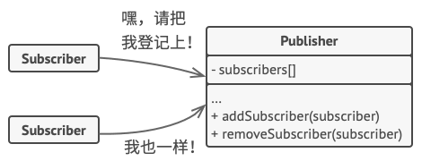
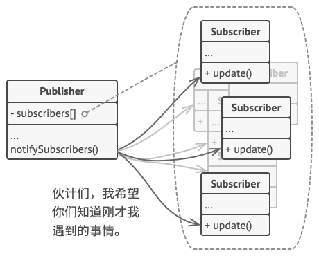

# 1. 设计模式概述

## 1.1 什么是设计模式？

**设计模式（Design Pattern）**是软件设计中常见问题的典型解决方案。它们就像能根据需求进行调整的预制蓝图，可用于解决代码中反复出现的设计问题。

模式并不是一段特定的代码，它与方法或库的使用方式不同，它是解决特定问题的一般性概念，我们可以根据模式来实现符合自己程序实际所需的解决方案。

人们常常会混淆模式和算法，因为两者在概念上都是已知特定问题的典型解决方案。但是算法总是明确定义达成特定目标所需的一系列步骤，而模式则是对解决方案的更高层次的描述。同一模式在两个不同程序中的实现代码可能会不一样。算法更像是菜谱：提供达成目标的明确步骤。模式更像是蓝图：你可以看到最终的结果和模式的功能，但需要自己确定实现步骤。

大部分模式都有正规的描述方式，以便在不同情况下使用。 模式主要包含以下内容：

- **意图**，简单描述问题和解决方案。
- **动机**，将进一步解释问题并说明模式会如何提供解决方案。
- **结构**，展示模式的每个部分和它们之间的关系。
- **在不同语言中的实现**提供流行编程语言的代码， 让读者更好地理解模式背后的思想。

## 1.2 模式的历史

谁发明了设计模式？ 这是一个很好的问题， 但也有点不太准确。 设计模式并不是晦涩的、 复杂的概念——事实恰恰相反。 模式是面向对象设计中常见问题的典型解决方案。 同样的解决方案在各种项目中得到了反复使用， 所以最终有人给它们起了名字， 并对其进行了详细描述。 这基本上就是模式被发现的历程了。

模式的概念是由克里斯托佛·亚历山大在其著作 《[建筑模式语言](https://refactoringguru.cn/pattern-language-book)》 中首次提出的。 本书介绍了城市设计的 “语言”， 而此类 “语言” 的基本单元就是模式。 模式中可能会包含对窗户应该在多高、 一座建筑应该有多少层以及一片街区应该有多大面积的植被等信息的描述。

埃里希·伽玛、 约翰·弗利赛德斯、 拉尔夫·约翰逊和理查德·赫尔姆这四位作者接受了模式的概念。 1994 年， 他们出版了 《[设计模式： 可复用面向对象软件的基础](https://refactoringguru.cn/gof-book)》 一书， 将设计模式的概念应用到程序开发领域中。 该书提供了 23 个模式来解决面向对象程序设计中的各种问题， 很快便成为了畅销书。 由于书名太长， 人们将其简称为 “四人组 （Gang of Four， GoF） 的书”， 并且很快进一步简化为 “GoF 的书”。

此后， 人们又发现了几十种面向对象的模式。  “模式方法” 开始在其他程序开发领域中流行起来。 如今， 在面向对象设计领域之外， 人们也提出了许多其他的模式。

## 1.3 为什么要学习设计模式？

或许你已从事程序开发工作多年， 却完全不知道单例模式是什么。 很多人都是这样。 即便如此， 你可能也在不自知的情况下已经使用过一些设计模式了。 所以为什么不花些时间来更进一步学习它们呢？

- 设计模式是针对软件设计中常见问题的工具箱， 其中的工具就是各种**经过实践验证的解决方案**。 即使你从未遇到过这些问题， 了解模式仍然非常有用， 因为它能指导你如何使用面向对象的设计原则来解决各种问题。
- 设计模式定义了一种让你和团队成员能够更高效沟通的通用语言。 你只需说 “哦， 这里用单例就可以了”， 所有人都会理解这条建议背后的想法。 只要知晓模式及其名称， 你就无需解释什么是单例。

# 2. 设计模式分类

不同设计模式的复杂程度，细节层次以及在整个系统中的应用范围等方面各不相同。好比于道路的建造： 如果你希望让十字路口更加安全， 那么可以安装一些交通信号灯， 或者修建包含行人地下通道在内的多层互通式立交桥。

最基础的、 底层的模式通常被称为*惯用技巧*。 这类模式一般只能在一种编程语言中使用。

最通用的、 高层的模式是*构架模式*。 开发者可以在任何编程语言中使用这类模式。 与其他模式不同， 它们可用于整个应用程序的架构设计。

此外， 所有模式可以根据其*意图*或目的来分类。 本书覆盖了三种主要的模式类别：

- **创建型模式**提供创建对象的机制， 增加已有代码的灵活性和可复用性。

  工厂方法、抽象工厂、生成器、原型、单例

- **结构型模式**介绍如何将对象和类组装成较大的结构， 并同时保持结构的灵活和高效。

  适配器、桥接、组合、装饰、外观、享元、代理

- **行为模式**负责对象间的高效沟通和职责委派。

  责任链、命令、迭代器、中介者、备忘录、观察者、状态、策略、模版方法、访问者

## 2.1 创建型模式

提供创建对象的机制， 增加已有代码的灵活性和可复用性。

### 2.1.1 单例模式

**单例模式（Singleton Pattern）能够保证一个类只有一个实例， 并提供一个访问该实例的全局节点。

单例模式就好比一个政府。 一个国家只有一个官方政府。 不管组成政府的每个人的身份是什么，  “某政府” 这一称谓总是鉴别那些掌权者的全局访问节点。


单例模式同时解决了两个问题， 所以违反了*单一职责原则*：

1. **保证一个类只有一个实例**。 为什么会有人想要控制一个类所拥有的实例数量？ 最常见的原因是控制某些共享资源 （例如数据库或文件） 的访问权限。

   单例模式的运作方式是这样的：如果你创建了一个对象，同时过一会后你决定再创建一个新对象， 此时你会获得之前已创建的对象， 而不是一个新对象。

2. **为该实例提供一个全局访问节点**。 还记得你用过的那些存储重要对象的全局变量吗？ 它们在使用上十分方便， 但同时也非常不安全， 因为任何代码都有可能覆盖掉那些变量的内容， 从而引发程序崩溃。

   和全局变量一样， 单例模式也允许在程序的任何地方访问特定对象。 但是它可以保护该实例不被其他代码覆盖。

   还有一点： 你不会希望解决同一个问题的代码分散在程序各处的。 因此更好的方式是将其放在同一个类中， 特别是当其他代码已经依赖这个类时更应该如此。

所有单例的实现都包含以下两个相同的步骤： 

- 将默认构造函数设为私有， 防止其他对象使用单例类的 `new`运算符。
- 新建一个静态构建方法作为构造函数。 该函数会调用私有构造函数来创建对象， 并将其保存在一个静态成员变量中。 此后所有对于该函数的调用都将返回这一缓存对象。

如果你的代码能够访问单例类， 那它就能调用单例类的静态方法。 无论何时调用该方法， 它总是会返回相同的对象。

#### 2.1.1.1 模式结构

**单例** （Singleton） 类声明了一个名为 `get­Instance`获取实例的静态方法来返回其所属类的一个相同实例。单例的构造函数必须对客户端 （Client） 代码隐藏。 调用 `获取实例`方法必须是获取单例对象的唯一方式。


#### 2.1.1.2 代码示例

Java

```java
public final class Singleton {
    private static Singleton instance;
    public String value;

    private Singleton(String value) {
        try {
            Thread.sleep(1000);
        } catch (InterruptedException ex) {
            ex.printStackTrace();
        }
        this.value = value;
    }

    public static Singleton getInstance(String value) {
        if (instance == null) {
            instance = new Singleton(value);
        }
        return instance;
    }
}

public class DemoSingleThread {
    public static void main(String[] args) {
        Singleton singleton = Singleton.getInstance("FOO");
        Singleton anotherSingleton = Singleton.getInstance("BAR");
        System.out.println(singleton.value);
        System.out.println(anotherSingleton.value);
    }
}
```

TypeScript

```typescript
class Singleton {
  	// 在类中添加一个私有静态成员变量用于保存单例实例
    private static instance: Singleton;

  	// 将类的构造函数设为私有，类的静态方法仍能调用构造函数，但是其他对象不能调用。
    private constructor() { }

  	// 声明一个公有静态构建方法用于获取单例实例
    public static getInstance(): Singleton {
        if (!Singleton.instance) {
            Singleton.instance = new Singleton();
        }

        return Singleton.instance;
    }

    public someBusinessLogic() {
        // ...
    }
}

function clientCode() {
    const s1 = Singleton.getInstance();
    const s2 = Singleton.getInstance();

    if (s1 === s2) {
        console.log('Singleton works, both variables contain the same instance.');
    } else {
        console.log('Singleton failed, variables contain different instances.');
    }
}

clientCode();
```

#### 2.1.1.3 适用场景

1. 如果程序中的某个类对于所有客户端只有一个可用的实例， 可以使用单例模式。（数据库连接实例）

    单例模式禁止通过除特殊构建方法以外的任何方式来创建自身类的对象。 该方法可以创建一个新对象， 但如果该对象已经被创建， 则返回已有的对象。

2. 如果你需要更加严格地控制全局变量， 可以使用单例模式。

    单例模式与全局变量不同， 它保证类只存在一个实例。 除了单例类自己以外， 无法通过任何方式替换缓存的实例。

   请注意， 你可以随时调整限制并设定生成单例实例的数量， 只需修改 `获取实例`方法， 即 getInstance 中的代码即可实现。

#### 2.1.1.4 实现步骤

1. 在类中添加一个私有静态成员变量用于保存单例实例。
2. 声明一个公有静态构建方法用于获取单例实例。
3. 在静态方法中实现"延迟初始化"。 该方法会在首次被调用时创建一个新对象， 并将其存储在静态成员变量中。 此后该方法每次被调用时都返回该实例。
4. 将类的构造函数设为私有。 类的静态方法仍能调用构造函数， 但是其他对象不能调用。
5. 检查客户端代码， 将对单例的构造函数的调用替换为对其静态构建方法的调用。

#### 2.1.1.5 优缺点

| 优点                                 | 缺点                                                         |
| ------------------------------------ | ------------------------------------------------------------ |
| 可以保证一个类只有一个实例           | 违反了*单一职责原则*。 该模式同时解决了两个问题              |
| 获得了一个指向该实例的全局访问节点   | 单例模式可能掩盖不良设计， 比如程序各组件之间相互了解过多等。 |
| 仅在首次请求单例对象时对其进行初始化 | 该模式在多线程环境下需要进行特殊处理， 避免多个线程多次创建单例对象 |
|                                      | 单例的客户端代码单元测试可能会比较困难， 因为许多测试框架以基于继承的方式创建模拟对象。 由于单例类的构造函数是私有的， 而且绝大部分语言无法重写静态方法， 所以你需要想出仔细考虑模拟单例的方法。 要么干脆不编写测试代码， 或者不使用单例模式。 |

## 3.1 行为型模式

负责对象间的高效沟通和职责委派。

### 3.1.1 策略模式

**策略模式（Strategy Pattern）**是一种行为设计模式， 它能让你定义一系列算法， 并将每种算法分别放入独立的类中， 以使算法的对象能够相互替换。


比如你需要前往机场。 你可以选择乘坐公共汽车、 预约出租车或骑自行车。 这些就是你的出行策略。 你可以根据预算或时间等因素来选择其中一种策略。


#### 3.1.1.1 模式结构

策略模式建议找出负责用许多不同方式完成特定任务的类， 然后将其中的算法抽取到一组被称为*策略*的独立类中。

名为*上下文*的原始类必须包含一个成员变量来存储对于每种策略的引用。

上下文并不执行任务， 而是将工作委派给已连接的策略对象。上下文不负责选择符合任务需要的算法——客户端会将所需策略传递给上下文。 实际上， 上下文并不十分了解策略， 它会通过同样的通用接口与所有策略进行交互， 而该接口只需暴露一个方法来触发所选策略中封装的算法即可。

因此， 上下文可独立于具体策略。 这样你就可在不修改上下文代码或其他策略的情况下添加新算法或修改已有算法了。


#### 3.1.1.2 代码示例

Java


TypeScript

```typescript
class Context {
    private strategy: Strategy;

    constructor(strategy: Strategy) {
        this.strategy = strategy;
    }

    public setStrategy(strategy: Strategy) {
        this.strategy = strategy;
    }

    public doSomeBusinessLogic(): void {
        // ...
        console.log('Context: Sorting data using the strategy (not sure how it\'ll do it)');
        const result = this.strategy.doAlgorithm(['a', 'b', 'c', 'd', 'e']);
        console.log(result.join(','));

        // ...
    }
}

interface Strategy {
    doAlgorithm(data: string[]): string[];
}

class ConcreteStrategyA implements Strategy {
    public doAlgorithm(data: string[]): string[] {
        return data.sort();
    }
}

class ConcreteStrategyB implements Strategy {
    public doAlgorithm(data: string[]): string[] {
        return data.reverse();
    }
}

const context = new Context(new ConcreteStrategyA());
console.log('Client: Strategy is set to normal sorting.');
context.doSomeBusinessLogic();

console.log('');

console.log('Client: Strategy is set to reverse sorting.');
context.setStrategy(new ConcreteStrategyB());
context.doSomeBusinessLogic();
```

#### 3.1.1.3 应用场景

1. 当你想使用对象中各种不同的算法变体， 并希望能在运行时切换算法时， 可使用策略模式。

    策略模式让你能够将对象关联至可以不同方式执行特定子任务的不同子对象， 从而以间接方式在运行时更改对象行为。

2.  当你有许多仅在执行某些行为时略有不同的相似类时， 可使用策略模式。

    策略模式让你能将不同行为抽取到一个独立类层次结构中， 并将原始类组合成同一个， 从而减少重复代码。

3. 如果算法在上下文的逻辑中不是特别重要， 使用该模式能将类的业务逻辑与其算法实现细节隔离开来。

    策略模式让你能将各种算法的代码、 内部数据和依赖关系与其他代码隔离开来。 不同客户端可通过一个简单接口执行算法， 并能在运行时进行切换。

4. 当类中使用了复杂条件运算符以在同一算法的不同变体中切换时， 可使用该模式。

    策略模式将所有继承自同样接口的算法抽取到独立类中， 因此不再需要条件语句。 原始对象并不实现所有算法的变体， 而是将执行工作委派给其中的一个独立算法对象。

#### 3.1.1.4 实现方式

1. 从上下文类中找出修改频率较高的算法 （也可能是用于在运行时选择某个算法变体的复杂条件运算符）。
2. 声明该算法所有变体的通用策略接口。
3. 将算法逐一抽取到各自的类中， 它们都必须实现策略接口。
4. 在上下文类中添加一个成员变量用于保存对于策略对象的引用。 然后提供设置器以修改该成员变量。 上下文仅可通过策略接口同策略对象进行交互， 如有需要还可定义一个接口来让策略访问其数据。
5. 客户端必须将上下文类与相应策略进行关联， 使上下文可以预期的方式完成其主要工作。

#### 3.1.1.5 优缺点

| 优点                                                    | 缺点                                                         |
| ------------------------------------------------------- | ------------------------------------------------------------ |
| 可以在运行时切换对象内的算法                            | 如果算法极少发生改变， 那么没有任何理由引入新的类和接口。 使用该模式只会让程序过于复杂。 |
| 可以将算法的实现和使用算法的代码隔离开来                | 客户端必须知晓策略间的不同——它需要选择合适的策略。           |
| 可以使用组合来代替继承                                  | 许多现代编程语言支持函数类型功能， 允许你在一组匿名函数中实现不同版本的算法。 这样， 你使用这些函数的方式就和使用策略对象时完全相同， 无需借助额外的类和接口来保持代码简洁。 |
| *开闭原则*。 你无需对上下文进行修改就能够引入新的策略。 |                                                              |

### 3.1.2 观察者模式

**观察者模式**是一种行为设计模式， 允许你定义一种订阅机制， 可在对象事件发生时通知多个 “观察” 该对象的其他对象。


如果你订阅了一份杂志或报纸， 那就不需要再去报摊查询新出版的刊物了。 出版社 （即应用中的 “发布者”） 会在刊物出版后 （甚至提前） 直接将最新一期寄送至你的邮箱中。

出版社负责维护订阅者列表， 了解订阅者对哪些刊物感兴趣。 当订阅者希望出版社停止寄送新一期的杂志时， 他们可随时从该列表中退出。


拥有一些值得关注的状态的对象通常被称为*目标*， 由于它要将自身的状态改变通知给其他对象， 我们也将其称为*发布者* （publisher）。 所有希望关注发布者状态变化的其他对象被称为*订阅者* （subscribers）。

观察者模式建议你为发布者类添加订阅机制， 让每个对象都能订阅或取消订阅发布者事件流。 不要害怕！ 这并不像听上去那么复杂。 实际上， 该机制包括 1） 一个用于存储订阅者对象引用的列表成员变量； 2） 几个用于添加或删除该列表中订阅者的公有方法。



现在， 无论何时发生了重要的发布者事件， 它都要遍历订阅者并调用其对象的特定通知方法。

因此， 所有订阅者都必须实现同样的接口， 发布者仅通过该接口与订阅者交互。 接口中必须声明通知方法及其参数， 这样发布者在发出通知时还能传递一些上下文数据。



#### 3.1.2.1 模式结构


#### 3.1.2.2 代码示例

TypeScript

```typescript
/**
 * The Subject interface declares a set of methods for managing subscribers.
 */
interface Subject {
    // Attach an observer to the subject.
    attach(observer: Observer): void;

    // Detach an observer from the subject.
    detach(observer: Observer): void;

    // Notify all observers about an event.
    notify(): void;
}

/**
 * The Subject owns some important state and notifies observers when the state
 * changes.
 */
class ConcreteSubject implements Subject {
    /**
     * @type {number} For the sake of simplicity, the Subject's state, essential
     * to all subscribers, is stored in this variable.
     */
    public state: number;

    /**
     * @type {Observer[]} List of subscribers. In real life, the list of
     * subscribers can be stored more comprehensively (categorized by event
     * type, etc.).
     */
    private observers: Observer[] = [];

    /**
     * The subscription management methods.
     */
    public attach(observer: Observer): void {
        const isExist = this.observers.includes(observer);
        if (isExist) {
            return console.log('Subject: Observer has been attached already.');
        }

        console.log('Subject: Attached an observer.');
        this.observers.push(observer);
    }

    public detach(observer: Observer): void {
        const observerIndex = this.observers.indexOf(observer);
        if (observerIndex === -1) {
            return console.log('Subject: Nonexistent observer.');
        }

        this.observers.splice(observerIndex, 1);
        console.log('Subject: Detached an observer.');
    }

    /**
     * Trigger an update in each subscriber.
     */
    public notify(): void {
        console.log('Subject: Notifying observers...');
        for (const observer of this.observers) {
            observer.update(this);
        }
    }

    /**
     * Usually, the subscription logic is only a fraction of what a Subject can
     * really do. Subjects commonly hold some important business logic, that
     * triggers a notification method whenever something important is about to
     * happen (or after it).
     */
    public someBusinessLogic(): void {
        console.log('\nSubject: I\'m doing something important.');
        this.state = Math.floor(Math.random() * (10 + 1));

        console.log(`Subject: My state has just changed to: ${this.state}`);
        this.notify();
    }
}

/**
 * The Observer interface declares the update method, used by subjects.
 */
interface Observer {
    // Receive update from subject.
    update(subject: Subject): void;
}

/**
 * Concrete Observers react to the updates issued by the Subject they had been
 * attached to.
 */
class ConcreteObserverA implements Observer {
    public update(subject: Subject): void {
        if (subject instanceof ConcreteSubject && subject.state < 3) {
            console.log('ConcreteObserverA: Reacted to the event.');
        }
    }
}

class ConcreteObserverB implements Observer {
    public update(subject: Subject): void {
        if (subject instanceof ConcreteSubject && (subject.state === 0 || subject.state >= 2)) {
            console.log('ConcreteObserverB: Reacted to the event.');
        }
    }
}

/**
 * The client code.
 */

const subject = new ConcreteSubject();

const observer1 = new ConcreteObserverA();
subject.attach(observer1);

const observer2 = new ConcreteObserverB();
subject.attach(observer2);

subject.someBusinessLogic();
subject.someBusinessLogic();

subject.detach(observer2);

subject.someBusinessLogic();
```

#### 3.1.2.3 应用场景

1. 当一个对象状态的改变需要改变其他对象， 或实际对象是事先未知的或动态变化的时， 可使用观察者模式。

    当你使用图形用户界面类时通常会遇到一个问题。 比如， 你创建了自定义按钮类并允许客户端在按钮中注入自定义代码， 这样当用户按下按钮时就会触发这些代码。

   观察者模式允许任何实现了订阅者接口的对象订阅发布者对象的事件通知。 你可在按钮中添加订阅机制， 允许客户端通过自定义订阅类注入自定义代码。

2.  当应用中的一些对象必须观察其他对象时， 可使用该模式。 但仅能在有限时间内或特定情况下使用。

    订阅列表是动态的， 因此订阅者可随时加入或离开该列表。

#### 3.1.2.4 实现步骤

1. 将业务逻辑拆分为两个部分： 独立于其他代码的核心功能将作为发布者； 其他代码则将转化为一组订阅类。

2. 声明订阅者接口。 该接口至少应声明一个 `update`方法。

3. 声明发布者接口并定义一些接口来在列表中添加和删除订阅对象。 记住发布者必须仅通过订阅者接口与它们进行交互。

4. 确定存放实际订阅列表的位置并实现订阅方法。 通常所有类型的发布者代码看上去都一样， 因此将列表放置在直接扩展自发布者接口的抽象类中是显而易见的。 具体发布者会扩展该类从而继承所有的订阅行为。

   但是， 如果你需要在现有的类层次结构中应用该模式， 则可以考虑使用组合的方式： 将订阅逻辑放入一个独立的对象， 然后让所有实际订阅者使用该对象。

5. 创建具体发布者类。 每次发布者发生了重要事件时都必须通知所有的订阅者。

6. 在具体订阅者类中实现通知更新的方法。 绝大部分订阅者需要一些与事件相关的上下文数据。 这些数据可作为通知方法的参数来传递。

   但还有另一种选择。 订阅者接收到通知后直接从通知中获取所有数据。 在这种情况下， 发布者必须通过更新方法将自身传递出去。 另一种不太灵活的方式是通过构造函数将发布者与订阅者永久性地连接起来。

7. 客户端必须生成所需的全部订阅者， 并在相应的发布者处完成注册工作。

#### 3.1.2.5 优缺点

| 优点                                                  | 缺点                     |
| ----------------------------------------------------- | ------------------------ |
| *开闭原则*。 你无需修改发布者代码就能引入新的订阅者类 | 订阅者的通知顺序是随机的 |
| 你可以在运行时建立对象之间的联系                      |                          |

