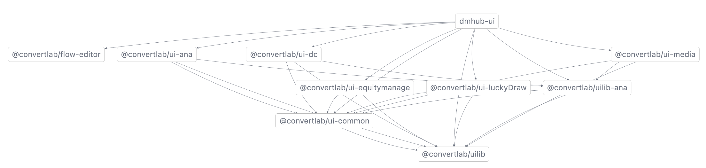
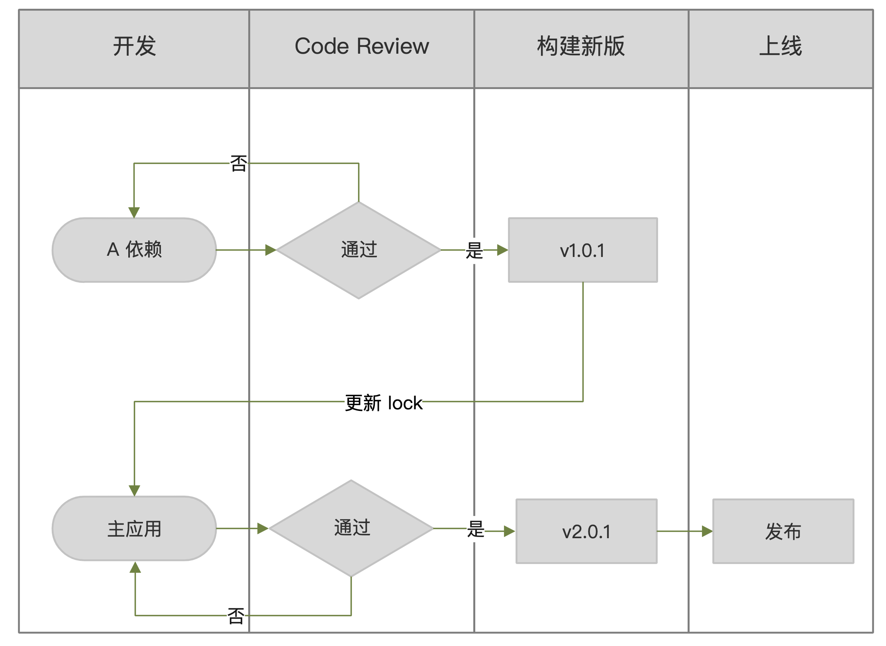
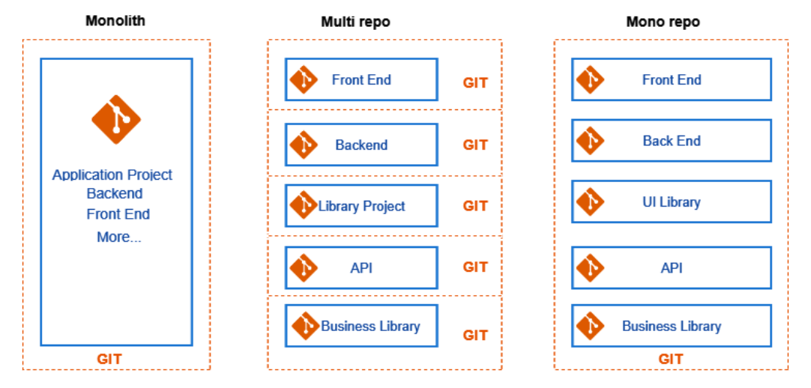
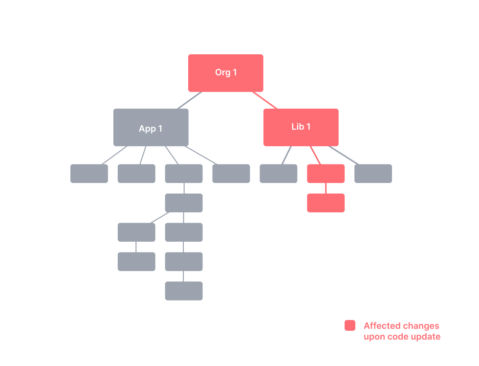
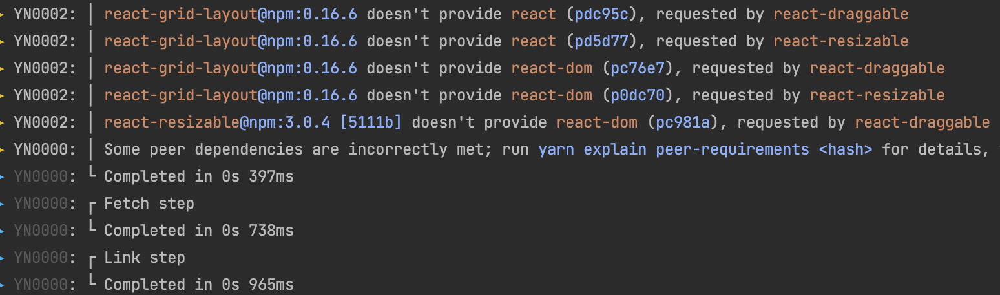
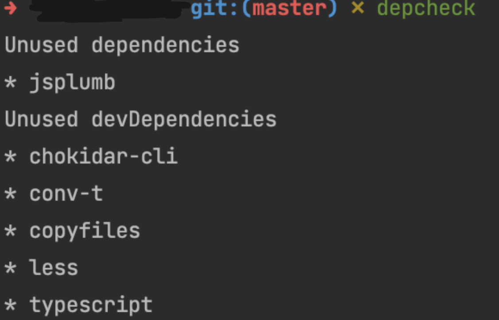
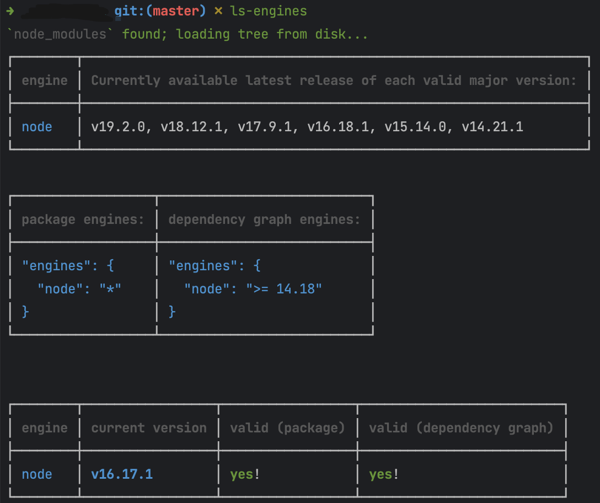

# DM Hub Monorepo 实践

## 1. 背景介绍

### 1.1 基于 Multirepo 的代码管理现状

DM Hub 产品经过多年的迭代，业务功能不断的增加，应用变得越来越庞大，发展到了百万行代码的“巨石应用”（Monolith）。同时项目工程的不断增加，并按照多个代码仓库（Multirepo）的管理方式存储于代码管理系统中。项目之间形成了下图中错综复杂的依赖关系，随之而来也产生了一系列的问题：

- 项目繁多，对新人不友好；
- 本地调试繁琐，开发体验感差；
- 混乱的依赖管理，缺乏统一的工程化规范；
- Repo 功能界定不清晰，存在大量重复的代码，代码只有加法难以做减法；



下面是一个安全漏洞的 HotFix 修复流程的场景，由于依赖的版本都使用了 lock 文件进行了锁定，如果需要修复某个依赖项目，版本更新后就必须也要更新主应用中的 lock 版本。



以上的这些问题，不仅降低了开发效率，增加了开发成本，同时也成为阻塞业务发展的一个重要因素。

### 1.2 Monorepo 介绍

Monorepo 也是管理项目代码的的一种方式，它将所有项目放在同一个存储库中，不同于常见的每个模块建一个代码仓库（Multirepo）。在图中可以看出 Multirepo 是每个项目一个仓库，而 Monorepo 是把所有的项目代码按照一定规则进行组织，存放于同一个代码仓库中。



在前端开源项目中，例如，Babel、React 和 Angular 都在使用 Monorepo 架构来维护它们的代码。此外在众多知名公司中，包括 Google 和 Facebook，也在使用 Monorepo。这种代码管理方式可以使团队协作更加高效，并简化依赖管理。

同一个代管库的管理，就意味着统一的工程化规范，统一的质量标准和代码风格，给开发带来一致的开发体验。当依赖代码发生改变时，开发人员可以立即得知，不会再出现构建出新的依赖版本，而开发却使用旧的版本导致更新不及时排查问题的情况。另外，Monorepo 还可以给我们带来以下好处：

- 唯一的依赖源，每个依赖只有一个版本，意味着没有版本冲突，没有依赖地狱；
- 更简单的依赖关系管理，所有模块都托管在同一个存储库中；
- 更好的协作和跨团队贡献，每个人都可以看到其他人的代码，快速协助其他项目的开发；
- 原子提交，原子提交使大规模重构更容易，开发人员可以在一次提交中更新多个包或项目；
- 统一的 CI/CD，可以为代码库中的每个项目使用相同的 CI/CD 部署流程；

## 2. Monorepo 基础设施

Monorepo 的代码管理也意味着代码量会变得更加的庞大，对代码的**依赖引用**、**依赖安装**、**构建速度**、**持续集成**、**发布流程**等提出了更高的要求。在接下来的文章中，我们将会对这些问题的解决方案一一进行阐述。

### 2.1 Monorepo Tools

试想一下，当一个 Monorepo 项目变得越来越庞大时，构建速度势必会变得越来越慢。同时当某处代码的改变就需要重新构建整个项目，这样会使开发效率变得低下。所以，如果想要发挥 Monorepo 的优势，让它起到真正的作用，就需要拥有正确的工具。在后续项目中即使加入更多的工作区，同样也可以保持快速和易于管理。

#### 2.1.1 基本特点

一款优秀的 Monorepo 工具应该需要包含以下特点：

- **本地计算缓存**

  缓存上一次的命令执行结果，大大提升下一次的构建速度。对于相同的代码，第一次的执行结果会被缓存起来，在下一次执行可以从缓存中直接读取。

  

- **本地任务编排**

  以正确的顺序和并行的方式运行任务。例如构建 app A 之前，需要先对其同一仓库中的 package B 依赖先进行构建。通过对任务的编排，可以按照正确的顺序（ B -> A）执行。另外可以支持多个任务的并行执行。

  

- **分布式计算缓存**

  与团队成员和 CI 系统共享本地计算缓存，以实现最高效率。比如某个成员在自己的本地计算机上开发了某个功能或者修复了某个 BUG，工具会将他此次的运行缓存结果上传到云端，其他团队成员拉取了他的代码同时也会将缓存下载到本地，实现读取缓存直接启动的效果。CI 系统同样也是如此。（此功能可能会收取费用，按需使用）。

  

- **检测受影响的项目**

  确定当前的更改可能会影响什么，以仅运行构建/测试受影响的项目。这个也很好理解，比如 app A1 依赖了 package B，当 package B 发生改变时，仅会对 package B 进行发布，对 app A1 进行重新的构建发布。而不会触发 app A2 的重新构建发布。

  

- **其他**

  另外还包括分析项目结构分析、依赖关系可视化、代码生成等功能。

#### 2.1.2 工具对比与选择

当前 Web 开发社区中使用较多和比较认可的 Monorepo 工具主要包括：[Bazel（谷歌）](https://bazel.build/?utm_source=monorepo.tools)、  [Gradle Build Tool（Gradle, Inc）](https://gradle.org/?utm_source=monorepo.tools)、  [Lage（微软）](https://microsoft.github.io/lage/?utm_source=monorepo.tools)、  [Lerna](https://lerna.js.org/?utm_source=monorepo.tools)、 [Nx（Nrwl）](https://nx.dev/?utm_source=monorepo.tools)、 [Pants（Pants Build 社区）](https://pantsbuild.org/?utm_source=monorepo.tools)、 [Rush（Microsoft) ](https://rushstack.io/?utm_source=monorepo.tools)和 [Turborepo（Vercel）](https://turborepo.org/?utm_source=monorepo.tools)。下面是这些工具功能的一些对比：

| 特性                | Bazel | Gradle | Lage | Lerna(v6) | Nx   | Pants | Rush | Turborepo |
| ------------------- | ----- | ------ | ---- | --------- | ---- | ----- | ---- | --------- |
| 本地计算缓存        | ✅     | ✅      | ✅    | ✅         | ✅    | ✅     | ✅    | ✅         |
| 本地任务编排        | ✅     | ✅      | ✅    | ✅         | ✅    | ✅     | ✅    | ✅         |
| 分布式计算缓存      | ✅     | ✅      | ✅    | ✅         | ✅    | ✅     | ✅    | ✅         |
| 检测受影响的项目/包 | ⚠️     | ✅      | ✅    | ✅         | ✅    | ✅     | ✅    | ✅         |
| 工具区分析          | ⚠️     | ✅      | ✅    | ✅         | ✅    | ✅     | ✅    | ✅         |
| 依赖图可视化        | ✅     | ⚠️      | ⚠️    | ⚠️         | ✅    | ⚠️     | ⚠️    | ✅         |
| 代码生成            | ⚠️     | ⚠️      | ⚠️    | ⚠️         | ✅    | ✅     | ⚠️    | ⚠️         |
| 项目约束与可见性    | ✅     | ⚠️      | ⚠️    | ⚠️         | ✅    | ⚠️     | ✅    | ⚠️         |

根据以上工具的对比可以看出，`Nx` 可以称得上是开箱即用，涵盖了 Monorepo 工具所应有的特点。它拥有非常完善的开发文档，丰富的生态插件，1.5M+ 开发者使用，11M+ 的月下载量；NRWL 团队维护，稳定性和可信用度高；

另外 `Nx` 对现有的系统集成非常的便捷，只需要简单的命令，即可为项目添加 `Nx`；对主流编辑器的支持，包括 VSCode、Webstorm 等，提供了专用的拓展插件，方便开发人员调试；

所以最终我们选择了 `Nx` 作为我们的 Monorepo 工具。

### 2.2 Workspaces

Workspaces 是一个通用术语，是包管理器的一组功能，支持从顶级根包中管理本地文件系统中的多个包。主要是用于管理多个项目的仓库，简化对多个项目的统一管理。简单的可以理解为每个包含 package.json 的项目，都是一个 workspace，即工作区。

试想一下，一个 Monorepo 项目 Project 包含了 ProjectA、ProjectC 两个项目，ProjectA 依赖了  packageA 和 Project C，ProjectC 依赖了  packageA 和 packageB。在没有 Workspaces 情况下，会出现以下问题：

- 安装依赖需要分别到 ProjectA、ProjectC 目录下执行命令，其他命令也是如此，缺少一个统一的执行入口；
- packageA 被两个项目依赖，会被重复的安装两次，不仅浪费时间而且占用空间；
- ProjectA 依赖了同一项目下的 ProjectC，当 ProjectC 发布了新的版本，需要手动修改 ProjectA 中的依赖版本；

```txt
# Monorepo

Project/
|--ProjectA/
|  |--package.json
|  |--node_modules/
|  |  |-- packageA/
|  |  |-- ProjectC/
|--ProjectC
|  |--package.json
|  |--node_modules/
|  |  |-- packageA/
|  |  |-- packageB/
```

通过 Workspces，就可以很完美的解决以上的问题：

- 所有的 package 会安装在最根目录的 node_modules 下，且在项目的任意目录下执行，都会达到一样的效果，节省磁盘空间与安装依赖的时间；
- 所有的 package 使用同一个 lock 文件，减少版本冲突且易于审查；
- 开发多个互相依赖的 package 时，Workspaces 会自动对 package 的引用设置软链接（symlink），且链接仅局限在当前workspace 中，不会对整个系统造成影响；
- package 新版本的发布可自动实现其对应消费者所依赖的版本的更改；
- 支持对各个 workspace 的统一管理，包括依赖安装、升级、卸载、脚本的执行等；

```tex
# Monorepo

Project/
|--node_modules/
|  |-- packageA/
|  |-- packageB/
|  |-- ProjectC/ -> ./ProjectC/
|--ProjectA/
|  |--package.json
|--ProjectC
|  |--package.json
```

### 2.3 Package Manager

既然我们已经知道 Workspace 的能力，那么就需要一个支持 Workspaces 的包管理器用于管理项目中的 workspace。现阶段最常见的包管理器主要包括：**NPM**、**Yarn**、**PNPM**。

**NPM** 是最早发布的，最初是由 Node.js 项目开发的 JavaScript 包管理器，它使开发人员能够轻松地在不同项目之间共享代码，并在自己的项目中使用其他人的代码。

随着 Node 的发展，Node 的包越来越多，人们在项目中添加的依赖越来越多，如何更快地下载，如何安全地下载被人们开始重视起来，于是在 2016年，Facebook 等公司开发了新的包管理器，就是我们现在经常使用的 **Yarn**。

2017 年 **PNPM** 问世，相比较于 yarn，pnpm 在性能上又有了极大的提升。PNPM 解决了 NPM、Yarn 重复文件过多、复用率低等问题。

#### 2.3.1 包管理器的对比

- **性能和磁盘效率**

  NPM：与 Yarn 和 PNPM 相比，相对比较慢。

  YARN： Yarn 使用相同的扁平化 node_modules 目录，但在速度和并行安装包方面与 NPM 相当。

  PNPM： PNPM 比 NPM 快 3 倍，效率更高。使用冷缓存和热缓存，PNPM 比 Yarn 更快。PNPM 只是从全局存储中链接文件，而 Yarn 从其缓存中复制文件，与其他两个包管理器相比，PNPM 还可以节省大量空间。

- **安全性**

  NPM：由于 npm 处理坏包的方式，一些安全漏洞直接影响了许多项目。

  YARN：存储在 yarn.lock 中的校验和一直被 Yarn Classic 和 Yarn Berry 使用。Yarn 还可以防止安装恶意软件包；如果检测到不匹配，安装将中止。

  PNPM：与 Yarn 类似，PNPM 也使用校验和，除了使用校验和之外，pnpm 还在执行代码之前验证其代码的完整性。

- **Monorepo 支持**

  NPM：NPM 包管理器通过各种 CLI 命令提供 monorepo 支持来管理多个包。但是不支持高级过滤或多个工作区。

  YARN：提供 Monorepo 支持的 Workspaces 功能。

  PNPM：开箱即用的内置 Workspaces 功能。

- **项目结构**

  NPM：使用 npm install 一个 package-lock.json 并生成一个 node_modules 文件夹。可以手动将 .npmrc 配置文件放在根级别。

  YARN：将创建 yarn.lock 文件和 node_modules 文件夹。Yarn v2 可以使用**.yarnrc**文件配置；Yarn Classic 也可以使用 **.npmrc**文件，Yarn v3 不再支持 .npmrc 文件的配置，被 .yarnrc.yml 取代。除了 .yarn/cache/ 之外，还可以使用其他存储 yarn 经典版本的位置（.yarn/releases/）

  PNPM：与 NPM、YARN 不同，PNPM 不会创建扁平的依赖关系树。在 node_modules 中，所有东西在 package.json 中都有自己的 node_modules 文件夹，并且每个依赖项都在 package.json 中精确指定。

#### 2.3.2 选择 Yarn 3

DM Hub 当前使用的包管理器是 Yarn 1 版本，基于以上包管理器的比较以及改造成本的考虑（CI 配置、各分支均适用 yarn.lcok 文件版本锁等），Yarn 满足了各种需求，是最适合 DMHub 的包管理器。

但是 Yarn 1 基本已经不在维护，并且明确不会添加新的功能，所以在此考虑 Yarn 3 的一些新的特性，并升级到此版本：

**A. 可读性更高的输出日志**

每行日志添加了代码及颜色区分，可以帮助开发者更好的定位问题



**B. 支持 `yarn dlx`**

功能类似于 `npx`，创建临时环境下载指定的依赖，不改变当前环境的 `package.json` 内容，并且它只执行远端的脚本而不执行本地的脚本，相对于 `npx` 有更高的安全性。

**C. 更好的 workspaces 支持，更好的 monorepo 开发** 

主要体现在以下几点：

- yarn add 添加交互模式（interactive mode）

  帮助检查这个依赖有没有在其他 Workspaces 中被使用，并且可以选择是要复用其他 Workspaces 中的依赖版本还是使用另外的版本。

- 一次更新所有 Workspaces 某个依赖的版本

  新增的 `yarn up` 命令可以同时更新所有 Workspaces 的该依赖的版本，而不用切换到各个 Workspace 中运行更新命令，也可以结合交互模式确认具体的操作。

- 自动发布关联的 Workspaces

  当某个包（workspace）发布了新的版本之后，发布其它相关联的包十分麻烦，而它提供了一个友好的交互界面来让我们十分容易地管理关联包的发布。

- 在多个 Workspaces 中运行相同的命令

  `yarn workspaces foreach`  命令来让你在多个 Workspaces 中运行同一个命令，这个命令是由它的 workspace-tools 插件支持。例如 `yarn workspaces foreach run build`。

**D. 缓存安装包**

Yarn 安装后，所有的依赖都会被压缩成一个文件放在特定的地方，由于压缩后的包体积很小，而且包的数量不会很多，所以可以考虑将此目录提交到 Git 上，在以后得开发中，安装速度会大大提升。

- 开发体验进一步提升，保证大家环境的一致。
- 代码review的时候可以更清楚哪些依赖发生了改变。

- 由于每次部署代码的时候， `yarn install`占用的时间都是一个大头，去掉这个步骤后部署速度将会大大提升。

- 不会存在本地运行没问题，发布线上环境的时候挂掉了的问题。

- 不用在 CI 文件里面进行一些安装依赖的配置。

**E. workspace 协议**

Yarn 2 新增了 `workspace` 解析协议，主要是告诉 Yarn 定义在 package.json 文件里面的依赖是如何解析的。当进行依赖安装时，如果包管理器要解析工作区可以满足的范围，它会尽可能优先使用工作空间解析而不是远程解析，Yarn 会自动对 package 的引用设置软链接（symlink）。当 workspace 进行打包发布（假设当前版本为 1.5.0），`workspace:` 通过以下方式动态替换任何依赖项：

```json
{
  "dependencies": {
    "star": "workspace:*",
    "caret": "workspace:^",
    "tilde": "workspace:~",
    "range": "workspace:^1.2.3",
    "path": "workspace:path/to/baz"
  }
}
```

将转化为：

```json
{
  "dependencies": {
    "star": "1.5.0",
    "caret": "^1.5.0",
    "tilde": "~1.5.0",
    "range": "^1.2.3",
    "path": "1.5.0"
  }
}
```

这个功能可以让我们不必依赖本地工作区以外的其他东西，同时仍然能够将生成的包发布到远程注册表而无需运行中间发布步骤。同时依赖的消费者也能够使用发布的工作区其他包。

## 3. MonoREPO 具体实施

### 3.1 目录划分与项目迁移

基于现有的项目，主要划分为目录，一个是应用 apps，另外一个是应用依赖的包 packages。

apps 主要通过现在的 src 目录根据具体的功能进行拆分，packages 需要相关的依赖包从其他仓库迁移进来。

```
project
├─ apps
|		├─ app1
|   ├─ app2
|   ├─ app3
|   └─ ...
├─ packages
|   ├─ package1
|   ├─ package2
|   ├─ package3
|   └─ ...
├─ package.json
```

### 3.2 Workspaces 设定与配置

#### 3.2.1 Workspaces 设定

设定 apps 与 packages 下的所有子目录均为独立的工作区。

我们需要在根目录下的 package.json 文件添加 `workspaces` 属性，通过该属性 Yarn 会自动识别出指定的所有工作区：

```json
{
  ...
  "workspaces": [
    "apps/*",
    "packages/*"
  ]
}
```

#### 3.2.2 优化依赖项

对所有工作区创建 `package.json`，如果存在可忽略创建步骤。

 `depcheck` 可以帮助我们检测某个项目缺少了哪些依赖、哪些依赖未被使用。

通过该工具可以帮我们确定 package.json 文件中缺少了哪些依赖的配置，以及哪些依赖未被使用，让我们可以删除 package.json 文件中的一些未使用的依赖项，避免无效的安装（依赖如果不是通过导入的方式使用是无法识别的，需要注意错删）。

进入到各个 workspace 文件夹下执行 `depcheck` 命令，并调整对应的 package.json。(可全局安装后执行)



#### 3.2.3 统一依赖版本

将所有 workspace 项目使用的相同依赖包调整为统一的版本，防止版本的重复安装：

- react、react-dom
- less
- typescript
- ...

#### 3.2.4 workspace 协议管理依赖版本

通过 workspace 协议管理依赖版本，可以保证使用最新的依赖，而不必担心某个依赖未安装最新版本，项目启动报错的问题。

在项目中，将直接引用 packages 下的依赖，这样可以保证依赖的最新版本，同时调整各个 workspace 中的对其他 workspace 的引用，均使用 Yarn 的 `workspace:*` 协议。

```diff
{
	dependencies: {
-   "package-1": "^5.0.0",
+   "package-1": "workspace:*",
-   "package-2": "^5.0.0",
+   "package-2": "workspace:*"
	}
}
```

#### 3.2.5 指定正确的代码引用

通过调整 tsconfig.json 的 paths 属性，可以帮助我们正确定位到当前项目下引用其他 workspace 代码的位置。

```json
{
  "paths": {
      "@scope-A/*": ["packages/*/src"],
      "@scope-B/*": ["apps/*/src"]
    }
}
```

### 3.3 Yarn 升级与配置

#### 3.3.1 Yarn 1 升级 Yarn 3

Yarn 默认使用的是 v1 版本，下载最新版的 Yarn，执行如下命令：

```sh
yarn set version berry
```

此时项目中会新增如下文件：

```diff
project
+ .yarn
+  release
+    yarn-berry.cjs
+  .yarnrc.yml
```

- `yarn-berry.cjs`：Yarn 最新版的源码，执行 `yarn` 命令会直接使用该文件

- `.yarnrc.yml`： Yarn 的配置文件，同 `.npmrc`3.2.1.5 提交 Git

将上述生成的 yarn 相关的文件提交到 Git，这样可以保持所有人 Yarn 版本和使用的统一。

调整 `.gitignore`

```diff
+ .yarn/cache
+ .yarn/install-state.gz
```

另外 Yarn 3 进行第一次安装之后，会生成 `.yarn/cache` 目录，下次再次进行安装时，会直接从 Cache 目录获取，大大提升安装速度，所以此目录可以根据实际情况选择是否需要提交到 Git 上。

#### 3.3.2 Yarn 配置调整

由于 Yarn 3 版本不再支持 `.npmrc`，所以需要根据 `.npmrc` 的配置，重新配置 `.yarnrc.yml`。

配置文件说明详见：https://yarnpkg.com/configuration/yarnrc

```yaml
nodeLinker: node-modules

npmRegistryServer: ***

npmScopes:
  prism:
    npmAuthIdent: ***
    npmRegistryServer: ***

unsafeHttpWhitelist:
  - ***

yarnPath: .yarn/releases/yarn-berry.cjs
```

#### 3.3.3 Yarn 插件安装

安装插件，增强 Yarn 的能力，Yarn 插件的列表与详细介绍可见：https://yarnpkg.com/api/

- `@yarnpkg/plugin-version`

  用于包的发布，可以检测哪些包发生了改变，可针对改动的包进行新版本的发布。

  ```shell
  yarn plugin import version
  ```

- `@yarnpkg/plugin-workspace-tools`

  增强 Yarn 的 workspace 能力，后续会用到

  ```shell
  yarn plugin import workspace-tools
  ```

- `@yarnpkg/plugin-interactive-tools`

  支持 `upgrade-interactive` 命令，用于交互式的选择更新依赖包。Yarn v1 版本默认支持，v3 版本需要独立安装插件才能使用。

  ```shell
  yarn plugin import interactive-tools
  ```

### 3.4 工程化规范调整

#### 3.4.1 统一规范标准

由于所有的项目均存储在同一个仓库中，所以相关的规范化配置不需要再对某个 workspace 进行单独的配置，仅需在项目根目录下配置即可。主要包括 `.editorconfig`、`eslint`、`husky`、`prettier`、`stylelint`、`commitlint`、`.gitignore` 等进行调整，配置规则大同小异，根据项目具体情况而定，此处不再一一赘述。

#### 3.4.2 统一 Node 版本

需要注意的一点是，由于原先的各个项目对 Node 版本要求可能不一致，现在的 Monorepo 项目需要针对 Node 进行最低版本的检测。

全局安装  `ls-engines`，然后在项目根目录下执行 `ls-engines`，接着调整根目录的 package.json，添加 `engines` 属性：

```json
{
  "engines": {
  	"node": ">= 14.18"
	}
}
```



### 3.5 引入 Nx

在前面的步骤中，我们已经搭建起来了 Monorepo。现在要通过引入 Nx 解决 Monorepo 项目构建速度的问题。

执行命令 `npx nx@latest init` ，会帮助我们安装 `Nx` 相关的依赖，通过命令交互配置出基础的 nx.json 文件。（由于 Nx 的云缓存是收费的，此出我们选择使用了本地缓存。）

```json
{
  "tasksRunnerOptions": {
    "default": {
      "runner": "nx/tasks-runners/default",
    }
  },
  "workspaceLayout": {
    "appsDir": "apps",
    "libsDir": "packages"
  },
  "affected": {
    "defaultBase": "master"
  }
}
```

#### 3.5.1 提升构建与启动速度

如果某个命令执行之后，下次仍需要重新的执行一次，这样会大大降低开发效率。而通过命令缓存则可以直接读取已经编译过的缓存，以及针对某部分的 workspace 的改动进行重新的编译。

另外 Nx 默认的缓存机制是任何文件的改动都会失效，但是有时我们改动的是一些测试、文档文件，这时缓存时不应该失效的，所以我们可以通过配置 Nx 提供的 `namedInputs` 属性，排除掉一些无关影响的文件。

比如我们最常用的 `build` 命令的调整：

```diff
{
  "tasksRunnerOptions": {
    "default": {
      "runner": "nx/tasks-runners/default",
+     "options": {
+       "cacheableOperations": ["build"],
+     }
    }
  },
+ "namedInputs": {
+   "default": ["{projectRoot}/**/*"],
+   "production": [
+     "default",
+     "!{projectRoot}/**/*.md",
+     "!{projectRoot}/**/dist",
+     "!{projectRoot}/**/es",
+     "!{projectRoot}/**/*.spec.ts",
+     "!{projectRoot}/**/*.spec.tsx",
+     "!{projectRoot}/jest.config.ts",
+     "!{projectRoot}/tsconfig.spec.json"
+   ]
+ },
+ "targetDefaults": {
+   "build": {
+     "inputs": ["production", "^production"],
+   }
+ },
  "workspaceLayout": {
    "appsDir": "apps",
    "libsDir": "packages"
  },
  "affected": {
    "defaultBase": "master"
  }
}
```

#### 3.5.2 指定任务的执行顺序

当我们进行项目的构建之前，需要先对其某些 workspace 依赖项进行编译，这时就需要用到 Nx 的任务编排功能，它可以让我们指定命令执行之前的前置步骤，帮助我们按照正确的顺序执行任务：

```diff
{
  "tasksRunnerOptions": {
    "default": {
      "runner": "nx/tasks-runners/default",
      "options": {
        "cacheableOperations": ["build"],
      }
    }
  },
  "namedInputs": {
    "default": ["{projectRoot}/**/*"],
    "production": [
      "default",
      "!{projectRoot}/**/*.md",
      "!{projectRoot}/**/dist",
      "!{projectRoot}/**/es",
      "!{projectRoot}/**/*.spec.ts",
      "!{projectRoot}/**/*.spec.tsx",
      "!{projectRoot}/jest.config.ts",
      "!{projectRoot}/tsconfig.spec.json"
    ]
  },
  "targetDefaults": {
    "build": {
      "inputs": ["production", "^production"],
+     "dependsOn": ["^build"],
    }
  },
  "workspaceLayout": {
    "appsDir": "apps",
    "libsDir": "packages"
  },
  "affected": {
    "defaultBase": "master"
  }
}
```

### 3.6 CI 配置

#### 3.6.1 配置调整

由于 Yarn 1 到 Yarn 3 的升级，存在部分 API 的变动，所以需要针对之前的 CI 配置进行相应的调整。

1. ###### Cache  Folder

   通过缓存，可以减少 CI 的总构建时间。

   在 Yarn v1 中，Yarn 的缓存主要存放于 `.yarn-cache` 文件夹中；在 Yarn v2 中，则存放于 `.yarn/cache` 文件夹中。

   对于 Yarn 2+ 的 CI 缓存策略，可参考此链接：[What to cache for CI using the node_modules linker?](https://github.com/yarnpkg/berry/discussions/2621)

2. ###### `yarn install --ignore-optional`

   忽略 ` optionalDependencies`  的依赖安装，在 v3 版本中已经不再支持，官方是如下解释的：

   

   大概意思就是，该选项不稳定，无法保证是否可以通过正常的安装，已经不推荐使用。

   所以，在 CI 的配置中，需要进行如下调整：

   ```diff
   - yarn install --ignore-optional
   + yarn install
   ```

3. ###### `yarn install --frozen-lockfile`

   指定该参数不会生成 `yarn.lock` 文件。该参数指定项目必须存在 `yarn.lock` 文件，并且依赖版本和 package.json 匹配时才会进行依赖的安装，否则报错。

   因为即使有 lockfile 的存在，也无法保证在持续集成环境中每次安装依赖都和开发时一致，因为可能存在 package.json 和 lockfile 版本号不匹配并需要更新依赖版本的情况。通过此命令，可强制开发者在持续集成前先在本地解决依赖版本的一致性问题。

   但是在 v3 中，该参数已经被标记为过时了，官方推荐使用 `--immutable` 代替。

   ```diff
   - yarn install --frozen-lockfile
   + yarn install --immutable
   ```

4. ###### `yarn install --no-lockfile`

   不读取也不生成 `yarn.lock` 文件。

#### 3.6.2 CI 缓存配置

参考链接： https://github.com/yarnpkg/berry/discussions/2621

#### 3.6.3 按需发布

在之前的步骤中，我们安装了 Yarn 的 version 插件，该插件可以帮助我们按需发布新的 package 版本，同时还可以自动更新消费者所引用的版本。也就是说， Yarn version 插件会自动检测出 Monorepo 中改动的某个 workspace，然后对其新版本的发布。

参考链接：https://yarnpkg.com/features/release-workflow

### 3.7 其他

#### 3.7.1 编辑器插件

Nx 支持 VSCode 和 Webstorm 插件，可以帮助我们快捷方便的执行命令。

插件市场搜索 `Nx console`，然后安装即可。

#### 3.7.2 配套的命令

```shell
# 安装依赖
# 1. 给某个 workspace 安装依赖
yarn workspace <workspaceName> add <packageName> # yarn workspace ** add react
# or 进入对应的文件夹下安装依赖
cd <workspacePath> && yarn add <packageName>  # cd apps/main && yarn add react

# 2. 给所有 workspace 安装依赖
yarn workspaces foreach add <packageName> # yarn workspaces foreach -pv add react

# 3. 给部分 workspace 安装依赖
yarn workspaces foreach --include '@scope/*' add <packageName> # yarn workspaces foreach -v --include '@scope/*' add react  

# 升级依赖
# 尽量保持所有的 workspace 的依赖版本一致
# 统一升级所有 workspace 的某个依赖到某个版本，只会对存在该依赖的 workspace 进行升级
yarn up <packageName> # yarn up react -i，其中 i 表示进入交互模式，可以选择具体的版本

# 卸载依赖
yarn remove <packageName>
yarn remove <packageName> --all # 卸载所有工作区的依赖

# 查看 Yarn 插件列表
yarn plugin list # 插件 API：https://yarnpkg.com/api

# 安装 Yarn 插件
yarn plugin import <pluginName> # yarn plugin import @yarnpkg/plugin-exec

# 卸载 Yarn 插件
yarn plugin remove <pluginName>

# 查看所有的 workspace 列表
yarn workspaces list

# 查看依赖图
yarn graph

# 清除 nx 缓存
nx reset

# 删除所有依赖打包目录
yarn workspaces foreach -v exec rimraf es
```

## 4. 注意事项

1. 历史代码存在 `../../node_modules/@scope/**/**` 类似的包的引用

   由于 Yarn 3 会把 node_modules 提升到项目根目录下，所以这种引用会直接报错，需要把这种类似的相对路径引用全部更改为绝对路径的引用，让 webpack 自动去解析。

2. 当使用 workspace 将依赖提升至顶级目录后，使用相对路径的一些依赖会出现问题

   - node_modules，由于依赖提升到顶级目录，所以使用 node_modules 目录的地方，也需要使用顶级目录的 node_modules。

     这里存在两种路径解析，一种是 path.resolve(__dirname)，这个路径是相对于当前目录，也就是需要从当前目录开始往上找。另外就是 process.cwd()，相对于命令执行的路径，推荐使用相对于该命令的位置进行查找解析。

   - webpack - resolve - symlinks，该值默认为 true，表示是否将符号链接(symlink)解析到它们的符号链接位置(symlink location)。

3. Yarn 3 不再支持自定义的 pre 和 post 生命周期钩子，比如 postbuild。所以构建完依赖之后，无法直行 postbuild，导致 less 等资源文件缺失。此时可以通过 nx.json 的配置实现 build 之后继续执行 postbuild 命令。

   ```diff
   - "targetDefaults": {
   -   "start": {
   -     "dependsOn": ["^build"]
   -    }
   -  }
   + "targetDefaults": {
   +   "start": {
   +     "dependsOn": ["^build", "^postbuild"]
   +    }
   +  }
   ```

## 5. 总结

通过 Monorepo 重新组织现有的 DM Hub 前端项目，统一代码风格、质量标准、部署发布流程；

通过 Yarn 包管理工具帮助我们解决 Monorepo 依赖安装的问题，统一依赖管理，使用其缓存机制提升安装速度；

通过 workspace 协议帮助我们解决 Monorepo 依赖引用的问题；

通过 NX 工具，缓存命令执行结果、本地任务编排、依赖可视化等，仅对受影响的项目重新构建，提升构建速度和开发体验；

CI 配套升级，实现开发 -> 构建 -> 发布的全套流程。

