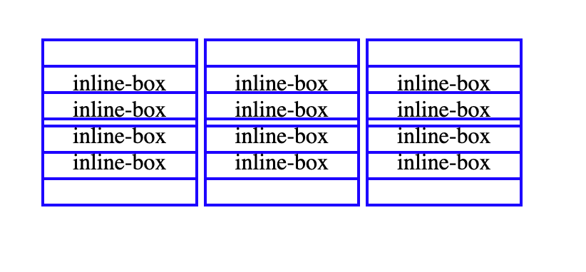

# 讲一下盒模型，普通盒模型和怪异盒模型有什么区别？

在 CSS 世界里，广泛流行使用两种盒子：块级盒子（Block box）和内联盒子（inline box）。这两种盒子会在页面流和元素之间的关系方面表现出不同的行为。

对于块级盒子：

- 其宽度会占据父容器的所有可用空间，即大多数情况下会和父容器的宽度保持一致。
- 每个盒子都会换行。
- 可以设置 `width` 和 `height` 属性。
- 设置 `margin`、`padding`、`border` 属性时，会将其他元素从盒子周围推开。

对于内联盒子：

- 其宽度由内容决定。
- 盒子不会换行。
- 设置 `width` 和 `height` 属性无效。
- 设置水平方向的 `padding`、`border` 会被应用，并把其他处于 `inline` 的元素推开。 
- 设置垂直方向的 `padding`、`border` 会被应用，但不会把其他处于 `inline` 的元素推开。
- 设置水平方向的 `margin` 会被应用，但不会把其他处于 `inline` 的元素推开。

