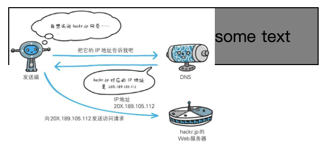
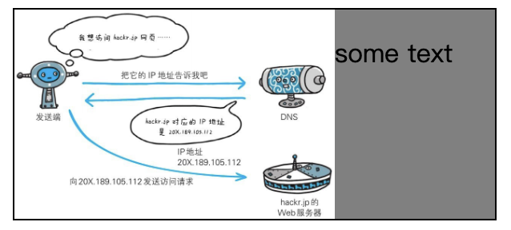

## 浮动和清除浮动

在非IE浏览器（如Firefox）下，当容器的高度为auto，且容器的内容中有浮动（float为left或right）的元素，在这种情况下，容器的高度不能自动伸长以适应内容的高度，使得内容溢出到容器外面而影响（甚至破坏）布局的现象。这个现象叫**浮动溢出**，为了防止这个现象的出现而进行的CSS处理，就叫CSS**清除浮动**。

如下代码，图片添加了 `float` 属性，脱离了正常的文档流，同时文字会受浮动影响紧贴图片，父容器的高度只能被 `<p>` 元素撑起。

```html
<style>
	.box { background: gray; border: solid 1px black; }
	.box img { float: left; }
</style>

<div class="box">
	
	<p>some text</p>
</div>
```



### 1. 利用 clear 样式

如上面的代码中，`<p>` 元素会受到 `img float: left` 属性的影响，使得文字会紧贴图片。如果想清除左侧浮动带来的影响，那么添加如下属性即可：

```css
p { clear: left; }
```


`<p>` 告诉浏览器，我的左边不允许有浮动的元素存在，请清除掉我左边的浮动元素。

但是浮动元素（`img`）位置已经确定，浏览器在计算 `<p>` 的位置时，为满足其需求，将`<p>`渲染在浮动元素下方，并且保证了`<p>`左边没有浮动元素。

同时可以看出，父元素的高度也被撑起来了，其兄弟元素的渲染也不再受到浮动的影响，这是因为`<p>`仍然在文档流中，它必须在父元素的边界内，父元素只有增加其高度才能达到此目的。


###  2. 父元素结束标签之前插入清除浮动的块级元素

```html
<style>
	.box { background: gray; border: solid 1px black; }
	.box img { float: left; }
	.clear { clear: both; }
</style>

<div class="box">
  
  <p>some text</p>
  <div class="clear"></div>
</div>
```



原理和上个例子一样，需要注意的是父级元素末尾添加的元素必须是一个**块级元素**。


### 3. 利用伪元素

为父容器添加一个伪元素。

```html
<style>
	.box { background: gray; border: solid 1px black; }
	.box img { float: left; }
	.clearfix:after {
    content: '';
    height: 0;
    display: block;
    clear: both;
	}
</style>

<div class="box clearfix">
  
  <p>some text</p>
</div>
```


该样式在`clearfix`，即父级元素的最后，添加了一个`:after`伪元素，通过清除伪元素的浮动，达到撑起父元素高度的目的。其底层逻辑和上面也是完全一样的。


### 4. 利用 overflow 清除浮动

在父级元素上添加了一个值为auto的overflow属性，父元素的高度立即被撑起，将浮动元素包裹在内。

```html
<style>
	.box { background: gray; border: solid 1px black; overflow: auto; }
	.box img { float: left; }
</style>

<div class="box">
  
  <p>some text</p>
</div>
```


其实，这里的overflow值，还可以是除了"visible"之外的任何有效值，它们都能达到撑起父元素高度，清除浮动的目的。不过，有的值可能会带来副作用，比如，scroll值会导致滚动条始终可见，hidden会使得超出边框部分不可见等。

这里清除浮动的原理利用了BFC，块级格式上下文。它是一块区域，规定了内部块盒的渲染方式，以及浮动相互之间的影响关系。

块格式化上下文（BFC）有下面几个特点：

1. BFC是就像一道屏障，隔离出了BFC内部和外部，内部和外部区域的渲染相互之间不影响。BFC有自己的一套内部子元素渲染的规则，不影响外部渲染，也不受外部渲染影响。
2. BFC的区域不会和外部浮动盒子的外边距区域发生叠加。也就是说，外部任何浮动元素区域和BFC区域是泾渭分明的，不可能重叠。
3. BFC在计算高度的时候，内部浮动元素的高度也要计算在内。也就是说，即使BFC区域内只有一个浮动元素，BFC的高度也不会发生塌缩，高度是大于等于浮动元素的高度的。
4. HTML结构中，当构建BFC区域的元素紧接着一个浮动盒子时，即，是该浮动盒子的兄弟节点，BFC区域会首先尝试在浮动盒子的旁边渲染，但若宽度不够，就在浮动元素的下方渲染。