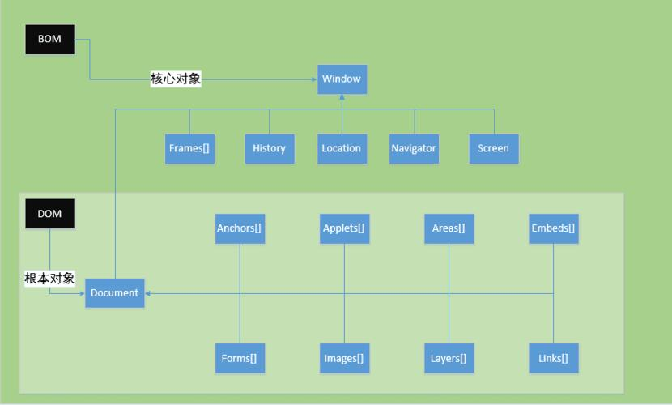

## BOM 和 DOM

DOM（document object model）：文档对象模型，提供操作页面元素的方法和属性。

BOM（browser object model）：浏览器对象模型，提供一些属性和方法可以操作浏览器。

Javascript 由三部分构成，ECMAScript，DOM和BOM。根据宿主（浏览器）的不同，具体的表现形式也不尽相同，ie和其他的浏览器风格迥异,IE 扩展了 BOM，加入了 ActiveXObject 类，可以通过 JavaScript 实例化 ActiveX 对象。 

1. ECMAScript(核心) 　　描述了JS的语法和基本对象

2. DOM 是文档对象模型，处理网页内容的方法和接口。是W3C 的标准； [所有浏览器公共遵守的标准] 

3. BOM 是浏览器对象模型，提供与浏览器交互的方法和接口。各个浏览器厂商根据 DOM在各自浏览器上的实现;[表现为不同浏览器定义有差别,实现方式不同] 

