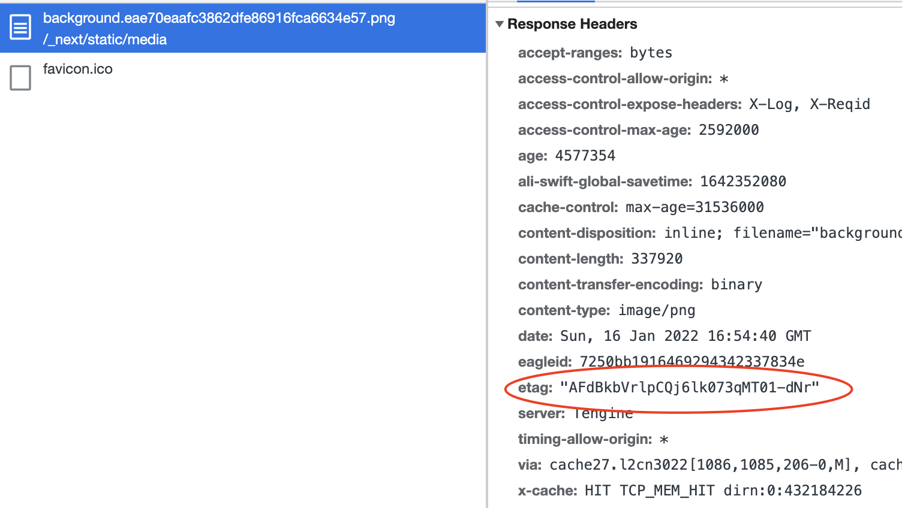
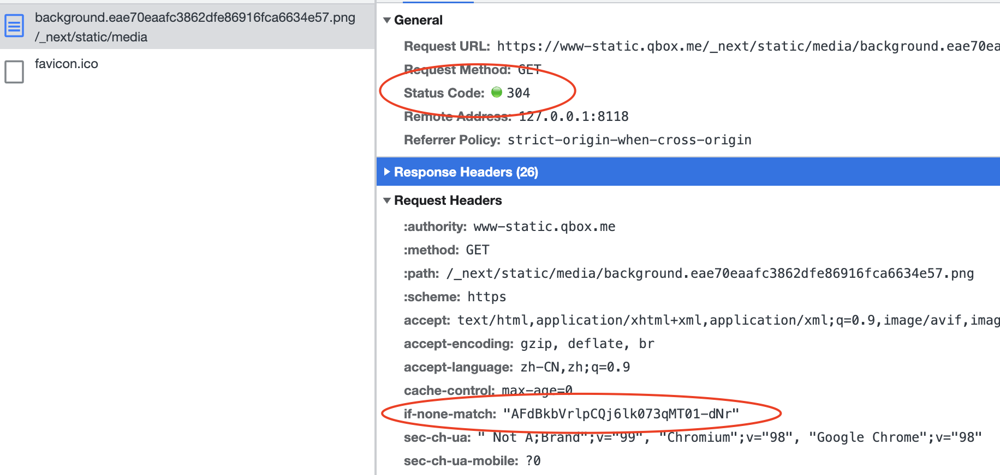

## 什么是 Etag？

**前言**

在HTTP1.1规范中，新增了一个HTTP头信息：**ETag**。对于普通开发者来说，可能平时真的不会接触到该HTTP头。平时接触不到或者说用得少，不代表这个请求头不重要。ETag 使用得当，是可以减少服务器带宽压力的。

**Etag 的作用**

Etag是 Entity tag的缩写，可以理解为“被请求变量的实体值”，Etag是服务端的一个资源的标识，在 HTTP 响应头中将其传送到客户端。所谓的服务端资源可以是一个Web页面，也可以是JSON或XML等。服务器单独负责判断记号是什么及其含义，并在HTTP响应头中将其传送到客户端。比如，浏览器第一次请求一个资源的时候，服务端给予返回，并且返回了ETag: "50b1c1d4f775c61:df3" 这样的字样给浏览器，当浏览器再次请求这个资源的时候，浏览器会将If-None-Match: W/"50b1c1d4f775c61:df3" 传输给服务端，服务端拿到该ETAG，对比资源是否发生变化，如果资源未发生改变，则返回304HTTP状态码，不返回具体的资源。

**使用场景**

通过 Etag 来利用浏览器的缓存，降低我们服务器的带宽压力。这是可以提升服务端的性能的（数据传输上）。

七牛云的文件存储，就用到了Etag的属性。

例如，通过请求其官方网站的某张图片，可以通过它的响应头看到，返回了Etag字段给我们。

再次刷新资源，HTTP的状态码变成了304，304状态码表示资源未改变，可以看到，客户端在向服务端请求资源的时候，通过If-None-Match请求头带上了之前服务端返回的Etag的值。服务端收到第二次请求的时候，发现携带了If-None-Match字段，就重新计算服务器对应资源的Etag，如果二者匹配了，就认为资源没有发生变化，直接给客户端相应304，让客户端读取缓存中的数据。

