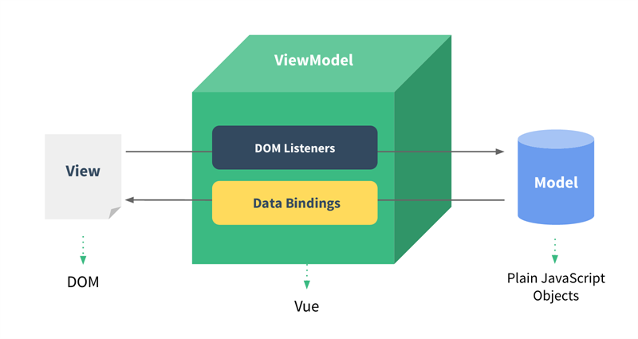
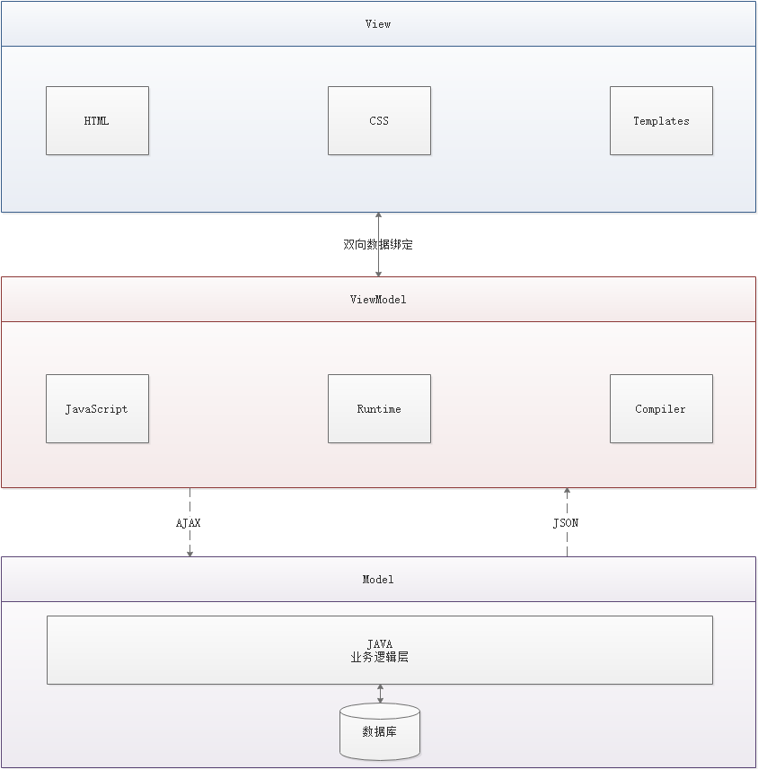

## MVC 和 MVVM

复杂的软件必须有清晰合理的架构。

### 1. MVC

下面是斯坦福大学公开课上的一幅图，可以说是最经典和最规范的MVC（Model-View-Controller）标准。

- 视图（View）：用户界面。
- 控制器（Controller）：业务逻辑
- 模型（Model）：数据保存

View 传送指令到 Controller，Controller 完成业务逻辑后，要求 Model 改变状态，Model 将新的数据发送到 View，用户得到反馈。

MVC 三层结构将表示部分和业务逻辑部分按照客户层和应用服务器相分离，客户端和应用服务器、应用服务器和数据库服务器之间的通信以及异构平台之间的数据交换等都可以通过中间件或者相关程序来实现。当数据库或者应用服务器的业务逻辑改变时，客户端并不需要改变，反之亦然，从而大大提高了系统模块的复用性，缩短了开发周期，降低了维护费用。

### 2. MVVM

MVVM：Model、View、ViewModel。与 MVC 相比，多了一个 ViewModel，少了一个 Controller。

ViewModel 由前端开发人员组织生成和维护的视图数据层。在这一层，前端开发者从后端获取得到Model数据进行转换出来，做二次封装，以生成符合View层使用预期的视图数据模型。视图状态和行为都封装在ViewModel里。这样的封装使得ViewModel可以完整地去描述View层。

在MVVM架构中，是不允许数据和视图直接通信的，只能通过ViewModel来通信，而ViewModel就是定义了一个Observer观察者。ViewModel是连接View和Model的中间件。

- ViewModel 能够观察到数据的变化，并对视图对应的内容进行更新。
- ViewModel 能够监听到视图的变化，并能够通知数据发生变化。

**MVVM 的优点**

- 低耦合：视图（View）可以独立于Model变化和修改，一个ViewModel可以绑定到不同的View上，当View变化的时候Model可以不变，当Model变化的时候，View也可以不变。
- 可复用：可以把一些视图逻辑放到一个ViewModel里面，让很多View重用这段视图逻辑。
- 独立开发：开发人员可以专注于业务逻辑和数据的开发（ViewModel），设计人员可以专注于页面设计。
- 可测试：界面素来是比较难于测试的，而现在测试可以针对ViewModel来写。