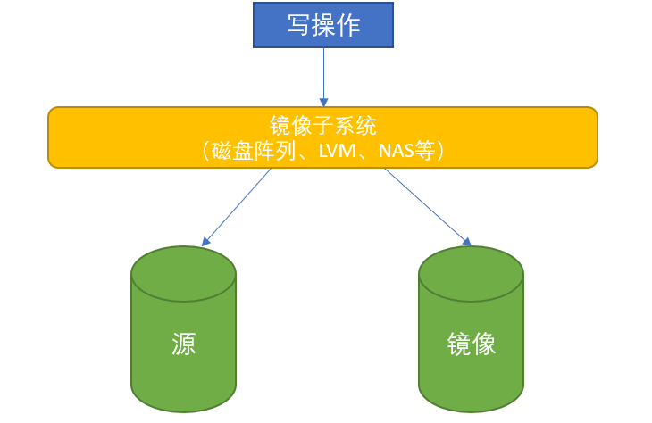

## 1. 快照的概念

快照可用于服务器数据备份。

快照可以是数据再现的一个副本或者复制。对于文件系统来说，文件系统快照是文件系统的一个即时拷贝，它包含了文件系统在快照生成时刻所有的信息，本身也是一个完整可用的副本。

**快照的应用**

　　**瞬时备份**：在不产生备份窗口的情况下，可以帮助客户创建一致性的[磁盘快照](https://www.zhihu.com/search?q=磁盘快照&search_source=Entity&hybrid_search_source=Entity&hybrid_search_extra={"sourceType"%3A"article"%2C"sourceId"%3A21749155})，每个磁盘快照都可以认为是一次对数据的全备份。从而实现常规备份软件无法实现的分钟级别的RPO。

　　**快速恢复**：用户可以依据存储管理员的定制，定时自动创建快照，通过磁盘差异回退，快速回滚到指定的时间点上来。通过这种回滚在很短的时间内可以完成。大大的提高了业务系统RTO的水平。

　　**应用测试**：用户可以使用快照产生的[虚拟硬盘](https://www.zhihu.com/search?q=虚拟硬盘&search_source=Entity&hybrid_search_source=Entity&hybrid_search_extra={"sourceType"%3A"article"%2C"sourceId"%3A21749155})的数据对新的应用或者新的操作系统版本进行测试，这样可以避免对生产数据造成损害，也不会影响到目前正在运行的应用。

## 2. 创建快照的步骤

1. 首先发起创建指令
2. 在发起时间点，指令通知操作系统暂停应用程序和文件系统的操作
3. 刷新文件系统缓存，结束所有的读写事务
4. 创建快照点
5. 创建完成之后，释放文件系统和应用程序，系统恢复正常运行。

## 3. 快照的分类

快照分类的方式有很多种，比如按照是全量还是增量来区分为全量快照、增量快照。比较也可以分为物理快照和逻辑快照。

常用的快照分类如下：

### 3.1 Clone/split mirror 克隆/镜像分离

Clone(或Split-Mirror)快照所创建的是数据的完整副本。

#### 3.1.1 Clone 克隆

顾名思义，就是完整复制数据，需要在没有写入的时候复制，这样数据才具有一致性。

#### 3.1.2 Split-Mirror 镜像分离

如下图，先创建一个原始卷的镜像卷，每次写磁盘的时候，都会往原始卷和快照卷同时写入内容，当启动快照时，则镜像卷能快速脱离，生成一个快照卷。然后重新创建一个原始卷的镜像卷，等待下次快照。

这种方案最大的**缺点**是很费磁盘空间，每个快照都需要占用和原始卷同样的空间，而且写数据时同时写两份，对写入性能影响比较大。**优点**是快照生成和恢复都方便，而且数据隔离很好，不存在快照卷和原始卷的相互影响。

### 3.2 Copy-on-write with background copy 后台拷贝的复制写

该快照有两个生成步骤，首先创建一个瞬时即可生成的 COW 快照，然后利用后台进程将数据卷的数据复制到快照空间，最后生成一份数据卷的克隆或镜像。

创建这种快照的目的是发挥COW快照的优势，同时尽量屏蔽它的不足。因此，这种快照常常被形容为COW和Clone快照的混合体。

### 3.3 COW 快照 (Copy-On-Write)

- 每个源数据卷都具有一张数据指针表(元数据)，简称源数据指针表，表记录就是指向相应源数据块的地址指针。

- 在创建快照时，存储子系统会建立源数据指针表的一个副本(元数据拷贝)，作为快照卷的数据指针表，简称快照数据指针表。

- 在创建快照之后，这个快照就相当于一个可供上层应用访问的存储逻辑副本，快照卷与源数据卷通过各自的指针表共享同一份物理数据。

- 当源数据卷中任意数据将要被改写时，COW会在原始数据修改之前进行拷贝到快照卷中，然后将新数据写入到源数据块中覆盖原始数据，并且将原始数据在快照卷中的新地址更新到快照数据指针表记录中，使快照时间点后更新的数据不会出现在快照卷中。

1. 在创建快照时，会同时创建快照卷和快照数据指针表。快照卷只需要很少的存储空间；
2. 更改数据时，会拷贝旧数据到快照卷，源数据会被覆盖，快照指针表的地址会更新；插入新数据，自然是不会对快照卷有影响。
3. 再次创建快照，会再次拷贝源数据指针表，新的修改会记录到旧的快照卷和新的快照卷。

**优缺点**

- 优点：原始卷物理块连续，没有碎片
- 缺点：降低源数据卷的写性能，每首次更新数据，至少进行两次写操作。

### 3.4 ROW 快照(Redirect-On-Write)

- ROW 的实现原理与 COW 非常相似，区别在于ROW 对原始数据卷的首次写操作，会将新数据重定向到预留的快照卷中，而非 COW 一般会使用新数据将原始数据覆盖。

- 所以，ROW 快照中的原始数据依旧保留在源数据卷中，并且为了保证快照数据的完整性，在创建快照时，源数据卷状态会由读写变成只读的。

1. 创建快照时，也会copy一份源数据指针表作为快照数据指针表，此时两张表的指针记录都相同；
2. 发生了写操作，那么新数据会直接被写入到快照卷中，然后再更新源数据指针表的记录，使其指向新数据所在的快照卷地址；
3. 再次创建快照，会再次copy一份源数据指针表，新的修改会写入到新的快照卷；
4. 因为源数据指针表上有上次快照的修改和新增数据，所以显然快照之间的关系是链式，恢复后面的快照需要源数据以及全面的快照作为基础。

**优缺点：**

- 优点：写性能基本没有损耗，只是修改指针
- 缺点：没有一个完整的快照卷，其快照之间的关系是链式，如果快照层级越多，进行快照恢复时的系统开销会比较大；