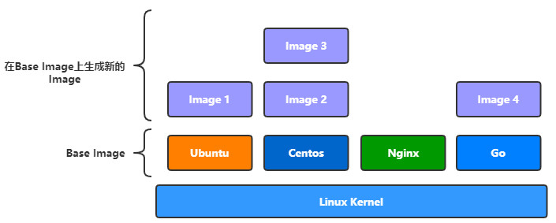

## 镜像

**镜像**是一种轻量级、可执行的独立软件包，用来打包软件运行环境和基于运行环境开发的软件，它包含运行某个软件所需的所有内容，包括代码、运行时、库、环境变量和配置文件。

Linux 分为两个部分：Linux 内核(Linux Kernel)与用户空间，而真正的Linux操作系统，是指Linux内核，我们常用的Ubuntu,Centos等操作系统其实是不同厂商在Linux内核基础上添加自己的软件与工具集(tools)形成的发布版本(Linux Distribution)。

因此，我们也可以把镜像看成是上面所说的用户空间，当Docker通过镜像创建一个容器时，就是将镜像定义好的用户空间作为独立隔离的进程运行在宿主机的Linux内核之上。

**镜像的特征**：

- 分层：即一个镜像可以多个中间层组成，多个镜像可以共享同一中间层，我们也可以通过在镜像添加多一层来生成一个新的镜像。

- 只读：镜像在构建完成之后，便不可以再修改，而上面我们所说的添加一层构建新的镜像，这中间实际是通过创建一个临时的容器，在容器上增加或删除文件，从而形成新的镜像，因为容器是可以动态改变的。