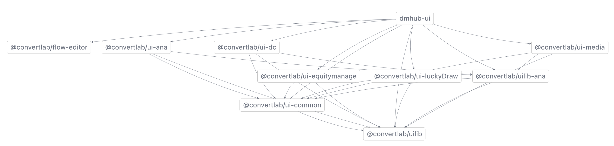
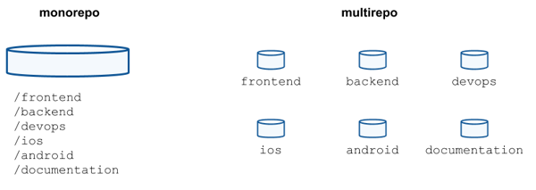
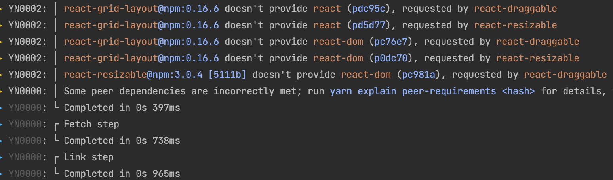
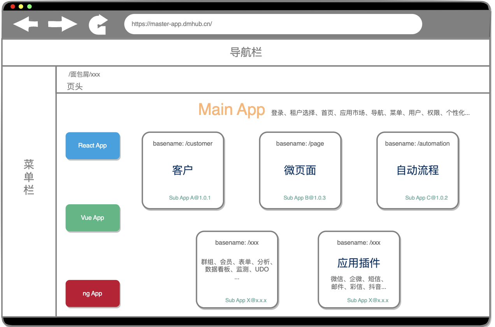
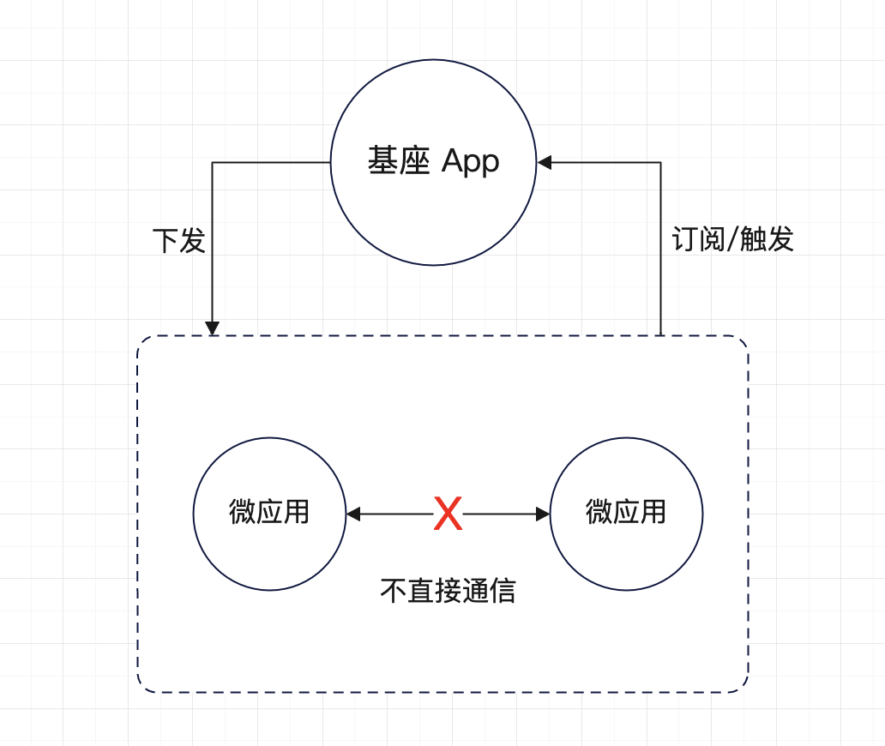
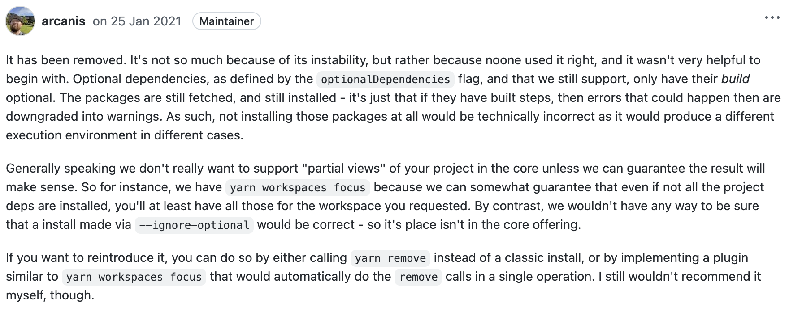
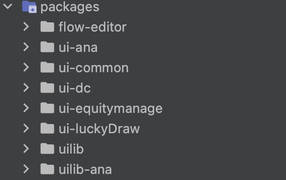
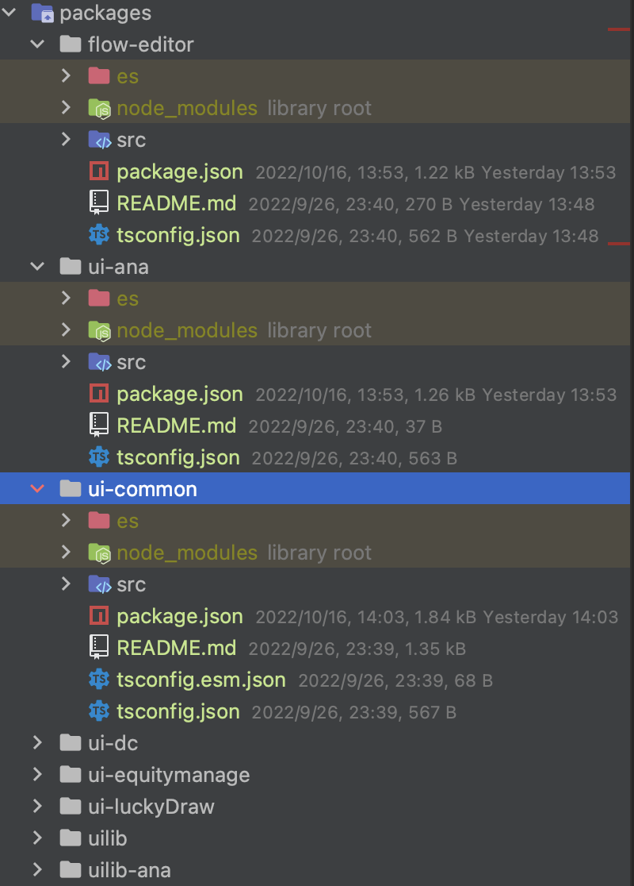
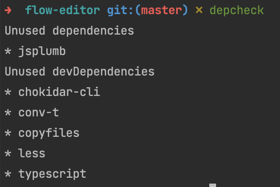
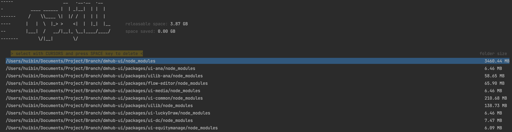

# 	Monorepo 技术选型调研

- Repository，代码仓库，简称 repo；
- MultiRepo，多仓库管理；
- MonoRepo，单一仓库管理；

## 1. 困局

DM Hub 产品经过多年的迭代，业务功能不断的增加，应用变得越来越庞大；团队的划分，开发人员变得分散；随之而来也产生了一系列的问题：

- 应用越来越庞大，难以维护；
- 跨部门协作开发项目效率低下；
- 项目类型多，本地调试繁琐，开发体验感差；
- 代码构建时间长，影响测试；
- 混乱的依赖管理，缺乏统一的工程化规范；
- 模块之间相互依赖，需求发布相互阻塞，需求经常延期，上线困难；
- 代码回滚相互影响；

以上的这些问题，不仅降低了开发效率，增加了开发成本，同时也成为阻塞业务发展的一个重要因素。

## 2. 破局

### 2.1 代码管理

#### 2.1.1 代码管理现状

DM Hub 产品前端目前采用的是 Multi-repo 的代码管理策略，主产品是一个  repo，其依赖被拆分出多个单独的 repo；随着产品功能的增加，更多的产品模块被拆分出单独的 repo 作为依赖引入。当开发需要进行本地调试开发这些应用的时候，就必须去查找其对应的仓库，拉取代码，安装开发调整，从一定的程度上增加了开发和理解成本、调试出错的几率、降低了开发的效率。

同时 DM Hub 还有很多的插件应用，并且随着功能的升级应用也在不断地增加；而这些应用也会被维护在单独的 repo 中。

下图是通过 `nx graph` 生成的 DM Hub 前端应用与其各个依赖项以及各个依赖之间的依赖关系，从图中可以看出依赖的管理非常的混乱。当某个被依赖项目的版本发生变化，就需要考虑所有依赖的 repo 版本的变更升级，隐形中增加了很多工作量。

例如当 dmhub-ui 发布新的版本切出新的分支 2.7，其 lock 文件就会被锁定。此时如果修改了 ui-common，当 ui-common 发布了新的版本之后，还需要再次对 dmhub-ui 中的 lock 文件进行调整，保证 dmhub-ui 安装到需要的 ui-common 版本，整个流程下来会增加很多额外的工作成本，甚至有时忘记调整 lock 文件，延迟测试和发布的时间。

当代码库越来越多的时候，管理成本会越来越高，另外在进行重构和整合的工作中，也会变得非常的困难。



#### 2.1.2 MonoRepo

> 什么是 MonoRepo ？
>
> MonoRepo 是来自 Facebook 的工程实践。它的诞生与 Facebook 在快速发展的过程中遇到的问题息息相关。随着 Facebook 的发展，逐渐出现了几十个项目工程，并按 MultiRepo 的方式存储于代码管理系统中。这些 Repo 之间存在错综复杂的依赖关系。为了开发新功能，团队可能需要在几十个 Repo 之间同步代码，导致产品维护难度升高、开发效率降低；同时，当一个新人加入团队后，往往需要了解这几十个项目就需要花费3-4周的时间。更糟糕的是，随着时间的推移，Repo 数量会越来越多，开发成本维护成本越来越高。
>
> 为了解决这个问题，Facebook 的工程师便提出了一个新的方案：**MonoRepo**，移除重复的文件，重新划分模块，用于代替MultiRepo 的 代码管理方式。

MonoRepo 是管理项目代码的的一个方式，它是在一个代码仓库中管理多个的模块/包，不同于常见的每个模块建一个代码仓库（MultiRepo）。在图中可以看出 MultiRepo 是每个包一个仓库，而 MonoRepo 是把所有的项目代码按照一定规则进行组织，存放于同一个代码仓库中。



Monorepo 把所有项目的所有代码统一维护在一个单一的代码版本库中，通过一些 Monorepo 工具进行管理。它主要有以下特点：

- 一致的开发体验，统一的质量标准和代码风格；
- 更方便的依赖库代码调试，直接在项目中引用工具库进行开发调试，不需要进行 link、watch；
- 唯一的依赖源，每个依赖只有一个版本，意味着没有版本冲突，没有依赖地狱；
- 更简单的依赖关系管理，所有模块都托管在同一个存储库中，因此都不需要包管理器；
- 更好的协作和跨团队贡献，每个人都可以看到其他人的代码，快速协助其他项目的开发；
- 原子提交，原子提交使大规模重构更容易，开发人员可以在一次提交中更新多个包或项目；
- 统一的 CI/CD，可以为代码库中的每个项目使用相同的 CI/CD 部署流程；

#### 2.1.3 MonoRepo tools

Monorepos 有很多优势，但要让它们发挥作用，就需要拥有正确的工具。随着工作空间的扩大，这些工具必须保持快速、易于理解和易于管理。

下面是现在比较流行的一些工具的对比：

| 特性                | 描述                                                         | Bazel | Gradle | Lage | Lerna | Nx   | Pants | Rush | Turborepo |
| ------------------- | :----------------------------------------------------------- | ----- | ------ | ---- | ----- | ---- | ----- | ---- | --------- |
| 本地计算缓存        | 缓存上一次命令执行的结果，大大提升下一次的构建速度           | ✅     | ✅      | ✅    | ❌     | ✅    | ✅     | ✅    | ✅         |
| 本地任务编排        | 以正确的顺序和并行的方式运行任务，lerna 存在局限性           | ✅     | ✅      | ✅    | ⚠️     | ✅    | ✅     | ✅    | ✅         |
| 分布式计算缓存      | 支持在不同的环境中缓存结果，比如 github、gitlab 等 CI，读取上次的结果，提升构建速度 | ✅     | ✅      | ✅    | ❌     | ✅    | ✅     | ✅    | ✅         |
| 检测受影响的项目/包 | 仅对受影响的项目/包进行重新的构建和测试                      | ⚠️     | ✅      | ✅    | ✅     | ✅    | ✅     | ✅    | ✅         |
| 工具区分析          | 可以将项目的目录结构分析出项目结构图                         | ⚠️     | ✅      | ✅    | ✅     | ✅    | ✅     | ✅    | ✅         |
| 依赖图可视化        | 各个应用及依赖之间的依赖关系可视化                           | ✅     | ⚠️      | ⚠️    | ⚠️     | ✅    | ⚠️     | ⚠️    | ✅         |
| 代码生成            | 通过命令快速创建一个新的项目                                 | ⚠️     | ⚠️      | ⚠️    | ⚠️     | ✅    | ✅     | ⚠️    | ⚠️         |
| 项目约束与可见性    | 标记某个项目为私有项目，限制其他人依赖它们                   | ✅     | ⚠️      | ⚠️    | ⚠️     | ✅    | ⚠️     | ✅    | ⚠️         |

根据以上工具的对比及市场的调研，再加上特性的支持，`Nx` 是最好的选择：

- 1.5M+ 的开发者使用，11M+ 的月下载量；NRWL 团队维护，稳定性和可信用度高；
- CI 时间可减少 3x - 14x，分布式任务执行和计算缓存，大大减少了 CI 时间；
- 对现有的系统集成便捷，只需要简单的命令，即可为项目添加 `nx`；
- 对主流编辑器的支持，包括 VSCode、Webstorm 等，提供了专用的拓展插件，方便开发人员调试；

#### 2.1.4 Workspace

Workspace 主要是用于 MonoRepo 的依赖管理。试想一下，如果没有 workspaces，需要分别在每个目录下执行装各自依赖，不仅开发效率低，而且产生如下问题：

1. 相同依赖会多次下载，耗时且占用控件
2. 没有统一入口进行全部项目的构建

通过 Workspce：

- 开发多个互相依赖的package时，workspace会自动对package的引用设置软链接（symlink），比yarn link更加方便，且链接仅局限在当前workspace中，不会对整个系统造成影响
- 所有package的依赖会安装在最根目录的node_modules下，节省磁盘空间，且给了yarn更大的依赖优化空间
- 所有package使用同一个yarn.lock，更少造成冲突且易于审查

#### 2.1.5 包管理器

包管理器主要用于安装、更新、卸载软件安装包，包括支持 Workspace 功能等，现在最常见的包管理器主要包括：NPM、Yarn、Pnpm。

NPM 是最早发布的，最初是由 Node.js 项目开发的 JavaScript 包管理器，它使开发人员能够轻松地在不同项目之间共享代码，并在自己的项目中使用其他人的代码。

随着 Node 的发展，Node 的包越来越多，人们在项目中添加的依赖越来越多，如何更快地下载，如何安全地下载被人们开始重视起来，于是在 2016年，Facebook 等公司开发了新的包管理器，就是我们现在经常使用的 Yarn。

2017 年 PNPM 问世，相比较于 yarn，pnpm 在性能上又有了极大的提升。PNPM 解决了 NPM、Yarn 重复文件过多、复用率低等问题。

##### 2.1.5.1 性能和磁盘效率

**NPM：**与 Yarn 和 PNPM 相比，相对比较慢。

**YARN：** Yarn 使用相同的扁平化 node_modules 目录，但在速度和并行安装包方面与 NPM 相当。

**PNPM：** PNPM 比 NPM 快 3 倍，效率更高。使用冷缓存和热缓存，PNPM 比 Yarn 更快。

PNPM 只是从全局存储中链接文件，而 Yarn 从其缓存中复制文件，与其他两个包管理器相比，PNPM 还可以节省大量空间。

##### 2.1.5.2 安全

**NPM：**由于 npm 处理坏包的方式，一些安全漏洞直接影响了许多项目。

**YARN：**存储在 yarn.lock 中的校验和一直被 Yarn Classic 和 Yarn Berry 使用。Yarn 还可以防止安装恶意软件包；如果检测到不匹配，安装将中止。

**PNPM：**与 Yarn 类似，PNPM 也使用校验和，除了使用校验和之外，pnpm 还在执行代码之前验证其代码的完整性。

##### 2.1.5.3 Monorepo 支持

**NPM：** NPM 包管理器通过各种 CLI 命令提供 monorepo 支持来管理多个包。但是不支持高级过滤或多个工作区。

**YARN：**提供 monorepo 支持的 workspace 功能。

**PNPM：**PNPM 在这方面具有优势。

##### 2.1.5.4 项目结构

**NPM：**使用 npm install 一个 package-lock.json 并生成一个 node_modules 文件夹。可以手动将 .npmrc 配置文件放在根级别。

**YARN：**这还将创建 yarn.lock 文件和 node_modules 文件夹。Yarn v2 可以使用**.yarnrc**文件配置；Yarn Classic 也可以使用 **.npmrc**文件，Yarn v3 不再支持 .npmrc 文件的配置，被 .yarnrc.yml 取代。

除了 .yarn/cache/ 之外，还可以使用其他存储 yarn 经典版本的位置（.yarn/releases/）

**PNPM：**与 NPM 不同，PNPM 不会创建扁平的依赖关系树。在 node_modules 中，所有东西在 package.json 中都有自己的 node_modules 文件夹，并且每个依赖项都在 package.json 中精确指定。在 npm 版本 3 之前，node_modules 结构是可预测的。

##### 2.1.5.5 选择 Yarn

DM Hub 当前使用的包管理器是 Yarn 1 版本，基于以上包管理器的比较以及改造成本的考虑，Yarn 满足了各种需求，是最适合 DMHub 的包管理器。

但是 Yarn 1 基本已经不在维护，并且明确不会添加新的功能，所以在此考虑 Yarn 3 的一些新的特性，并升级到此版本：

**A. 可读性更高的输出日志**

每行日志添加了代码及颜色区分，可以帮助开发者更好的定位问题



**B. 支持 `yarn dlx`**

功能类似于 `npx`，创建临时环境下载指定的依赖，不改变当前环境的 `package.json` 内容，并且它只执行远端的脚本而不执行本地的脚本，相对于 `npx` 有更高的安全性。

**C. 更好的 workspaces 支持，更好的 monorepo 开发** 

主要体现在以下几点：

- yarn add 添加交互模式（interactive mode）

  帮助检查这个依赖有没有在其他workspaces中被使用，并且会让你选择是要复用其他workspaces中的依赖版本还是使用另外的版本。

- 一次更新所有 workspaces 某个依赖的版本

  新增的 `yarn up` 命令可以同时更新所有workspaces的该依赖的版本，而不用切换到各个workspace中运行更新命令，也可以结合交互模式确认具体的操作。

- 自动发布关联的 workspaces

  当某个包（workspace）发布了新的版本之后，发布其它相关联的包十分麻烦。而 Yarn 的 version 插件允许你将一部分包版本管理工作分发给你的代码贡献者，而且它还提供了一个友好的交互界面来让你十分容易地管理关联包的发布。

- 在多个workspaces中运行相同的命令

  `yarn workspaces foreach`  命令来让你在多个workspaces中运行同一个命令，这个命令是由它的 workspace-tools 插件支持。

  `yarn workspaces foreach run build`。

**D. 缓存安装包**

Yarn 安装后，所有的依赖都会被压缩成一个文件放在特定的地方，由于压缩后的包体积很小，而且包的数量不会很多，所以可以将此目录提交到 Git 上，在以后得开发中，安装速度会大大提升。

- 开发体验进一步提升，保证大家环境的一致。
- 代码review的时候可以更清楚哪些依赖发生了改变。

- 由于每次部署代码的时候， `yarn install`占用的时间都是一个大头，去掉这个步骤后部署速度将会大大提升。

- 不会存在本地运行没问题，发布线上环境的时候挂掉了的问题。

- 不用在 CI 文件里面进行一些安装依赖的配置。

**E. 新协议**

Yarn v2版本添加了两个新的协议：`patch`和 `portal`协议。它大概是用来告诉yarn，定义在package.json文件里面的依赖是如何解析的。

#### 2.1.6 代码管理调整

基于 MonoRepo 以上优点，及其丰富的管理工具。 对于改变 DM Hub 现在的 MultiRepo 代码管理的现状无疑是最佳的选择。

MonoRepo 主要划分为两个工作区，一个是应用 apps，另外一个是应用依赖的包 packages。

apps 目录主要通过现在的 src 目录进行拆分，packages 需要将 `@convertlab/*` 相关的依赖包迁进来。

目录结构划分如下：

```
dmhub-ui
├─ .yarn
├─ config
├─ script
├─ apps
|		├─ main
|   ├─ sms
|   ├─ email
|   └─ ...
├─ packages
|   ├─ flow-editor
|   ├─ uilib
|   ├─ ui-common
|   ├─ ui-dc
|   ├─ ui-media
|   └─ ...
├─ .editorconfig
├─ eslintrc
├─ prettier
├─ package.json
└─ tsconfig.json
```

在后续的微前端改造中，仍然可以使用这种方式进行代码管理，只需要简单的配置即可。

### 2.2 开发体验

在以往的 DM Hub 中，如果涉及到相关的 @convertlab/* 依赖包的调整，均需要打开 dmhub-ui 项目，然后再打开对应的依赖包，安装 -> 启动 -> Watch 依赖，整个流程下来需要花费很长的时间，开发效率低，开发体验感也很差。

- 代码质量及规范不一致
- 依赖安装慢，项目启动慢，构建时间长
- 项目类型多，依赖管理混乱
- 本地调整繁琐
- 本地环境代码不一致，导致部分开发无法启动项目（需要重装依赖）

所以提升开发体验势在必行，从一定程度上可以提升开发效率，减少项目的维护成本。

#### 2.2.1 统一代码风格和质量标准

通过 2.1 的 MonoRepo 管理现有的代码，各个项目不需要再进行单独的 prettier、eslint、husky 等相关的配置，均可提升至顶级目录进行配置，这样可以保证所有的代码风格保持一致。

#### 2.2.2 统一依赖安装

##### 2.2.2.1 加快安装速度

通过 Yarn workspace，可以将所有的 workspce 的依赖提升到顶级目录进行安装，不需要单独的对某个目录进行安装，`yarn install` 即可安装所有目录的依赖。

package.json

```diff
{
+	"workspaces": [
+   "apps/*",
+   "packages/*"
+ ]
}
```

tsconfig.json

```diff
{
	"compilerOptions": {
+ 	"paths": {
+     "@convertlab/*": ["packages/*/src"],
+     "@dmhub-ui/*": ["apps/*/src"]
+   }
	}
}
```

Yarn 3 进行第一次安装之后，会生成 `.yarn/cache` 目录，下次再次进行安装，直接从 Cache 目录获取，大大提升安装速度，所以此目录可以提交到 Git 上。

##### 2.2.2.2 workspace 协议管理依赖版本

通过 workspace 协议管理依赖版本，可以保证使用最新的依赖，而不必担心某个依赖未安装最新版本，项目启动报错的问题。

在 dmhub-ui 中，将直接引用 packages 下的依赖，这样可以保证依赖的最新版本，同时调整各个 @convertlab/* 中的对其他包的引用，均使用 Yarn 的 Workspace 协议。

```diff
{
	dependencies: {
-   "@convertlab/flow-editor": "^5.0.0",
+   "@convertlab/flow-editor": "workspace:*",
-   "@convertlab/ui-ana": "^5.0.0",
+   "@convertlab/ui-ana": "workspace:*",
-   "@convertlab/ui-common": "^5.0.0",
+   "@convertlab/ui-common": "workspace:*",
-   "@convertlab/ui-dc": "^5.0.0",
+   "@convertlab/ui-dc": "workspace:*",
-   "@convertlab/ui-equitymanage": "^5.0.0",
+   "@convertlab/ui-equitymanage": "workspace:*",
-   "@convertlab/ui-luckyDraw": "^5.0.0",
+   "@convertlab/ui-luckyDraw": "workspace:*",
-   "@convertlab/uilib": "^5.1.2",
+   "@convertlab/uilib": "workspace:*",
-   "@convertlab/uilib-ana": "^5.0.0",
+   "@convertlab/uilib-ana": "workspace:*",
	}
}
```

##### 2.2.2.3 发布 Workspaces

Yarn 的 workspace 可以很好的管理依赖的发布，比如某个包依赖了使用 workspace 的协议依赖：

```json
{
  "dependencies": {
    "star": "workspace:*",
    "caret": "workspace:^",
    "tilde": "workspace:~",
    "range": "workspace:^1.2.3",
    "path": "workspace:path/to/baz"
  }
}
```

在对其发布时，Yarn 将会对其进行转换：

```json
{
  "dependencies": {
    "star": "1.5.0",
    "caret": "^1.5.0",
    "tilde": "~1.5.0",
    "range": "^1.2.3",
    "path": "1.5.0"
  }
}
```

另外可能需要配合 Yarn 的 version 插件，可以在发布时，同时修改依赖当前包的 package.json 中的版本，极大的简化了发布的流程。

#### 2.2.3 加快构建与启动速度

现有的项目启动速度是很缓慢的，一次启动大概需要3-5分钟，开发效率极低。

##### 2.2.3.1 拆分多个子应用

解决此问题的方案主要是通过微前端拆分为多个子应用，这样单个应用的体积就会大大降低，从而大大提升单个应用的构建速度和启动速度。而开发人员则可以根据自己的需要启动某些应用。

##### 2.2.3.2 配套的执行脚本

有时会存在删除 node_modules 或者构建目录的情景，如果一个个去目录下删除，这种效率非常的低下。

通过 `nx` 和 `yarn`，不仅可以实现按需启动项目，也可以实现一次删除所有依赖或者构建目录等。

```json
{
    "dev": "nx run-many --target=start --projects=@dmhub-ui/main,@dmhub-ui/abtest",
    "clean": "yarn workspaces foreach exec -- rimraf es",
    "prune": "yarn workspaces foreach exec -- rimraf node_modules && rimraf node_modules"
  }
```

##### 2.2.3.2 计算缓存

如果某个命令执行之后，下次仍需要重新的执行一次，也会提升开发的时间。而通过命令缓存则可以直接读取已经编译过的缓存。

主要就是通过配置 `nx.json` 文件

```json
{
  "cacheableOperations": ["build", "postbuild"]
}
```

可以配置需要缓存的命令，下次再次执行可以读取缓存不需要重新的执行一次。

#### 2.2.4 HRM 模块热替换

在本地开发中，如果修改了某个文件，需要刷新整个页面，等待页面加载完成再看到效果，这种开发体验是非常差的，而且有时页面加载的很慢，导致开发效率非常的低下。

而对应的解决方案就是 HRM 模块热替换，可以实现修改某个文件，仅仅刷新部分页面，也就是近对某个组件进行重新的加载，不需要刷新整个页面，这样下来开发效率会有大大的提升。

DM Hub 现在已经通过 `@pmmmwh/react-refresh-webpack-plugin`、`react-refresh` 插件实现了该功能。

### 2.3 发布速度

#### 2.3.1 产品发布现状

DM Hub UI 规模早已突百万行代码，项目体积已经变得非常的庞大。从开发构建到发布的整个过程非常的缓慢。由于整个项目各个模块之间相互关联，整个项目必须一起发布。这样就到出现需求发布相互阻塞，需求经常延期，上线困难。

#### 2.3.2 微前端架构

微前端（Micro-Frontends）是一种类似于微服务的架构，它将微服务的理念应用于浏览器端，即将 Web 应用由单一的单体应用转变为多个小型前端应用聚合为一的应用。**微前端不是单纯的前端框架或者工具，而是一套架构体系**。

微前端的核心三大原则就是：**独立开发、独立运行、独立部署**。

微前端架构可以很好的解决 DM Hub 产品发布这一现状，将应用分而治之，实现快速的独立运行、部署、发布。实现了各个团队可以拥有独立的开发发布周期，而不受其他模块的影响。

#### 2.3.3 微前端方案

微前端解决方案大致有以下几种：

- 最原始的 Nginx 配置反向代理是从接入层的角度来将系统进行分离，但是需要运维配置；⚠️
- iframe 嵌套是最简单和最快速的方案，但是 iframe 的弊端也是无法避免的；⚠️
- Web Components 的方案则需要大量的改造成本；⚠️
- 组合式应用路由分发方案改造成本中等并且能满足大部分需求，也不影响各前端应用的体验，是当下各个业务普遍采用的一种方案； ✅

| 方案               | 描述                                                         | 优点                                               | 缺点                                                         |
| ------------------ | ------------------------------------------------------------ | -------------------------------------------------- | ------------------------------------------------------------ |
| Nginx路由转发      | 通过Nginx配置反向代理来实现不同路径映射到不同应用，例如www.abc.com/app1对应app1，www.abc.com/app2对应app2，这种方案本身并不属于前端层面的改造，更多的是运维的配置。 | 简单，快速，易配置                                 | 在切换应用时会触发浏览器刷新，影响体验                       |
| iframe嵌套         | 父应用单独是一个页面，每个子应用嵌套一个iframe，父子通信可采用postMessage或者contentWindow方式 | 实现简单，子应用之间自带沙箱，天然隔离，互不影响   | iframe的样式显示、兼容性等都具有局限性；太过简单而显得low    |
| Web Components     | 每个子应用需要采用纯Web Components技术编写组件，是一套全新的开发模式 | 每个子应用拥有独立的script和css，也可单独部署      | 对于历史系统改造成本高，子应用通信较为复杂易踩坑             |
| 组合式应用路由分发 | 每个子应用独立构建和部署，运行时由父应用来进行路由管理，应用加载，启动，卸载，以及通信机制 | 纯前端改造，体验良好，可无感知切换，子应用相互隔离 | 需要设计和开发，由于父子应用处于同一页面运行，需要解决子应用的样式冲突，变量对象污染，通信机制等技术点 |

#### 2.3.4 微前端基座

基于上述微前端方案，**组合式应用路由**是最符合当前 DM Hub 产品的一种方案。

该方案的核心是“主从”思想，即包括一个基座（MainApp）应用和若干个微（MicroApp）应用，基座应用大多数是一个前端 SPA 项目，主要负责应用注册，路由映射，消息下发等，而微应用是独立前端项目，这些项目不限于采用 React，Vue，Angular 或者 JQuery开发，每个微应用注册到基座应用中，由基座进行管理，但是如果脱离基座也是可以单独访问。

不过对于 DM Hub 来说，由于基座应用承载了登录、租户、权限控制等功能，所以子应用是必须要附属于该基座应用，从一定程度上来说不是完全的独立。



基座应用中有一些菜单项，点击每个菜单项可以展示对应的微应用，这些应用的切换是纯前端无感知的。基于目前的方案来说，一个微前端的基座框架需要具备以下的能力：

- 路由切换的分发

- 主微应用的隔离

- 应用之间的通信

##### 2.3.4.1 路由分发

作为微前端的基座应用，是整个应用的入口，负责承载当前微应用的展示和对其他路由微应用的转发，对于当前微应用的展示，一般是由以下几步构成：

1. 作为一个 SPA 的基座应用，本身是一套纯前端项目，要想展示微应用的页面，要能先拉取到微应用的页面内容， 这就需要**远程拉取机制**；
2. 当浏览器的路径变化后，路由监听 hashchange 或者 popstate 事件，基座的 Router 接收到变化，获取到路由切换的时机。通过查询注册信息可以获取到需要展示哪个微应用；
3. 接着远程拉取机制通常会采用 fetch API 来首先获取到微应用的内容，然后通过解析将微应用的 JavaScript 和 CSS 进行抽离，采用eval 方法来运行 JavaScript，并将 CSS 和 HTML 内容 append 到基座应用中留给微应用的展示区域，当微应用切换走时，同步卸载这些内容，这就构成的当前应用的展示流程；
4. 展示微应用的同时会将 Router 转发到那个微应用，经过一些逻辑处理后，采用修改 hash方法或者 pushState 方法来路由信息推送给微应用的路由，微应用通过 React-router 接管路由，后面的逻辑就由微应用自己控制。

##### 2.3.4.2 应用隔离

应用隔离问题主要分为主应用和微应用、微应用和微应用之间的JavaScript执行环境隔离，CSS样式隔离。

- **CSS 隔离**

  主应用和微应用同屏渲染时，就可能会有一些样式会相互污染，如果要彻底隔离 CSS 污染，可以采用 CSS Module 或者命名空间的方式，给每个微应用模块以特定前缀，即可保证不会互相干扰，可以采用 postcss 插件，在打包时添加特定的前缀。

  微应用与微应用之间的CSS隔离就非常简单，在每次应用加载时，将该应用所有的link和style 内容进行标记。在应用卸载后，同步卸载页面上对应的link和style即可。

- **JavaScript 隔离**

  微应用的 JavaScript 被加载并运行时，它的核心实际上是对全局对象 Window 的修改以及一些全局事件的改变，例如 jQuery 这个 js 运行后，会在 Window 上挂载一个`window.$`对象，对于其他库也同样如此。为此，需要在加载和卸载每个微应用的同时，尽可能消除这种冲突和影响，最普遍的做法是采用**沙箱机制（SandBox）**。

  沙箱机制的核心是让局部的 JavaScript 运行时，对外部对象的访问和修改处在可控的范围内，即无论内部怎么运行，都不会影响外部的对象。对于浏览器，需要结合 with 关键字和 window.Proxy 对象来实现浏览器端的沙箱。

##### 2.3.4.3 应用通信

应用间通信有很多种方式，要让多个分离的微应用之间要做到通信，本质上仍离不开中间媒介或者说全局对象。所以对于消息订阅（pub/sub）模式的通信机制是非常适用的，在基座应用中会定义事件中心Event，每个微应用分别来注册事件，当被触发事件时再有事件中心统一分发，这就构成了基本的通信机制：



在 DM Hub 中，可以通过使用 Redux（不推荐） 或者 Context 实现应用之间的通信。

#### 2.3.5 微前端框架

基于上述对微前端整体概念和理论的阐述，目前业界已经有不少框架来帮助开发者轻松的集成微前端架构。

##### 2.3.5.1 Garfish

**特性**

- 🌈 **丰富高效的产品特征**
  - Garfish 微前端子应用支持任意多种框架、技术体系接入
  - Garfish 微前端子应用支持「**独立开发**」、「**独立测试**」、「**独立部署**」
  - 强大的预加载能力，自动记录用户应用加载习惯增加加载权重，应用切换时间极大缩短
  - 支持依赖共享，极大程度的降低整体的包体积，减少依赖的重复加载
  - 内置数据收集，有效的感知到应用在运行期间的状态
  - 支持多实例能力，可在页面中同时运行多个子应用提升了业务的拆分力度
- 📦 **高扩展性的核心模块**
  - 通过 Loader 核心模块支持 HTML entry、JS entry 的支持，接入微前端应用简单易用
  - Router 模块提供了路由驱动、主子路由隔离，用户仅需要配置路由表应用即可完成自主的渲染和销毁，无需关心内部逻辑
  - Sandbox 模块为应用的 Runtime 提供运行时隔离能力，能有效隔离 JS、Style 对应用的副作用影响
  - Store 提供了一套简单的通信数据交换机制
- 🎯 **高度可扩展的插件机制**
  - 提供业务插件满足各种定制需求

**官网地址**：https://www.garfishjs.org/

##### 2.3.5.2 SingleSpa

##### 2.3.5.3 Qiankun

##### 2.3.5.4 Module Federation

##### 2.3.5.5 最终考虑

由于 DM Hub 当前接入插件的方式都是通过 Webpack Module Federation，所以接下来对于集成子应用来说成本是最小的选择，开发人员也已经对此很熟悉。所以暂时考虑仍然使用 MF 作为微前端的框架。

#### 2.3.6 CI/CD

关于部署主要有两种方案：单服务器部署、多服务器部署。

## 3. 实施

### 3.1 v2.8 Sprint 计划

主要计划是，确定技术方案，逐步的进行前端的改造，尽量避免对开发环境产生影响。

#### 3.1.1 S40 10/3 - 10/7（7D）

- 微前端技术选型调研
- 技术方案总结
- 技术方案落地的问题解决

#### 3.1.2 S41 10/17 - 10/28（10D）

- url 方案的调整（待定）
- 前端国际化改造（10./17 - 10/28 ）
  - i18n 的目录调整，改造为单个的 workspace，插件的配套升级；
  - 翻译 key 的命名和提取

- MonoRepo 搭建（10/17 - 10/21）
  - 依赖库的迁移，dependencies 的删减等
  - MonoRepo 搭建及基础工具的升级调整，包括 Yarn、nx、eslint、prettier，通用的 webpack、babel、微前端配置等
  - CI 配置调整，主要是和 Yarn 相关的配置

- 应用模块划分（10/24 - 10/28，可能会多出 1 - 3 人天）
  - 拆分现有的 dmhub-ui 整个应用为各个独立的 workspace（各个应用之间可相互引用，已确定该方案可行）

#### 3.1.3 S42 10/31 - 11/11（10D）

- 前端国际化改造（不影响开发进度，根据翻译完成的时间而定）

  - en-US.ts 文件的翻译。key 提取完成之后，将该文件交给 Maggie 翻译，然后再覆盖进 DM Hub

  - 产品经理对翻译进行走查，是否存在不符合的翻译
  - 设计走查英文版页面，提出问题
  - 组件调整，适配英文页面

- 微前端改造（10/31 - 11/11）

  - 应用代码解耦，保证各个应用之间不存在代码的相互引用

#### 3.1.4 S43 11/14 - 11/25（10D）

- 微前端改造（11/14 - 11/25）
  - 针对上面拆分的应用，通过微前端的方式接入主应用
  - CI/CD 配置调整

#### 3.1.5 S44 11/28 - 12/9（10D）

- Bug 修复
- 未完成的工作继续调整
- 后续优化工作
  - webpack 优化
  - 可能存在的问题的调整
  - 插件迁移 or 部分应用调整为插件？

#### 3.1.6 S45 12/12 - 12/23（10D）

- 保留的 Sprint，保证发布正常进行

### 3.2 MonoRepo 搭建

MonoRepo 主要划分为两个工作区，一个是应用 apps，另外一个是应用依赖的包 packages。详见 2.1.6。

#### 3.2.1 升级 Yarn 到 v3

##### 3.2.1.1 Yarn 升级

Yarn 默认使用的是 v1 版本，下载最新版的 Yarn（当前是 v3.2.4），执行如下命令：

```bash
yarn set version berry
```

此时项目中会新增如下文件：

```diff
dmhub-ui
+  .yarn
+    release
+    yarn-berry.cjs
+  .yarnrc.yml
```

- `yarn-berry.cjs`：Yarn 最新版的源码，执行 `yarn` 命令会直接使用该文件

- `.yarnrc.yml`： Yarn 的配置文件，同 `.npmrc`

##### 3.2.1.2 Yarn 配置调整

由于 Yarn 的该版本不再支持 `.npmrc`，所以需要根据 `.npmrc` 的配置，重新配置一份 `.yarnrc.yml`

配置文件说明详见：https://yarnpkg.com/configuration/yarnrc

```yaml
nodeLinker: node-modules

npmAlwaysAuth: true

npmAuthIdent: ***

npmRegistryServer: ***

npmScopes:
  prism:
    npmAuthIdent: ***
    npmRegistryServer: ***

unsafeHttpWhitelist:
  - ***

yarnPath: .yarn/releases/yarn-berry.cjs
```

##### 3.2.1.3 Yarn 插件

添加插件，增强 Yarn 的能力，Yarn 插件的详细介绍可见：https://yarnpkg.com/api/

- `@yarnpkg/plugin-typescript`

  安装依赖包时，如果该依赖包存在 @types/*，会同时下载该依赖的类型

  执行 `yarn plugin import typescript` 安装插件

- `@yarnpkg/plugin-workspace-tools`

  增强 Yarn 的 workspace 能力，后续会用到

  执行 `yarn plugin import workspace-tools` 安装插件

- `@yarnpkg/plugin-interactive-tools`

  支持 `upgrade-interactive` 命令，用于交互式的选择更新依赖包。Yarn v1 版本默认支持，v3 版本需要独立安装插件才能使用。

安装之后，会新增如下文件：

```diff
dmhub-ui
  .yarn
+  plugins
+    @yarnpkg
+      plugin-typescript.cjs
+      plugin-workspace-tools.cjs
   release
     yarn-berry.cjs
  .yarnrc.yml
```

##### 3.2.1.4 docker 文件调整？

`.dockerignore`、`Dockerfile` 后续确认是否有必要进行调整。

##### 3.2.1.5 提交 Git

将上述生成的 yarn 相关的文件提交到 Git，这样可以保持所有人 Yarn 版本和使用的统一。

调整 `.gitignore`，防止将额外的文件提交到 Git

```diff
+ .yarn/cache
+ .yarn/install-state.gz
```

然后将其余生成的文件提交上去。

##### 3.2.1.6 CI 配置调整

1. ###### Cache  Folder

   通过缓存，可以减少 CI 的总构建时间。

   在 Yarn v1 中，Yarn 的缓存主要存放于 `.yarn-cache` 文件夹中；在 Yarn v2 中，则存放于 `.yarn/cache` 文件夹中。

   对于 Yarn 2+ 的 CI 缓存策略，可参考此链接：[What to cache for CI using the node_modules linker?](https://github.com/yarnpkg/berry/discussions/2621)

   主要结论是：缓存 `.yarn/cache` 是运行构建的最高效的方式。缓存`node_modules`是不值得的，它只会减慢 CI 的总构建时间。

   所以可以把本地的 `.yarn/cache`，提交到 Git 上，提升构建速度。

   .gitignore

   ```diff
   - .yarn/cache
   - .yarn/install-state.gz
   + .yarn/*
   + !.yarn/cache
   + !.yarn/release
   + !.yarn/plugins
   ```

   对于 CI 相关的配置，也需要进一步的调整。（相关 cache 的配置都可以删除）

2. ###### `yarn install --ignore-optional`

   忽略 ` optionalDependencies`  的依赖安装，在 v3 版本中已经不再支持，官方是如下解释的：

   

   大概意思就是，该选项不稳定，无法保证是否可以通过正常的安装，已经不推荐使用。

   所以，在 CI 的配置中，需要进行如下调整：

   ```diff
   - yarn install --ignore-optional
   + yarn install
   ```

3. ###### `yarn install --frozen-lockfile`

   指定该参数不会生成 `yarn.lock` 文件。该参数指定项目必须存在 `yarn.lock` 文件，并且依赖版本和 package.json 匹配时才会进行依赖的安装，否则报错。

   因为即使有 lockfile 的存在，也无法保证在持续集成环境中每次安装依赖都和开发时一致，因为可能存在 package.json 和 lockfile 版本号不匹配并需要更新依赖版本的情况。通过此命令，可强制开发者在持续集成前先在本地解决依赖版本的一致性问题。

   但是在 v3 中，该参数已经被标记为过时了，官方推荐使用 `--immutable` 代替。

   ```diff
   - yarn install --frozen-lockfile
   + yarn install --immutable
   ```

3. ###### `yarn install --no-lockfile`

   不读取也不生成 `yarn.lock` 文件。

4. ###### `yarn install --production`

   通过指定 `--production` 该参数，在生产环境下安装依赖的时候不安装 `devDependencies` 下的依赖包。

   Yarn v3 版本已经将该参数从 `yarn install` 命令中移除，需要进行如下替换：

   ```diff
   - yarn install --production
   + yarn workspaces focus --all --production
   ```

   但是需要注意的是，该命令不支持 `--mutable`。

#### 3.2.2 迁移 @convertlab/* 项目

##### 3.2.2.1 创建 packages

根据 2.1.6 的代码组织结构，先在 dmhub-ui 下面创建 packages 目录，然后以此将 @convertlab/* 的各个 repo 的代码拷贝到该目录下，形成如下结构：



共计 8 个目录，`ui-media` 后续不在维护，所以不考虑迁移进 dmhub-ui 中。

##### 3.2.2.2 删减配置及依赖

- **Babel**

  在 2.7 版本中，已经将各个 repo 中的构建工具改为 tsc 进行构建，不再依赖于 babel，所以可以将所有的 babel 相关的依赖包进行移除

- **Eslint、Perttier、lintstage**

  在 MonoRepo 中，所有的代码规范及规则均提升至项目根目录中统一管理，所以各个包中不再需要相关配置及依赖包

- **npmrc、husky、commitlint、.gitignore**

  由于全部统一到一个仓库中，所以这些配置都可以移除

- **i18n 配置**

  采用新版国际化之后，之前的相关配置均不再需要，都可以进行删除

- **package.json**

  考虑到后续不再发布这些包，所以可以删除该文件下的 `homepage、publishConfig、files` 等配置

精简之后各个包的文件结构如下：



##### 3.2.2.3 统一依赖版本

将所有 workspace 项目使用的通用依赖包调整为统一的版本，防止版本的重复安装：

- react、react-dom
- less
- typescript
- ...

##### 3.2.2.4 .gitignore 调整

由于现在是单仓库、多项目，所以 .gitignore 也需要相应的进行调整，匹配多级目录：

```diff
- node_modules/
+ **/node_modules/
- package-lock.json
+ **/package-lock.json
- yarn.lock
+ **/yarn.lock
- es/
+ **/es
```

##### 3.2.2.5 编译器替换

后续考虑替换为 tsup 进行编译，可以进一步的提升构建速度。

#### 3.2.3 应用目录配置

dmhub-ui src 目录也拆分为 MonoRepo 进行管理，当前不拆分为多个应用，暂时全部独立为一个主应用，即：

将 `config`、`public`、`scripts`、`src`、bable 配置、package.json、tsconfig 配置，统一调整到 apps/main 文件夹下，作为一个单独的 workspace，后续拆分子应用再从 apps/main 中拆出其他的子应用。

#### 3.2.4 Workspace 配置

##### 3.2.4.1 引用 `nx`

##### 3.2.4.2 yarn workspace

### 3.3 微前端搭建

#### 3.3.1 拆分子应用

#### 3.3.2 接入主应用

#### 3.3.3 打包配置

### 3.4 CI/CD 配置

#### 3.4.1 CI 配置缓存

参考 https://github.com/yarnpkg/berry/discussions/2621

### 3.5 辅助工具

#### 3.5.1 `depcheck`

`depcheck` 可以检测某个项目缺少了哪些依赖、哪些依赖未被使用，通过该工具可以帮我们删除 package.json 文件中的一些依赖项，避免安装。

当然部分依赖是无法识别的，需要注意错删。



#### 3.5.2 `ls-engines`

检测当前环境 Node 版本，是否满足要求，并提供需要安装的最低版本。

#### 3.5.3  `rimraf`

用于 node 版的 unix 命令：`rm -rf`，兼容 Mac 和 Window 系统

#### 3.5.4 `cross-env`

大多数 Windows 命令提示符都会阻塞 `NODE_ENV=production`，通过 `cross-env` 可以无需担心为平台正确设置或使用环境变量。

#### 3.5.5 `npkill`

列出系统中的任何*node_modules*目录，以及它们占用的空间。然后可以选择要删除的内容以释放空间。



#### 3.5.6 命令

下面是一些可能会使用到的命令，留着后续需要更换包管理器时使用：

```shell
npm exec --workspaces -- rm -rf node_modules && rm -rf node_modules

yarn workspaces foreach exec -- rimraf node_modules && rimraf node_modules

pnpm -r exec -- rm -rf node_modules && rm -rf node_modules
```

### 3.6 后续优化

DM Hub 插件管理

CI/CD 流程优化，JIRA commit 合并 -> 构建 -> 部署 -> 企微通知

Webpack 打包优化

### 3.7 踩坑记录

1. 不要使用 `mv foo boo` 这个指定进行文件夹的调整

   主要原因有两个：第一被移动的文件会丢失所有的 commit 记录，相当于将该文件删除新建；第二部分文件会丢失，基本都是各个模块下的 `store/reduxUtility.js` 文件。

2. 历史代码存在 `../../node_modules/@converltab/**/**` 类似的包的引用

   由于 Yarn 3 会把 node_modules 提升到项目根目录下，所以这种引用会直接报错，需要把这种类似的相对路径引用全部更改为绝对路径的引用，让 webpack 自动去解析。

3. 当使用 workspace 将依赖提升至顶级目录后，使用相对路径的一些依赖会出现问题

   - node_modules，由于依赖提升到顶级目录，所以使用 node_modules 目录的地方，也需要使用顶级目录的 node_modules。

     这里存在两种路径解析，一种是 path.resolve(__dirname)，这个路径是相对于当前目录，也就是需要从当前目录开始往上找。另外就是 process.cwd()，相对于命令执行的路径，推荐使用相对于该命令的位置进行查找解析。

   - webpack - module - rules - include，由于各个模块之间相互依赖，编译的时候需要编译其他模块的代码，所以 include 需要添加为 `{ or: [paths.appSrc, paths.appDMHub] }`

   - webpack - resolve - symlinks，该值默认为 true，表示是否将符号链接(symlink)解析到它们的符号链接位置(symlink location)。需要将该值设置为 false，否则无法编译依赖其他模块的代码。

4. Yarn 3 不再支持自定义的 pre 和 post 生命周期钩子，比如 postbuild。所以构建完依赖之后，无法直行道 postbuild，导致 less 等资源文件缺失。此时可以通过 nx.json 的配置实现 build 之后继续执行 postbuild 命令。

   ```diff
   - "targetDefaults": {
   -   "start": {
   -     "dependsOn": ["^build"]
   -    }
   -  }
   + "targetDefaults": {
   +   "start": {
   +     "dependsOn": ["^build", "^postbuild"]
   +    }
   +  }
   ```

5. 使用nx 启动项目的时候，会先试用 tsc 对依赖进行构建的时候，如果 ts 报错，会直接导致 nx 命令启动失败，其实都是ts的问题，不应该影响整个流程。

   解决办法就是调整下 build 脚本，增加 `|| true`

   ```diff
   - "build": "rm -rf ./es && tsc",
   + "build": "rm -rf ./es && tsc || true",
   ```

### 3.8 未解决问题67

1. 第一次启动项目的时候，命令的 `dependsOn` 失效，也就是说执行 `start` 命令并没有先进行依赖的构建，导致启动后报错。
2. `nx` 的 `cacheableOperations` 暂时还有问题，改动某一个依赖库，就会把所有的依赖重新构建一遍。

## 4. 总结

通过微前端架构拆分 DM Hub 应用模块，主应用+多个子应用，实现独立开发、部署、升级；

通过 MonoRepo 重新组织现有的 DM Hub 前端项目，统一代码风格、质量标准、部署发布流程；

通过 Yarn 包管理工具的 Workspce 管理各个项目，缓存机制提升构建速度，统一依赖管理；

通过 NX 工具，缓存命令执行结果、本地任务编排、依赖可视化、仅对受影响的项目重新构建发布，提升构建速度和开发体验；

CI/CD 配套升级，实现开发 -> 构建 -> 发布的全套流程。

