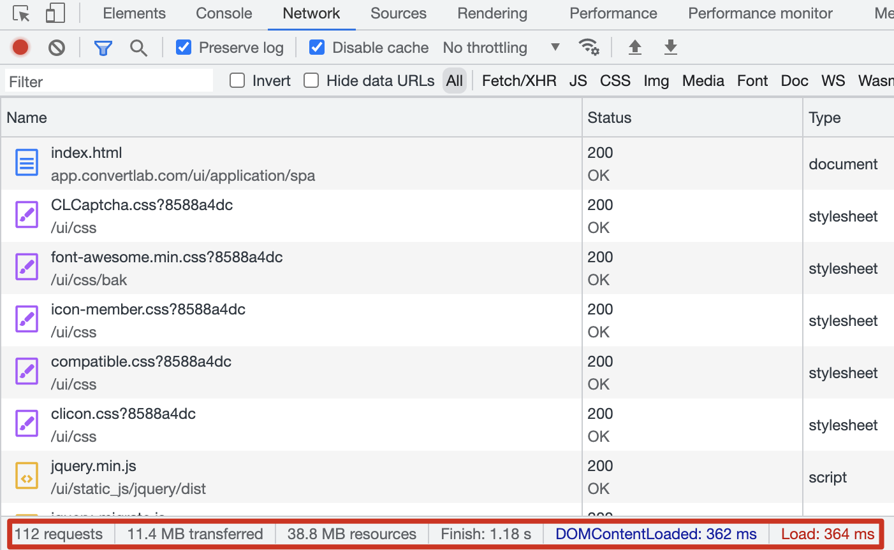
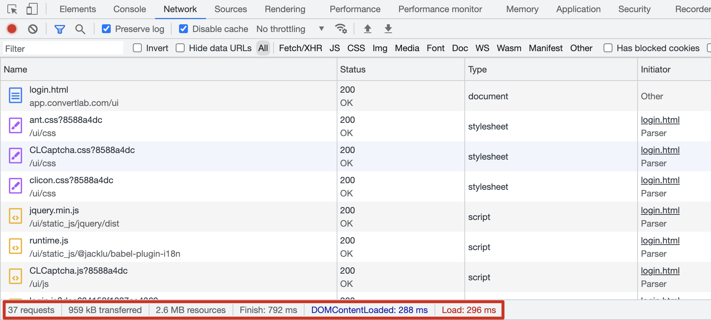
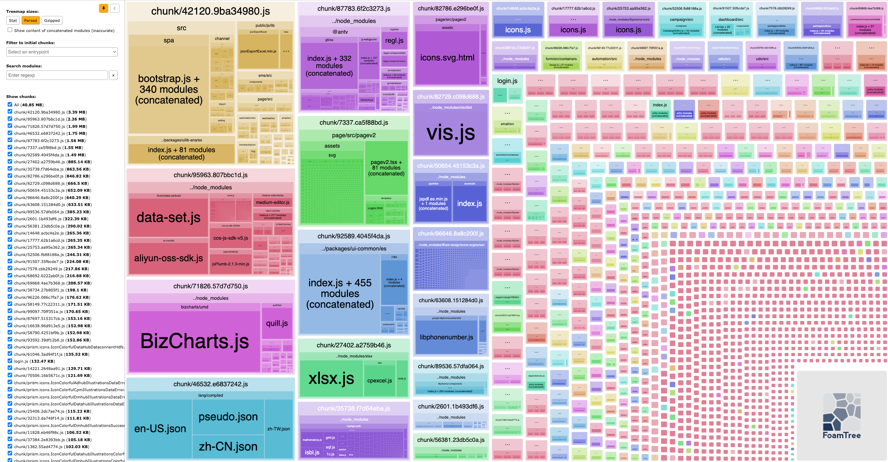
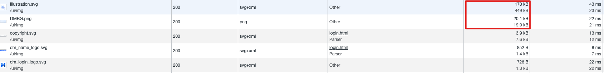
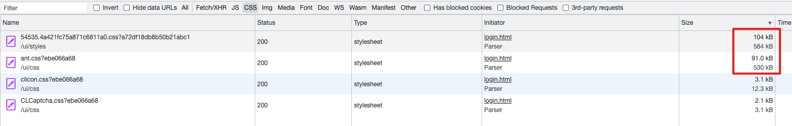

## webpack 性能优化

## 1. 主要问题

现在的系统主要存在以下几点比较明显的问题：

- 页面重定向逻辑有误
- 页面加载缓慢
- 项目启动慢，构建时间较长
- 打包产物过大

## 2. 问题分析

以下问题的分析基于 master 环境 https://master-app.dmhub.cn/ ，即当前的 2.9 版本。

### 2.1 页面重定向逻辑有误

当在浏览器中访问系统内任意一页面，后台服务会进行当前用户 session 是否过期的判断：

如果**登录未过期**，会直接加载当前页面。

如果**登录过期**，以 https://master-app.dmhub.cn/ui/application/spa/index.html#/home 为例，首先会加载当前 html 内的相关资源，当页面被加载到某一阶段，开始请求接口时，这时服务会判断该用户登录过期，然后把页面重定向到 https://master-app.dmhub.cn/ui/login.html 登录页面，这时才开始进行登录页的资源的加载渲染，让用户重新登录。

> 109 requests	8.4 MB transferred	21.4 MB resources



如果直接加载 login.html 的资源请求如下：

> 19 requests	1.2 MB transferred	1.6 MB resources



由此可看出，前后资源加载的差异，所以用户会感到这个过程非常的的缓慢。


### 2.2 页面加载缓慢

以首页 https://master-app.dmhub.cn/ui/application/spa/index.html#/home 为例，并禁用缓存：

当进入系统首页或者进行页面的刷新，会明显感觉到白屏时间比较长，页面加载缓慢。

#### 2.2.1 资源加载分析

以首页为例，网络正常，服务返回正常的情况下：

> 155 requests	10.9 MB transferred	23.8 MB resources	Finish: 9.54 s	DOMContentLoaded: 1.22 s	Load: 5.21 s

- 接口请求数：65 个，传输 104 KB
- JS 请求数：71 个，传输 6.2 MB（Gzip，原 17.9 MB）
- CSS 请求数：13 个，传输 244 KB（Gzip，原 1.2 MB）
- 字体数：1 个，传输 4.3 MB

由此可以看出，主要是 JS 文件和 Font 比较的大，多个 JS 文件均超过 1MB，最大 3MB。其次 Chrome 浏览器在同一域名下的最大并发连接数是 6 个，过多的资源请求，也会导致资源加载缓慢。最后就是存在大量接口的重复请求。

#### 2.2.2 打包产物分析

通过 `webpack-bundle-analyzer` 对打包产物进行分析，如下图：



通过上图可以看出，bundles 文件共计 40 MB，并且有部分较大的依赖会被打包进去，如果结合代码进行分析的话，会发现有一部分已经废弃但是仍然被打包了进去。另外较大的依赖应该移出单独生成。所以可以根据此图，针对性的进行调整。

#### 2.2.3 分析总结

- **资源请求数过多**，导致大量请求等待，需要进行打包优化，减少资源较小的 JS 单独打包完一个文件（包括 SVG Icons）
- **JS 打包资源过大**，部分单一 JS 文件过大，加载时间长，可能存在很多非必要的加载和重复的打包，需要进行打包优化个 chunks 分包
- **Font 文件过大**，中文字体本身都比较大，如果考虑缓存的话可以忽略，否则需要考虑优化
- **重复的接口请求**，优化代码逻辑，同一接口及相同参数不应该被重复的请求多次
- **无效资源文件请求，有部分静态资源文件，或者依赖包已经不再使用，需要结合代码进行清除

### 2.3 构建时间长

项目启动慢，主要有以下原因：

- webpack 打包器需要进行相关配置的优化
  - 减少非必要的入口文件
  - 减少非必要的 babel 插件配置
  - 减少 webpck 插件，针对开发与生产不同的环境配置对应的插件
  - 使用最新版本的 webpack 与 node
  - 优化其他 webpack 配置
  - 开启缓存（开发环境）
- babel 转译器较慢，可以考虑使用 swc 替换优化

### 2.4 打包产物大

最近进行微前端改造，把一个模块改造成微应用，这个模块的代码量本身不大，大概只有 160 KB，但是打包出来的产品有 20MB +。

- 基础库开启 tree sharking，如果 package.json 未配置 sideEffect: false，打包工具不会进行 tree sharking
- MF 的 Shared 关闭，被 MF Shared 的组件库，不会被 tree sharking
- 调整使用 import * 的地方，被 import * 的组件库，然后动态使用，也不会被 tree sharking

## 3. 具体优化

### 3.1 登录页

#### 3.1.1 服务端重定向逻辑优化

从上述请求方式可以看出，直接访问登录页比访问其他路径跳转登录页的资源大小要少近 10 MB，这个在慢网情况下加载时长会有很大的差异。

其主要原因是后端会先把请求重定向到 index.html，此时随着 index.html 文件的加载，会下载大量的资源。当加载完成开始进行请求的接口，此时后端会判断用户未登录，再次被重定向到登录页。

解决方法就是需要后端先判断当前用户是否已登录，如果未登录，直接重定向到登录页，否则继续请求当前页面。

#### 3.1.2 资源请求优化

##### 3.1.2.1 图片

图片资源中存在一个较大的背景图，Gzip 压缩后仍有 170 KB 的大小



##### 3.1.2.2 样式

通过下面逐步分析各个样式文件：

- **ant.css（91.0 KB/530 KB）**，通过代码分析，及 Blocked ant.css 文件，发现对页面无任何影响，即根本未引用到 ant.css 中的样式，可以直接删除；
- **ui-components css（104 KB/584 KB）**，本质上登录页只用到了这个文件中的几个 CSS 变量，但是却将整个文件引入进来，造成了资源请求浪费，可以针对该文件进行优化，剔除无效内容。
- **clion.css（12.3 KB/3.1 KB）**，字体图标库，已经不再使用，可以直接删除。




### 3.2 Webpack

优化前构建时长：280123 ms		优化后构建时长：167610 ms

优化前 chunk 总大小：39M				 优化后 chunk 总大小：

优化前最大 chunk 大小：19.2M				 优化后 chunk 总大小：

#### 3.2.1 减少入口文件 entry

由之前的 9 个入口减少到 6 个入口

##### 3.2.1.1 public 文件夹下的静态资源打包

优化之前，public 下所以的静态资源统一作为一个单独的入口进行打包

优化之后，使用 copy-webpack-plugin 拷贝到输出目录下，不作为一个独立的打包入口

##### 3.2.1.2 i18n.js

优化之前，i18n.js 作为一个单独的入口文件进行打包

优化之后，将 i18n.js 拷贝到 public 下，不作为一个打包入口

##### 3.2.1.3 删除/合并 compileMap.js 中不再使用的入口文件

1. WeChat/transfer 不再使用，删除
2. 合并首页 -> spa 同一个路由下（待定）
3. 移动 login.js 和 login.html 到 public 下，不作为打包入口（待定）
4. 合并 invitation、invitationV2 到 spa 路由下，不作为打包入口（待定）
5. 删除 dependencies 入口，都通过 webpack 打包和 tree shaking


#### 3.2.2 减少 webpack 的 plugin 和 loader


#### 3.2.3 更新 webpack 及 node 到最新版本

避免使用生产/开发环境下才需要用的工具，用到了其他环境


#### 3.2.4 优化 webpack 配置项

##### 3.2.4.1 outpu.pathinfo 设置 false

##### 3.2.4.2 resolve.extensions 配置

当模块导入语句未携带文件后缀时，如 `import './a'` ，Webpack 会遍历 `resolve.extensions` 项定义的后缀名列表，尝试在 `'./a'` 路径追加后缀名，搜索对应物理文件。

在 Webpack 5 中，`resolve.extensions` 默认值为 `['.js', '.json', '.wasm']` ，这意味着 Webpack 在针对不带后缀名的引入语句时可能需要执行三次判断逻辑才能完成文件搜索，针对这种情况，可行的优化措施包括：

- 调整顺序，频率出现最高的文件后缀要优先放在最前面，以做到尽快的退出寻找过程
- 后缀尝试列表要尽可能的小，不要把项目中不可能存在的情况写到后缀尝试列表中

- 修改 `resolve.extensions` 配置项，减少匹配次数

- 代码中尽量补齐文件后缀名，比如 data.json 类似的文件，都补齐 .json 后缀名
- 设置 `resolve.enforceExtension = true` ，强制要求开发者提供明确的模块后缀名，这种做法侵入性太强，不太推荐

##### 3.2.4.3 resolve.modules 配置

当 Webpack 遇到 `import 'lodash'` 这样的 npm 包导入语句时，会尝试先当前项目的 `node_modules` 搜索资源，如果找不到则按目录层级尝试逐级向上查找 `node_modules` 目录，如果依然找不到则最终尝试在全局 `node_modules` 中搜索。

在一个依赖管理执行的比较良好的业务系统中，我们通常会尽量保持 `node_modules` 资源的高度内聚，控制在有限的一两个层级上，因此 Webpack 这一逐层查找的逻辑大多数情况下实用性并不高，开发者可以通过修改 `resolve.modules` 配置项，主动关闭逐层搜索功能。

##### 3.2.4.4 resolve.mainFiles 配置

与 `resolve.extensions` 类似，`resolve.mainFiles` 配置项用于定义文件夹默认文件名，例如对于 `import './dir'` 请求，假设 `resolve.mainFiles = ['index', 'home']` ，Webpack 会按依次测试 `./dir/index` 与 `./dir/home` 文件是否存在。

因此，实际项目中应控制 `resolve.mainFiles` 数组数量，减少匹配次数。

##### 3.2.4.5 noParse 跳过文件编译

有不少 npm 包默认提供了提前打包好，不需要做二次编译的资源版本，例如：

- Vue 包的 `node_modules/vue/dist/vue.runtime.esm.js` 文件
- React 包的 `node_modules/react/umd/react.production.min.js` 文件

对使用方来说，这些资源版本都是高度独立、内聚的代码片段，没必要重复做依赖解析、代码转译操作，此时可以使用 `module.noParse` 配置项跳过这些 npm 包，例如：

```js
// webpack.config.js
module.exports = {
  //...
  module: {
    noParse: /vue|lodash|react/,
  },
};
```

配置该属性后，任何匹配该选项的包都会跳过耗时的分析过程，直接打包进 chunk，提升编译速度。

##### 3.2.4.6 最小化 Loader 作用范围

Loader 组件用于将各式文件资源转换为可被 JavaScript 理解、运行的代码片段，正是这一特性支撑起 Webpack 强大的资源处理能力。不过，Loader 在执行内容转换的过程可能需要做大量的 CPU 运算操作，例如 babel-loader、eslint-loader、vue-loader 等，因此开发者有必要根据实际需求，通过 `module.rules.include`、`module.rules.exclude` 等配置项限定 Loader 的执行范围，例如：

```js
// webpack.config.js
module.exports = {
    // ...
    module: {
        rules: [{
            test: /\.js$/,
            exclude: /node_modules/,
            // include: path.join(__dirname, './src'),
            use: ['babel-loader', 'eslint-loader']
        }]
    }
};
```

示例配置 `exclude: /node_modules/` 属性后，Webpack 在处理 `node_modules` 中的 js 文件时会直接跳过这个 `rule` 项，不会为这些文件执行后续的 Loader。

##### 3.2.4.7 最小化 watch 监控范围

在 watch 模式下(通过 `npx webpack --watch` 命令启动)，Webpack 会持续监听项目所有代码文件，发生变化时重新构建最新产物。不过，通常情况下前端项目中某些资源并不会频繁更新，例如 `node_modules` ，此时可以设置 `watchOptions.ignored` 属性忽略这些文件，例如：

```js
// webpack.config.js
module.exports = {
  //...
  watchOptions: {
    ignored: /node_modules/
  },
};
```

##### 3.2.4.8 跳过 TS 类型检查

JavaScript 本身是一门弱类型语言，这在多人协作项目中经常会引起一些不必要的类型错误，影响开发效率。随前端能力与职能范围的不断扩展，前端项目的复杂性与协作难度也在不断上升，TypeScript 所提供的静态类型检查能力也就被越来越多人所采纳。

不过，类型检查涉及 AST 解析、遍历以及其它非常消耗 CPU 的操作，会给工程化流程引入性能负担，必要时开发者可选择关闭编译主进程中的类型检查功能，同步用 `fork-ts-checker-webpack-plugin` 插件将其剥离到单独进程执行，例如对于 `ts-loader`：

```js
const ForkTsCheckerWebpackPlugin = require('fork-ts-checker-webpack-plugin');

module.exports = {
  // ...
  module: {
    rules: [{
      test: /\.ts$/,
      use: [
        {
          loader: 'ts-loader',
          options: {
            transpileOnly: true
          }
        }
      ],
    }, ],
  },
  plugins:[
    new ForkTsCheckerWebpackPlugin()
  ]
};
```

##### 3.2.4.9 慎用 source-map

`source-map` 是一种将经过编译、压缩、混淆的代码代码映射回源码的技术，它能够帮助开发者迅速定位到更有意义、更结构化的源码中，方便调试。不过，同样的 `source-map` 操作本身也有很大性能开销，建议读者根据实际场景慎重选择最合适的 `source-map` 方案。

针对 `source-map` 功能，Webpack 提供了 `devtool` 选项，可以配置 `eval`、`source-map`、`cheap-source-map` 等值，不考虑其它因素的情况下，最佳实践：

- 开发环境使用 `eval` ，确保最佳编译速度
- 生产环境使用 `source-map`，获取最高质量

##### 3.2.4.10 module.rules.oneof 优化 loader 匹配

#### 3.2.5 删除非必要的 babel 插件

- @jacklu/i18n，项目中暂时未找到改插件🚗
- @babel/plugin-proposal-nullish-coalescing-operator，@babel/preset-env 已经包含，需要配置该插件🚗
- react-dev-inspector/plugins/babel，暂时先给删除🚗

### 3.3 删减 package 包

#### 3.3.1 `externals` 配置替换为 `splitChunks.cacheGroups`

> `externals` 是防止将某些 `import` 的包(package)打包到 bundle 中，而是在运行时(runtime)再去从外部获取这些*扩展依赖(external dependencies)*。主要是用于开发 `library` 。

在 DM Hub UI 中，会把所有不需要打包到 bundle 中的包全部都先 `externals` 中，然后把这些包的代码引入到 html 中，这样会导致在加载该 HTML 页面的时候，会把这些 JS 文件全部都下载到浏览器中，实际情况中某些路由并不需要这些 JS，反而全部都加载了。这样主要会造成首次加载页面的时长变多。

> `splitChunks.cacheGroups` 可以根据匹配条件及规则，把某些包单独打包成一个 chunk 文件，这些 chunks 文件不会随 html 立即被下载，而是在需要的路由页面动态的去加载。

通过 `splitChunks.cacheGroups` 可以减少首次加载非必要的 js 文件的下载，从而提升页面的加载速度。当然并不是所有的依赖包都需要被单独打包成 chunk，可以设定包的大小进行匹配，或者通过 https://bundlephobia.com/ 查询依赖的大小进行配置，下面是一些需要配置的包：

- bizcharts，Minified 1.6 MB，Minified + Gzipped 420.9 KB
- echarts，Minified 1 MB，Minified + Gzipped 324.6 KB
- xlsx，Minified 412 KB，Minified + Gzipped 135.5 KB
- @antv/g2，Minified 646 KB，Minified + Gzipped 174.9 KB
- moment，Minified 290.4 KB，Minified + Gzipped 72.1 KB
- ahooks，Minified 172.5 KB，Minified + Gzipped 54.8 KB


#### 3.3.2 删除无用的依赖包

- `ali-oss`，代码中有导入，但是实际方法未被引用，可以删除，大小 512.94 KB
- `react-router`，现在已经全部替换为 `react-router-dom` 了，所以此包可以移除
- finally-pllyfill，浏览器已经支持 Promise.prototype.finally，所以无需安装此包

