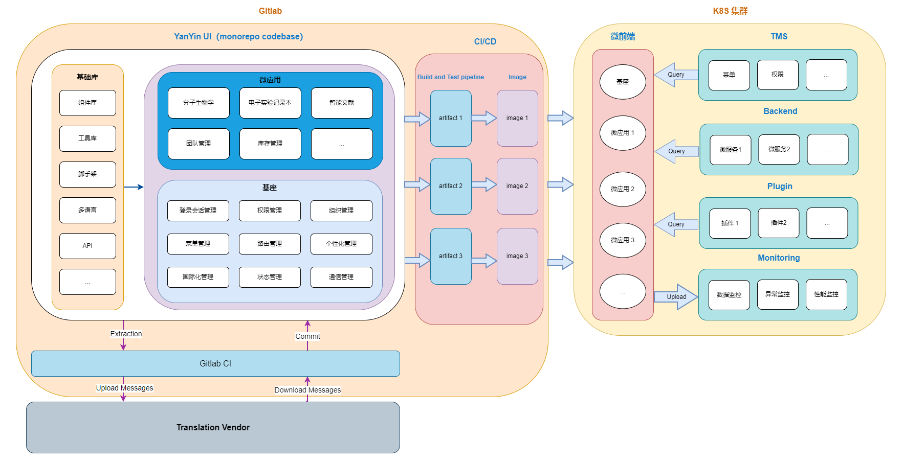
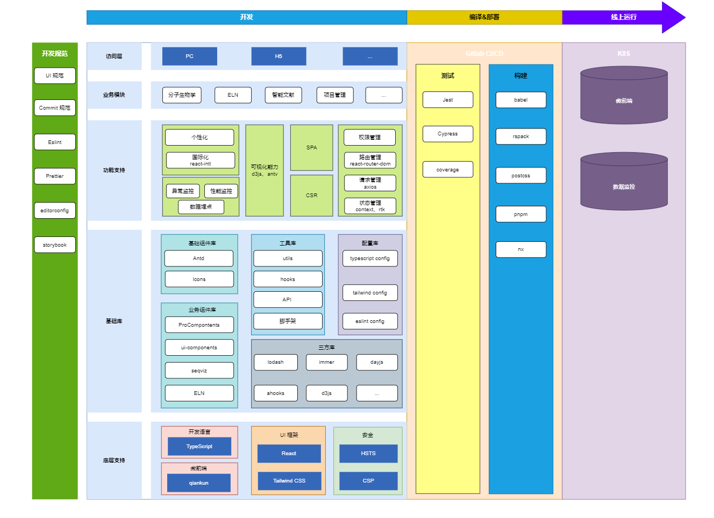

# 前端技术调研与架构设计

## 1. 需求收集

### 1.1 业务需求

1. 各模块可以独立发布
2. 支持插件机制，加载远程模块
3. 兼顾运维的便利性和开发的效率
4. 前端监控与数据埋点
5. 搜索功能

### 1.2 系统设计需求

1. 前后端分离 & 微前端 & 单页应用；服务端渲染？（NextJS、Remix）
2. 支持个性化定制，包括 主题（颜色、尺寸、风格）、logo、页面布局、深色模式、色弱模式 等
3. 支持多语言与国际化（翻译系统）
4. 支持多端的布局显示（PC 端、移动端）
5. 兼容现代主流浏览器
6. 组件库、图标库等的设计与管理，组件说明文档
7. 路由管理、状态管理
8. API 管理，Swagger API 管理工具以及 Mock Server，axios 封装
9. 代码规范，js、css、commit
10. 代码质量，e2e 测试、单元测试、coverage
11. CI/CD 流程（版本发布、安全检查）

### 1.3 面向未来需求

1. 业务功能增多、代码量变大，页面的加载速度与开发效率不受影响（项目的构建时间、代码分包与缓存；工具转换：vite、rspack、snowpack、turbopack，pnpm，bun）
2. 功能模块、组件库增多，哪种代码管理模式更能提升开发效率（monorepo，turbo，lerna、nx）
3. 可视化页面保持高性能渲染，支持快捷键（d3js）

## 2. 架构设计分析

针对上述需求，进行如下分析。

### 2.1 系统结构

微前端是一种类似于微服务的架构，是一种由独立交付的多个前端应用组成整体的架构风格，将前端应用分解成一些更小、更简单的能够独立开发、部署、交付的应用，而在用户看来仍然是内聚的单个产品。通过使用微前端进行模块的独立发布，插件的动态加载，是非常契合业务需求的架构，所以基于 `基座管理` + `子应用分治` 的微前端方案是一种比较自然的选择。

通过后台管理系统中注册应用或插件，运行时基座将会获取注册的列表信息，再通过基座来动态控制子应用的渲染和销毁，并提供集中式的模式来完成应用间的通信和应用的公共依赖管理。

### 2.2 开发效率与体验

为了兼顾运维便利性和开发效率，可采用 monorepo 的代码管理模式。通过将所有模块的代码存储在同一个代码仓库中，同时使用工具如 Turbo、nx 或 lerna 可以简化 monorepo 的管理和构建过程，提高开发效率。这种代码管理模式主要有以下好处：

1. 统一代码规范与质量标准
2. 更方便地进行代码共享和团队协作
3. 更方便的依赖库代码调试
4. 更简单的依赖关系管理，所有模块都托管在同一个存储库中，减少版本冲突，没有依赖地狱

另外前端构建工具这块，webpack 构建速度较慢，尤其是比较大的项目要启动很久，而前端生态中已经新出了很多优秀的构建工具，比如 vite、turbopack、rspack、snowpack 等。

### 2.3 前端监控

前端监控一般分为三大类，数据监控（用户行为）、异常监控、性能监控。

可以使用工具如 Sentry、Bugsnag 或 Raygun 来监控前端应用的错误和性能问题。同时，可以使用工具如 Google Analytics、Mixpanel 或自定义埋点方案来收集用户行为数据和业务指标。

#### 2.3.1 数据监控

- PV/UV: PV(page view)：即页面浏览量或点击量；UV：指访问某个站点或点击某条新闻的不同 IP 地址的人数
- 用户在每一个页面的停留时间
- 用户通过什么入口来访问该网页
- 用户在相应的页面中触发的行为等

通过统计数据，可以知道用户在每一个页面停留的时间，某些功能的使用次数。然后分析这些数据，可以对某些功能进行针对性的设计与增强。

#### 2.3.2 性能监控

- 不同用户，不同机型和不同系统下的首屏加载时间
- 白屏时间
- http 等请求的响应时间
- 静态资源整体下载时间
- 页面渲染时间
- 页面交互动画完成时间等

这些性能监控的结果，可以展示前端性能的好坏，根据性能监测的结果可以进一步的去优化前端性能，尽可能的提高用户体验。

#### 2.3.3 异常监控

- Javascript 的异常监控
- 样式丢失的异常监控

及时的上报异常情况，可以避免线上故障的发上。

### 2.4 系统搜索

系统内搜索，由于 ELN 数据都是存储数据库中的，需要后端实现搜索功能 Elasticsearch ；对于帮助中心，文档存储在代码库中，前端通过 Astro + Algolia 实现。

### 2.5 代码质量

对于代码质量的管理，主要措施是采用 TypeScript 语言进行开发，同时配合 huksy + lint-staged 避免开发人员将静态类型检查出来的错误提交上去，可以减少一定的错误隐患。同时增加 eslint 与 prettier 的检查，强制规范代码。

另外就是针对函数要求使用 jest 编写单元测试，针对 UI 组件使用 cypress 编写 e2e 测试用例。

### 2.6 国际化与个性化定制

 个性化主要包括主题（颜色、尺寸、风格）、logo、页面布局、深色模式、色弱模式，Antd 5 + ProComponents UI 组件库可完美的实现这些功能，配合 tailwind css，可以大大减少很多的工作量，同时这些库支持响应式设计，只需要开发针对性的调整即可。

国际化可以采用 react-intl 方案，支持 react 组件，而且 antd 现在使用的也是这个国际化方案，后续可以考虑结合 CI 与翻译系统，实现从开发到翻译的整个流程。

通过微前端架构管理应用模块，主应用+多个子应用，实现独立开发、部署、升级；

通过 monorepo 重新组织现有的 DM Hub 前端项目，统一代码风格、质量标准、部署发布流程，提升开发效率；

通过 pnpm 包管理工具的 Workspce 管理各个项目，缓存机制提升构建速度，统一依赖管理；

通过 NX 工具，缓存命令执行结果、本地任务编排、依赖可视化、仅对受影响的项目重新构建发布，提升构建速度和开发体验；

设计原则：平台化、演进式、持续性；降本增效、产品质量、用户体验。

微前端是一种类似于微服务的架构，是一种由独立交付的多个前端应用组成整体的架构风格，将前端应用分解成一些更小、更简单的能够独立开发、部署、交付的应用，而在用户看来仍然是内聚的单个产品。通过使用微前端进行模块的独立发布，插件的动态加载，是非常契合业务需求的架构，所以基于 基座管理 + 子应用分治 的微前端方案是一种比较自然的选择。

通过后台管理系统中注册应用或插件，运行时基座将会获取注册的列表信息，再通过基座来动态控制子应用的渲染和销毁，并提供集中式的模式来完成应用间的通信和应用的公共依赖管理。

------

为了兼顾运维便利性和开发效率，可采用 monorepo 的代码管理模式。通过将所有模块的代码存储在同一个代码仓库中，同时使用工具如 Turbo、nx 或 lerna 可以简化 monorepo 的管理和构建过程，提高开发效率。这种代码管理模式主要有以下好处：

1. 统一代码规范与质量标准
2. 更方便地进行代码共享和团队协作
3. 更方便的依赖库代码调试
4. 更简单的依赖关系管理，所有模块都托管在同一个存储库中，减少版本冲突，没有依赖地狱

另外前端构建工具这块，webpack 构建速度较慢，尤其是比较大的项目要启动很久，而前端生态中已经新出了很多优秀的构建工具，比如 vite、turbopack、rspack、snowpack 等。

------

前端监控一般分为三大类，数据监控（用户行为）、异常监控、性能监控。

可以使用工具如 Sentry、Bugsnag 或 Raygun 来监控前端应用的错误和性能问题。同时，可以使用工具如 Google Analytics、Mixpanel 或自定义埋点方案来收集用户行为数据和业务指标。

------

对于搜索功能，系统内搜索，由于 ELN 数据都是存储数据库中的，需要后端实现搜索功能 Elasticsearch ；对于帮助中心，文档存储在代码库中，前端通过 Astro + Algolia 实现。

------

对于代码质量的管理，主要措施是采用 TypeScript 语言进行开发，同时配合 huksy + lint-staged 避免开发人员将静态类型检查出来的错误提交上去，可以减少一定的错误隐患。同时增加 eslint 与 prettier 的检查，强制规范代码。

另外就是针对函数要求使用 jest 编写单元测试，针对 UI 组件使用 cypress 编写 e2e 测试用例。

------

个性化主要包括主题（颜色、尺寸、风格）、logo、页面布局、深色模式、色弱模式。由于团队本身对 React 框架比较熟悉，同时 Antd 5 + ProComponents UI React 组件库可完美的实现这些功能，配合 tailwind css，可以大大减少很多的工作量，提升开发效率及开发质量，同时这些库支持响应式设计，只需要开发针对性的调整即可。

------

国际化可以采用 react-intl 方案，支持 react 组件，而且 antd 现在使用的也是这个国际化方案，后续可以考虑结合 CI 与翻译系统，实现从开发到翻译的整个流程。

## 3. 技术选型

|              | **技术框架**                                                 | **说明**                                                     |
| :----------- | :----------------------------------------------------------- | :----------------------------------------------------------- |
| 开发语言     | TypeScript 5.0+                                              | 相对于 JavaScript，静态类型检查，提升代码可靠性、可读性、可维护性 |
| UI 框架      | React 18                                                     | 团队对此框架的技术栈比较熟悉                                 |
| UI 组件库    | Antd 5 + ProComponents                                       | 团队对其使用比较熟悉，用户多、功能强大、稳定更新             |
| CSS 框架     | Tailwind CSS                                                 | 提升开发效率、提升渲染性能、可定制、响应式设计、学习成本低、避免样式冲突 |
| 可视化工具   | d3js、antv                                                   | d3js 可操作最基本的图元，用于绘制一些定制化的需求；antv 可用于绘制一些常用的图表 |
| 路由管理     | react-router-dom 6+                                          |                                                              |
| 数据请求     | axios                                                        |                                                              |
| 日期格式化   | dayjs                                                        |                                                              |
| Hooks 库     | ahooks                                                       |                                                              |
| 单元测试     | jest                                                         |                                                              |
| e2e测试      | cypress                                                      |                                                              |
| 微前端框架   | MF / qiankun                                                 |                                                              |
| 代码管理模式 | monorepo，turbo / nx / lerna                                 |                                                              |
| 包管理器     | pnpm / yarn / bun                                            |                                                              |
| 打包工具     | webpack / vite / turbopack / bun                             |                                                              |
| 代码规范     | EditorConfig、prettier、eslint、commitlint、husky、lint-staged |                                                              |
| 其他         | lodash、immer                                                |                                                              |

## 4. 实施计划

### 4.1 技术准备

这个阶段，技术第一，业务第二。主要需要完成 3 个任务：

- 架构设计
  - 架构设计文档，技术栈选型
  - 架构图设计，包括系统架构图、技术架构图
- 概念验证(PoC)：快速搭建与业务无关的示例代码，验证架构可行
  - 搭建项目，制定代码结构
  - 接入相关技术栈
- 迭代 0：搭建完整环境，更细粒度的技，术选型，代码库/CI/CD
  - 代码提交规范
  - 代码风格制定，代码质量检查规则
  - 代码测试策略制定，选定测试框架，创建测试规则；单元测试、组件测试、接口测试、E2E 测试
  - 完成 tsconfig、taildwind config 基础库的建设（API 库）
  - 迁入模块功能，能够正常启动与构建
  - 配置 GItlab CI/CD，正常部署到阿里云 K8S

### 4.2 业务回补

业务开发过程正常，开始追回之前的业务累积，对应第一次业务的 DDL。这一阶段意味着技术上可能存在的调整有：

- 根据 UI 规范，进行基础组件库的建设
- 搭建脚手架工具，提升开发效率，能够快速搭建新的业务模块 / 组件
- 根据实际开发情况，调整代码规范
- API 文档管理，Mock Server，前端监控
- 测试策略调整，调低覆盖率，之后补回，加快开发速度
- 验证部署
- 提升团队能力：技术分享/WorkShop/结对编程/对外输出

### 4.3 成长优化

建立多次上线（大概在场景三上线后），业务开发流程相对固定，开始偿还技术债务：代码质量/测试覆盖率/依赖问题。

## 5. 技术风险

能否在保证用户体验与系统性能的前提下，满足未来的一些需求。

如何避免开发无限制的引入第三方库。