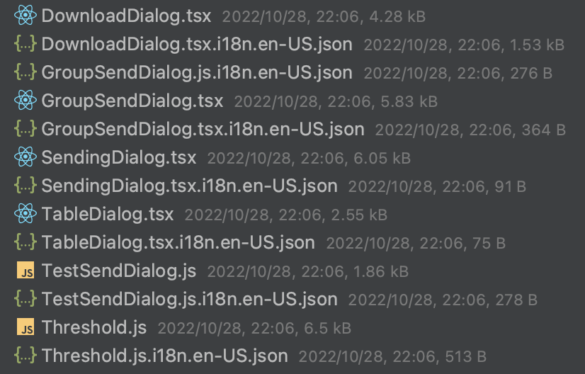

# 国际化方案调研

## 名词释义

### i18n

i18n（其来源是英文单词 internationalization的首末字符i和n，18为中间的字符数）是“国际化”的简称。

涵盖范围：

**语言**

- [电子文件](https://baike.baidu.com/item/电子文件?fromModule=lemma_inlink)

- 字母。目前大部分的系统都采用统一码为标准来解决[字符编码](https://baike.baidu.com/item/字符编码?fromModule=lemma_inlink)。
- 不同的数字命名系统。
- 书写方向。譬如德语是从左到右，而波斯语、希伯来语和阿拉伯语是由右到左。
- 相同语言在不同地区的拼法差异，如美国英语、加拿大英语使用localization，而英国英语和澳大利亚英语使用localisation。
- 文件处理上的差异，如某些文字存在大小写，其它则否。字母顺序。

- 文字的图像表示（列印物、内含线上图片）。
- 读法（音频）
- 视频的字幕

**文化**

- 图片和颜色：这牵涉到理解和文化适宜的议题。
- 名字和称谓
- 政府给定的编码（如美国的社会安全码，英国的National Insurance number，爱沙尼亚的Isikukood及其它各国的身份证号码）和护照
- 电话号码、地址和国际邮递区号
- 货币 （符号、货币标志的位置）
- 度量衡
- 纸张大小

**书写习惯**

- 日期跟时间的格式，包含各式日历。
- 时区（在国际场合会使用世界标准时间）
- 数字格式（小数点、分隔点的位置、分隔所用的[字符](https://baike.baidu.com/item/字符?fromModule=lemma_inlink)）


除了i18n，L10n（localization），g11n（globalization），还有m17n（multilingualization），区别是：

**i18n**支持多种语言，但是同一时间只能是英文和一种选定的语言，例如英文+中文、英文+德文、英文+韩文等等；

**L10n**（localization），支持2种语言，英文和另外一种语言（例如中文）；

**g11n**（globalization），简单的理解可以认为g11n = i18n + L10n。

**m17n**（multilingualization）可以在同一时间支持多种语言，例如你可以在一个页面里看到中文、英文、德文和韩文。


### Unicode CLDR

Unicode Common Locale Data Repository (CLDR) ，Unicode 通用语言环境数据存储库。

该项目提供一些常见信息的标准化翻译，由Unicode Consortium非盈利组织提供的XML格式语言数据，主要用于机器使用，计算机操作系统涉及到的很多信息都包含在内。

主要包括：

- 语言名称的翻译
- 领土和国家名称的翻译
- 货币名称的翻译，包括单/复数
- 完整和缩写形式的工作日、月份、时代、时段的翻译
- 时区和示例城市（或类似城市）的时区翻译
- 日历字段的翻译
- 用于格式化/解析日期或一天中的时间的模式
- 用于编写语言的示例字符集
- 格式化/解析数字的模式
- 适应语言的排序规则
- 在传统数字系统中格式化数字的规则（例如罗马数字、亚美尼亚数字 …）
- 将数字拼写为单词的规则
- 脚本之间音译的规则，其中很多是基于BGN / PCGN罗马化的

```
字 - returns ['zh', 'ja', 'ko'] 
العربية - returns ['ar']
a - returns ['en', 'fr', 'de'] //and many more
й - returns ['ru', 'be', 'bg', 'uk']
```

参考文档：https://cldr.unicode.org/index


### ICU Message syntax

International Component for Unicode 简称 ICU， 是 IBM 与开源组织合作研究，基于 "IBM 公共许可证" 的用于支持软件国际化的开源项目。 ICU 实现了对数字、日期、货币等提供国际化支持。

**参数替换**

{key, type, format}

```
I have {numCats, number} cats.
```

**条件判断**

{key, select, matches}

```
{gender, select,
	male {He}
	female {She}
	other {Then}
} will respond shortly.
```

**复数格式**

{key, plural, matches}

```
Cart: {itemCount} {itemCount, plural,
    one {item}
    other {items}
}
You have {itemCount, plural,
    =0 {no items}
    one {1 item}
    other {{itemCount} items}
```

使用 # 格式化

```
You have {itemCount, plural,
    =0 {no items}
    one {# item}
    other {# items}
}.
```

**富文本**

```
Our price is <boldThis>{price, number, ::currency/USD precision-integer}</boldThis>
```

**转义**

```
"This is not an interpolation: '{word}"
→ "This is not an interpolation: {word}"

"'<notATag>"
→ "<notATag>"
```


参考文档：https://unicode-org.github.io/icu/userguide/format_parse/messages/


### ECMA-402

ECMAScript Internationalization API，该标准定义了 ECMAScript 对象的应用程序编程接口，这些对象支持需要适应不同人类语言和国家所使用的语言和文化约定的程序。

参考文档：https://www.ecma-international.org/publications-and-standards/standards/ecma-402/

## 1. 背景

### 1.1 DM Hub 2.7 及之前国际化方案

DM Hub 在 2.7 及之前的国际化主要形式是一个源文件对应一个语言翻译 JSON 文件，然后通过 Babel + Webpack 打包处理，将翻译内容注入到打包后的代码中，最后在运行时获取 LocalStorage 中的语言环境，展示对应的语言文本。



该方案有个比较明显的优势，就是对源代码无侵入，翻译文件和源码完全隔离，仅在打包时才会将翻译文件注入进去。

同时也有以下缺点：

- 方案源码后续维护困难

  国际化方案代码由个人开发，该方案交给后续开发人员需要花较多时间熟悉该方案逻辑，维护成本很高。

- 翻译文件维护成本高

  每当在源码文件中添加一段文字，都需要对应的生成一份翻译的内容，这样也可能会产生很多漏翻的文字。

- 拓展性差

  当需要新增一种新的语言翻译，（比如 pseudo），可能意味着再将每一文件再生成一份对应的语言翻译文件，这部分的工作量比较大，后续维护成本很高。

- 翻译供应商介入困难

  由于生成的翻译文件，非标准的可交付给翻译供应商的文件，文件内容无法提供语境上下文，并且文件繁多，也需要经过特殊处理。
  
- 打包体积大

  该方案会将所有的翻译文件打包到代码中，会大大增加打包体积。

- 缺少时区、货币单位、数字格式等解决方案


### 1.2 为何采用 `react-intl` 作为国际化解决方案？

- 专业的开源团队维护，与 ECMA-402、Unicode CLDR、ICU Message syntax 标准保持一致；
- 嵌套使用，兼容同时展示多种语言；
- 丰富的生态工具，命令行工具、一键提取、规则校验等；
- 支持组件内、外翻译定义；
- 维护成本低，拓展性强，并且可为翻译人员提供友好的翻译格式文件；

## 2. 产品国际化现状

DM Hub 采用了 `react-intl` 国际化方案，但是未能真正发挥其核心能力，导致现有的开发流程繁琐，维护成本增加、开发体验感很差。

### 2.1 开发翻译流程

1. 开发
2. 通过 VSCode  插件识别中文，并提取 key
3. 生成 i18n.ts、en.ts、zh.ts 文件
4. 导出 en.ts 文件进行翻译
5. 覆盖产品内的 en.ts 文件，完成翻译

当某个文本改变，或者 key 变化时：

1. 修改 i18n.ts 文件的 key 或 value
2. 修改 en.ts、zh.ts 的 key 或 value，同时重新翻译
3. 修改引用处的 key

### 2.2 方案缺陷

**从开发流程和开发体验的角度，该方案存在以下问题**：

#### 2.2.1 文本与代码分离

文本与代码分离是开发体验感最差的一部分，虽然有 VSCode 插件的提示，但是从阅读代码的体验上来看，仍然相差很多。而非 VSCode 编辑器，更是无法直观的获取其具体信息。

同时对于开发过程中，检索关键字查找代码所在处，也会增加很多环节：首先需要先找到文本对应的 key，再去查找 key 引用的地方，如果存在多处引用，需要进一步的进行判断具体是哪里使用，从一定程度上也增加了开发成本。

```tsx
<Button type="primary" onClick={this.toggleCollapsed}>
  {translate(I18n.customer.components.list.CollapsibleBoard.collapsed)}
</Button>
```

#### 2.2.2 复杂的 key 的提取

对于 key 的提取是增加开发工作量的主要一部分。由于文本与代码的隔离，所以语义化的 key 具有一定的意义。

但是语义化 key 的定义需要开发的思考和判断，并且要保证 key 值的唯一性。虽然 key 从命名规则上一定程度的减少了 key 的重复，但是仍然无法保证其唯一性，并且在同一文件中的定义存在相同的 key，也是需要考虑定义为其他不同的 key。

另外当前 key 的命名规则采用的是多级目录名称 + 文件名 + key 组合的方式，所以也导致的 key 特别的长，增加了阅读代码的复杂度。

```json
{
  'customer.components.list.CollapsibleBoard.collapsed': '收起侧栏'
}
```

#### 2.2.3 重复性的翻译文本

对于大型的项目，尤其是 monorepo，一定意味着会有很多重复性的文本。虽然已经提取出来了很多重复的公共翻译，但是仍然避免不了会有重复翻译的出现，并且在后续会越来越多。

#### 2.2.4 繁琐的修改流程

如果一个 key 不小心拼写错误，那么需要修改至少四处文件，改动特别复杂，并且很容易出错，导致程序报错。

如果一个 value 需要进行改动，也需要修改至少三处文件，并且需要重新翻译，改动同样很复杂。

另外还需要注意的是，对于 key 和 value 的修改，还需要考虑其所有引用的地方是否有影响，这个动作风险很大。

#### 2.2.5 缺少强制翻译校验规则

开发过程中难免会漏翻，测试更不可能覆盖到所有地方都能保证正常的翻译。VS Code 插件虽然有翻译提示，但无法做到强制提醒

#### 2.2.6 插件维护成本高，无法跨编辑器使用

VS Code 插件虽然一定程度上帮助开发人员减轻了工作量，但是对于项目的持续重构，或者说使用其他的编辑器，这些功能就会全部失效。然后就需要调整插件，增加了很多额外的工作量。

#### 2.2.7 缺少日期、数字等国际化方案

国际化不仅意味着对文本的翻译，同时也要考虑到一开始提到的 i18n 名称释义中的涵盖范围，为标准化的国际化方案打下基础。

#### 2.2.8 MonoRepo 开发模式不友好

对于 MonoRepo 的项目，存在着很多依赖包，甚至于很多的产品应用。如果每一个地方都有一份 i18n 的配置，或者说翻译文件，代码会显得特别的冗余，并且对将来可能出现的代码拆分增加额外的工作量。

## 3. 优化方案

### 3.1 优化后流程

优化后的流程中，开发仅需和以往保持一致的开发流程即可，其他环节无需参与，可大大减轻工作量。

开发 -> 规则校验 -> CI 提取 -> 翻译

### 3.2 具体实施

针对当前国际化方案的缺陷，下面将一一的进行优化

#### 3.2.1 内联文本

内联文本表示代码和文本写在一起，这样可以让代码的逻辑变得更加的清晰，更易读懂代码，也大大提升了开发体验。

**组件内：**

```diff
- import { I18n, translate } from 'i18n';
+ import { FormattedMessage } from 'react-intl';

- <Button type="primary" onClick={this.toggleCollapsed}>
-   {translate(I18n.customer.components.list.CollapsibleBoard.collapsed)}
- </Button>

+ <Button type="primary" onClick={this.toggleCollapsed}>
+   <FormattedMessage defaultMessage="收起侧边栏" />
+ </Button>
```

**组件外：**

```diff
- import { I18n, translate } from 'i18n';
+ import { defineMessage } from 'react-intl';

- const button = translate(I18n.customer.components.list.CollapsibleBoard.collapsed);
+ const button = defineMessage({ defaultMessage: '预定义' });
```

#### 3.2.2 省略 key 的定义与提取

安装 `babel-plugin-formatjs`，修改 babel 配置：

```diff
{
  "presets": ["@babel/preset-env", "@babel/preset-react", "@babel/preset-typescript"],
+   "plugins": [
+    [
+      "formatjs",
+      {
+        "idInterpolationPattern": "[sha512:contenthash:base64:6]",
+        "ast": true
+      }
+    ]
+  ]
}
```

通过 Babel 插件的转换，可以实现开发中无需进行 key 的定义，运行中自动补充 key。

同时对于 key 的生成可以实现自定义配置，一般采用 sha512 哈希算法生成，保证了 key 的唯一性。

#### 3.2.3 翻译的唯一性

通过 `sha512` 哈希算法，既可以保证 key 的唯一性，同时也保证了相同的文本必定会产生相同的加密字符串，这样也就意味着无论在代码的任何地方定义的问题，其最终对应的翻译的 key，一定都是一样的，也就保证了不会出现多余的重复的翻译。


#### 3.2.4 开发即翻译

在开发过程中，在所有翻译的地方都使用 `react-intl` 进行包装，即文本多了一层组件包裹，在后续的流程中，开发都无需参与，也就意味着开发的完成，也就是翻译的完成。

另外 key 全部交给 Babel 进行处理，也就不存在 key 的修改。而文本的修改也是直接对代码处进行调整即可，Babel 会自动生成新的 key，与以往的开发流程没有任何区别。

#### 3.2.6 Eslint 规则校验

安装 `eslint-plugin-formatjs`，修改 Eslint 配置：

```diff
- "plugins": ["react", "@typescript-eslint"],
- "rules": {}

+ "plugins": ["react", "@typescript-eslint", "formatjs"],
+ "rules": {
+		"formatjs/enforce-default-message": ["error", "literal"],
+   "formatjs/enforce-placeholders": ["error"],
+   "formatjs/no-offset": "error",
+   "formatjs/no-literal-string-in-jsx": [
+     "error",
+     {
+       "props": {
+         "include": [["*", "message"]]
+       }
+     }
+   ]
+ }
```

通过该规则一是可以提示到开发哪里需要进行翻译，另外可以配合 husky 实现强制校验，不翻译不允许提交代码。

#### 3.2.7 内置 CLI，配合 CI，实现零插件维护

结合以上的翻译流程，几乎不再需要 VS Code 插件的辅助。另外配置 CI，实现自动化的 key 的提取。

安装 `@formatjs/cli`，增加如下命令：

```json
{
  "scripts": {
    "extract": "formatjs extract 'src/**/*.ts*' --out-file lang/dev.json --format scripts/formatter.js",
    "compile": "formatjs compile lang/dev.json --out-file lang/zh-CN.json --format scripts/formatter.js",
    "compile:pseudo": "formatjs compile lang/dev.json --out-file lang/pseudo.json --format scripts/pseudo.js"
  }
}
```

#### 3.2.8 支持日期、数字等国际化解决方案

```tsx
import { FormattedDate, FormattedTime, FormattedNumber } from 'react-intl';

<FormattedNumber value={10000} />
<FormattedDate value={new Date()} />
<FormattedTime value={new Date()} />
```

### 3.3 翻译文件的替换方案

#### 3.3.1 已翻译文件

因为现有的已翻译文件，统一都是通过 `translate` 函数进行翻译，所以具有一定的规则，可以通过正则匹配的方式进行统一的替换。

#### 3.3.2 未翻译文件

使用编辑器的替换功能，进行正则匹配替换。

## 4. 具体调整

### 4.1 基本原则

- 翻译的文本一定是需要显示在页面上的文字，如果不会显示在页面上，那么就不需要翻译；

- 显示在页面上的文字一定是被 React 组件 `render` 的，如果不会被 React 组件用到，那么也不需要翻译；

- `defineMessage` 和 `FormattedMessage` 在组件内外均可使用，`formatMessage` 函数仅能在组件内使用；

- 数字、日期、货币等（除文本外），定义的地方不处理，消费的地方使用 `Formattedxxx` 处理；

- 消费文本的地方如果仅支持 `string` 类型，在组件外仅可使用 `defineMessage` 函数翻译文本，组件内既可使用 `defineMessage` 定义，也可直接使用 `formatMessage` 函数定义；

- 消费文本的地方可支持 `jsx` 类型，在组件内外既可使用 `defineMessage` 函数翻译，也可使用 `FormattedMessage` 直接翻译；

- 如果是 `FormattedMessage` 或 `formatMessage` 定义好的，那么消费的地方直接使用即可；如果是被 `defineMessage` 定义好的，`FormattedMessage` 和 `formatMessage` 均可消费；

### 4.2 基本使用

API 参考文档：https://formatjs.io/docs/react-intl

#### 4.2.1 `FormattedMessage`、`FormattedDate` 等组件

这些组件可以直接从 `react-intl` 中导入，**函数组件和类组件内均可使用**；

推荐在展示 `jsx` 的地方使用。

```jsx
import React, { Component } from 'react';
import { FormattedMessage } from 'react-intl'

const App1 = () => (
  <FormattedMessage defaultMessage="bar" />
)

class App2 extends Component {
  render() {
    return (
      <FormattedMessage defaultMessage="boo" />
    )
  }
}
```

#### 4.2.2 `formatMessage`、`formattedDate` 等函数

这些函数需要从 `intl` 对象中获取，仅可在组件内使用，函数组件和类组件均有对应的获取方式，具体见 4.2.3。

推荐在属性中，如 `title`、`label`、`placeholder` 等接收 `string` 的地方使用。

```jsx
import React from 'react';
import { FormattedMessage } from 'react-intl';
import { Form, Select } from 'antd';

const App = () => (
  <Form>
    <Form.Item label={intl.formatMessage({ defaultMessage: '爱好' })} name="hobby">
      <Select placeholder={intl.formatMessage({ defaultMessage: '请选择爱好' })}>
        <Select.Option value="read">
          <FormattedMessage defaultMessage="阅读" />
        </Select.Option>
        <Select.Option value="swimming">
          <FormattedMessage defaultMessage="游泳" />
        </Select.Option>
      </Select>
    </Form.Item>
  </Form>
)
```

#### 4.2.3 `intl`、`useIntl`、`injectIntl` 

`intl` 对象可以获取到 `formatMessage` 等函数，具体获取方式如下：

##### 4.2.3.1 直接导入的方式

一般由使用 `IntlProvider` 的地方定义并导出，组件可直接导入使用，**适用于函数组件和类组件**。

```jsx
import React, { Component } from 'react';
import { Input } from 'antd';
import { intl } from './index';

class App1 extends Component {
  render() {
    const { formatMessage } = intl;
    
    return (
      <Input placeholder={intl.formatMessage({ defaultMessage: '请输入用户名' })} />
    )
  }
}

const App2 = () => {
	return (
		<Input placeholder={intl.formatMessage({ defaultMessage: '请输入用户名' })} />
	);
}
```

##### 4.2.3.2 封装高阶组件

主要通过 `react-intl` 提供的高阶函数 `injectIntl`，将组件封装为高阶组件，然后从 `props` 中获取到 `intl` 对象，**适用于函数组件和类组件，但是不推荐在函数组件使用，函数组件推荐使用 hooks；**

```jsx
import React, { Component } from 'react';
import { FormattedMessage, injectIntl } from 'react-intl';
import { Input, Form, Select } from 'antd';

class ClassCompment extends Component {
  render() {
    const { intl } = this.props;

    return (
      <div>
        <Form labelCol={{ span: 6 }} wrapperCol={{ span: 18 }}>
          <Form.Item label={intl.formatMessage({ defaultMessage: '用户名' })} name="userName">
            <Input placeholder={intl.formatMessage({ defaultMessage: '请输入用户名' })} />
          </Form.Item>
          <Form.Item label={intl.formatMessage({ defaultMessage: '爱好' })} name="hobby">
            <Select placeholder={intl.formatMessage({ defaultMessage: '请选择爱好' })}>
              <Select.Option value="read">
                <FormattedMessage defaultMessage="阅读" />
              </Select.Option>
              <Select.Option value="swimming">
                <FormattedMessage defaultMessage="游泳" />
              </Select.Option>
            </Select>
          </Form.Item>
        </Form>
      </div>
    );
  }
}

export default injectIntl(ClassCompment);
```

##### 4.2.3.3 hooks 获取

通过 `react-intl` 提供的 hooks `useIntl` 获取，**仅适用于函数组件**。

```jsx
import React from 'react';
import { FormattedMessage, useIntl } from 'react-intl';
import { Input, Form, Select } from 'antd';

const FunctionComponent = () => {
  const intl = useIntl();

  return (
    <Form labelCol={{ span: 6 }} wrapperCol={{ span: 18 }}>
      <Form.Item label={intl.formatMessage({ defaultMessage: '用户名' })} name="userName">
        <Input placeholder={intl.formatMessage({ defaultMessage: '请输入用户名' })} />
      </Form.Item>
      <Form.Item label={intl.formatMessage({ defaultMessage: '爱好' })} name="hobby">
        <Select placeholder={intl.formatMessage({ defaultMessage: '请选择爱好' })}>
          <Select.Option value="read">
            <FormattedMessage defaultMessage="阅读" />
          </Select.Option>
          <Select.Option value="swimming">
            <FormattedMessage defaultMessage="游泳" />
          </Select.Option>
        </Select>
      </Form.Item>
    </Form>
  );
};

export default FunctionComponent;
```


#### 4.2.4 `defineMessage`、`defineMessages`

组件外的翻译，官方推荐使用 `defineMessage`、`defineMessages` 在组件外定义包裹好文本，然后在组件内部使用 `FormattedMessage` 或 `formatMessage` 使用；也可以使用 `FormattedMessage` 直接翻译好，再在组件内部使用（但是需要注意使用的地方是否支持传递组件）。

```jsx
import React from 'react';
import {
  defineMessage,
  defineMessages,
  FormattedMessage,
  FormattedDate,
  FormattedTime,
  FormattedNumber,
  FormattedList,
  FormattedPlural,
  useIntl,
  injectIntl,
} from 'react-intl';
import { intl } from './index';

// const fruits = defineMessages({
//   apple: {
//     value: 'apple',
//     defaultMessage: '苹果'
//   },
//   banana: {
//     value: 'banana',
//     defaultMessage: '香蕉'
//   }
// });

const fruits = [
  {
    value: 'apple',
    label: defineMessage({ defaultMessage: '苹果' }),
  },
  {
    value: 'banana',
    label: defineMessage({ defaultMessage: '香蕉' }),
  },
];

const number = 1234567890;

const messages = defineMessages({
  greeting: {
    defaultMessage: 'Hello, {name}!',
  },
});

const outFCMessage = <FormattedMessage defaultMessage="组件外的 FormattedMessage" />;

const outMessage = defineMessage({ defaultMessage: '组件外使用 defineMessage 定义的' });

const SummarySamples = props => {
  const intl = useIntl();
  const innerMessage = intl.formatMessage({ defaultMessage: '组件内使用 defineMessage 定义的' });

  return (
    <div>
      <p>{outFCMessage}</p>
      <FormattedMessage tagName="p" {...outMessage} />
      {props.intl.formatMessage(outMessage)}
      {intl.formatMessage(outMessage)}
      <FormattedNumber value={number} />
      <h1>{intl.formatMessage({ defaultMessage: '你好啊' })}</h1>
      <select>
        {fruits.map(fruit => (
          <option key={fruit.value} value={fruit.value}>
            {intl.formatMessage(fruit.label)}
          </option>
        ))}
      </select>
      <p>{innerMessage}</p>
      <p>
        <FormattedMessage defaultMessage="😀这是一段不应该使用 Emoji 的文字" />
      </p>
      <FormattedMessage tagName="p" defaultMessage="这是一段文字" description="fsd" />
      <p>这是一段未被翻译的文字</p>
    </div>
  );
};

export default injectIntl(SummarySamples);

```

### 4.3 注意事项

- `FormattedMessage` 等组件返回的是一个**组件**，组件内外均可用于翻译文本，但是需要注意具体具体使用的地方是否支持接收组件类型；
- `formatMessage` 等函数返回的是一个**字符串**，一般适用于接收字符串的地方，比如某些组件的属性；需要从 `intl` 对象中获取，仅可在组件内部使用；
- `defineMessage` 等函数返回的是一个**对象**，使用该函数定义的变量，必须再使用 `FormattedMessage 或 formatMessage` 消费，组件内外均可使用；
- 组件之外需要翻译的文本，一定要使用 `FormattedMessage` 或 `defineMessage` 定义，然后再在组件内使用；

## 5. 存在问题

## 6. 后续优化

- 支持多种语言的切换
- 切换语言进行动态替换，不刷新页面
- 默认使用 navigator.language，跟随浏览器语言环境


当前支持的翻译语言：**zh_CN**、**zh_TW**、**en_US**
