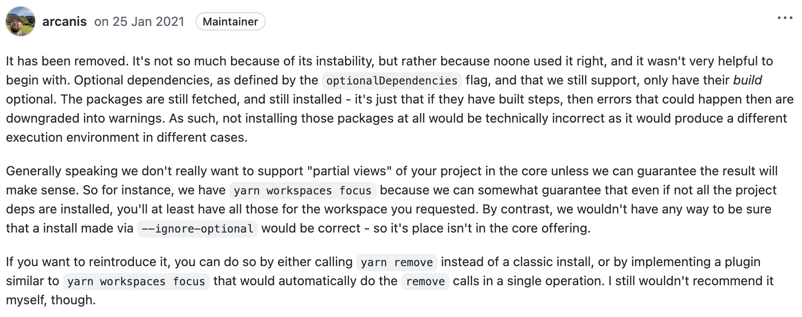

# 微前端技术选型调研

- Repository，代码仓库，简称 repo；
- MultiRepo，多仓库管理；
- MonoRepo，单一仓库管理；

## 1. 困局

DM Hub 产品经过多年的迭代，业务功能不断的增加，应用变得越来越庞大；团队的划分，开发人员变得分散；随之而来也产生了一系列的问题：

- 应用越来越庞大，难以维护；
- 跨部门协作开发项目效率低下；
- 项目类型多，本地调试繁琐，开发体验感差；
- 代码构建时间长，影响测试；
- 混乱的依赖管理，缺乏统一的工程化规范；
- 模块之间相互依赖，需求发布相互阻塞，需求经常延期，上线困难；
- 代码回滚相互影响；

以上的这些问题，不仅降低了开发效率，增加了开发成本，同时也成为阻塞业务发展的一个重要因素。

## 2. 破局

### 2.1 代码管理

#### 2.1.1 代码管理现状

DM Hub 产品前端目前采用的是 Multi-repo 的代码管理策略，主产品是一个  repo，其依赖被拆分出多个单独的 repo；随着产品功能的增加，更多的产品模块被拆分出单独的 repo 作为依赖引入。当开发需要进行本地调试开发这些应用的时候，就必须去查找其对应的仓库，拉取代码，安装开发调整，从一定的程度上增加了开发和理解成本、调试出错的几率、降低了开发的效率。

同时 DM Hub 还有很多的插件应用，并且随着功能的升级应用也在不断地增加；而这些应用也会被维护在单独的 repo 中。

下图是通过 `nx graph` 生成的 DM Hub 前端应用与其各个依赖项以及各个依赖之间的依赖关系，从图中可以看出依赖的管理非常的混乱。当某个被依赖项目的版本发生变化，就需要考虑所有依赖的 repo 版本的变更升级，隐形中增加了很多工作量。

例如当 dmhub-ui 发布新的版本切出新的分支 2.7，其 lock 文件就会被锁定。此时如果修改了 ui-common，当 ui-common 发布了新的版本之后，还需要再次对 dmhub-ui 中的 lock 文件进行调整，保证 dmhub-ui 安装到需要的 ui-common 版本，整个流程下来会增加很多额外的工作成本，甚至有时忘记调整 lock 文件，延迟测试和发布的时间。

当代码库越来越多的时候，管理成本会越来越高，另外在进行重构和整合的工作中，也会变得非常的困难。


#### 2.1.2 Monorepo

> 什么是 Monorepo ？
>
> MonoRepo 是来自 Facebook 的工程实践。它的诞生与 Facebook 在快速发展的过程中遇到的问题息息相关。随着 Facebook 的发展，逐渐出现了几十个项目工程，并按 MultiRepo 的方式存储于代码管理系统中。这些 Repo 之间存在错综复杂的依赖关系。为了开发新功能，团队可能需要在几十个 Repo 之间同步代码，导致产品维护难度升高、开发效率降低；同时，当一个新人加入团队后，往往需要了解这几十个项目就需要花费3-4周的时间。更糟糕的是，随着时间的推移，Repo 数量会越来越多，开发成本维护成本越来越高。
>
> 为了解决这个问题，Facebook 的工程师便提出了一个新的方案：**MonoRepo**，移除重复的文件，重新划分模块，用于代替MultiRepo 的 代码管理方式。

MonoRepo 是管理项目代码的的一个方式，它是在一个代码仓库中管理多个的模块/包，不同于常见的每个模块建一个代码仓库（MultiRepo）。在图中可以看出 MultiRepo 是每个包一个仓库，而 MonoRepo 是把所有的项目代码按照一定规则进行组织，存放于同一个代码仓库中。


Monorepo 把所有项目的所有代码统一维护在一个单一的代码版本库中，通过一些 Monorepo 工具进行管理。它主要有以下特点：

- 一致的开发体验，统一的质量标准和代码风格；
- 更方便的依赖库代码调试，直接在项目中引用工具库进行开发调试，不需要进行 link、watch；
- 唯一的依赖源，每个依赖只有一个版本，意味着没有版本冲突，没有依赖地狱；
- 更简单的依赖关系管理，所有模块都托管在同一个存储库中，因此都不需要包管理器；
- 更好的协作和跨团队贡献，每个人都可以看到其他人的代码，快速协助其他项目的开发；
- 原子提交，原子提交使大规模重构更容易，开发人员可以在一次提交中更新多个包或项目；
- 统一的 CI/CD，可以为代码库中的每个项目使用相同的 CI/CD 部署流程；

#### 2.1.3 Monorepo tools

MonoRepo 文化已经存在很多年，那么就需要管理 MopoRepo 的工具，

| 特性                | 描述                                                         | Bazel | Gradle | Lage | Lerna | Nx   | Pants | Rush | Turborepo |
| ------------------- | :----------------------------------------------------------- | ----- | ------ | ---- | ----- | ---- | ----- | ---- | --------- |
| 本地计算缓存        | 缓存上一次命令执行的结果，大大提升下一次的构建速度           | ✅     | ✅      | ✅    | ❌     | ✅    | ✅     | ✅    | ✅         |
| 本地任务编排        | 以正确的顺序和并行的方式运行任务，lerna 存在局限性           | ✅     | ✅      | ✅    | ⚠️     | ✅    | ✅     | ✅    | ✅         |
| 分布式计算缓存      | 支持在不同的环境中缓存结果，比如 github、gitlab 等 CI，读取上次的结果，提升构建速度 | ✅     | ✅      | ✅    | ❌     | ✅    | ✅     | ✅    | ✅         |
| 检测受影响的项目/包 | 仅对受影响的项目/包进行重新的构建和测试                      | ⚠️     | ✅      | ✅    | ✅     | ✅    | ✅     | ✅    | ✅         |
| 工具区分析          | 可以将项目的目录结构分析出项目结构图                         | ⚠️     | ✅      | ✅    | ✅     | ✅    | ✅     | ✅    | ✅         |
| 依赖图可视化        | 各个应用及依赖之间的依赖关系可视化                           | ✅     | ⚠️      | ⚠️    | ⚠️     | ✅    | ⚠️     | ⚠️    | ✅         |
| 代码生成            | 通过命令快速创建一个新的项目                                 | ⚠️     | ⚠️      | ⚠️    | ⚠️     | ✅    | ✅     | ⚠️    | ⚠️         |
| 项目约束与可见性    | 标记某个项目为私有项目，限制其他人依赖它们                   | ✅     | ⚠️      | ⚠️    | ⚠️     | ✅    | ⚠️     | ✅    | ⚠️         |

#### 2.1.4 Workspace

如果没有yarn workspaces，需要分别在每个目录下执行yarn install安装各自依赖，产生如下问题：

1. 相同依赖会多次下载，耗时且占用控件
2. 没有统一入口进行全部项目的构建


- 开发多个互相依赖的package时，workspace会自动对package的引用设置软链接（symlink），比yarn link更加方便，且链接仅局限在当前workspace中，不会对整个系统造成影响
- 所有package的依赖会安装在最根目录的node_modules下，节省磁盘空间，且给了yarn更大的依赖优化空间
- 所有package使用同一个yarn.lock，更少造成冲突且易于审查

#### 2.1.5 包管理工具

DM Hub 当前使用的包管理器是 Yarn，Yarn 现在也已经很好的支持了 Workspace，

Yarn 默认使用的版本是 v1 版本，并且此版本已经很久没有更新了。

#### 2.1.6 代码管理调整

基于 MonoRepo 以上优点，及其丰富的管理工具。 对于改变 DM Hub 现在的 MultiRepo 代码管理的现状无疑是最佳的选择。

那么按照 MonoRepo 的代码管理方式，需要将 `@convertlab/*` 相关的依赖包迁移到 dmhub-ui 项目中去。目录结构划分如下：

```
dmhub-ui
	- .yarn
	- config
	- public
	- script
	- src
		- sms
		- email
		- ...
	- packages
		- flow-editor
		- uilib
		- ui-common
		- ui-dc
		- ui-media
		- ...
	- .editorconfig
	- eslintrc
	- prettier
	- package.json
	- tsconfig.json
```


在 dmhub-ui 中，将直接引用 packages 下的依赖，这样可以保证依赖的最新版本。

通过 monorepo tools 管理工具（具体下面介绍），


**rimraf**

用于 node 版的 unix 命令：`rm -rf`，兼容 Mac 和 Window 系统

**cross-env**

大多数 Windows 命令提示符都会阻塞 `NODE_ENV=production`，通过 `cross-env` 可以无需担心为平台正确设置或使用环境变量。

**npkill**

列出系统中的任何*node_modules*目录，以及它们占用的空间。然后可以选择要删除的内容以释放空间。


删除 node_modules：rimraf node_modules 或者 rm -rf node_modules

npm exec --workspaces -- rm -rf node_modules && rm -rf node_modules

yarn workspaces foreach exec -- rimraf node_modules && rimraf node_modules

pnpm -r exec -- rm -rf node_modules && rm -rf node_modules

### 2.2 开发体验

### 2.3 发布速度

### 2.4 更多思考

DM Hub 插件管理

CI/CD 流程优化，JIRA commit 合并 -> 构建 -> 部署 -> 企微通知

踩坑记录：

yarn postbuild，3.0 不再支持自定义的 pre 和 post 生命周期钩子。

## 3. 实施

### 3.1 MonoRepo 搭建

#### 3.1.1 升级 Yarn 到 v3

##### 3.1.1.1 Yarn 升级

Yarn 默认使用的是 v1 版本，下载最新版的 Yarn（当前是 v3.2.4），执行如下命令：

```bash
yarn set version berry
```

此时项目中会新增如下文件：

```diff
dmhub-ui
+	.yarn
+		release
+			yarn-berry.cjs
+	.yarnrc.yml
```

- `yarn-berry.cjs`：Yarn 最新版的源码，执行 `yarn` 命令会直接使用该文件

- `.yarnrc.yml`： Yarn 的配置文件，同 `.npmrc`

##### 3.1.1.2 Yarn 配置调整

由于 Yarn 的该版本不再支持 `.npmrc`，所以需要根据 `.npmrc` 的配置，重新配置一份 `.yarnrc.yml`

配置文件说明详见：https://yarnpkg.com/configuration/yarnrc

```yaml
nodeLinker: node-modules

npmAlwaysAuth: true

npmAuthIdent: ***

npmRegistryServer: ***

npmScopes:
  prism:
    npmAuthIdent: ***
    npmRegistryServer: ***

unsafeHttpWhitelist:
  - ***

yarnPath: .yarn/releases/yarn-berry.cjs
```

##### 3.1.1.3 Yarn 插件

添加插件，增强 Yarn 的能力，Yarn 插件的详细介绍可见：https://yarnpkg.com/api/

- `@yarnpkg/plugin-typescript` 

  安装依赖包时，如果该依赖包存在 @types/*，会同时下载该依赖的类型

  执行 `yarn plugin import typescript` 安装插件

- `@yarnpkg/plugin-workspace-tools`

  增强 Yarn 的 workspace 能力，后续会用到

  执行 `yarn plugin import workspace-tools` 安装插件

- `@yarnpkg/plugin-interactive-tools`

  支持 `upgrade-interactive` 命令，用于交互式的选择更新依赖包。Yarn v1 版本默认支持，v3 版本需要独立安装插件才能使用。

安装之后，会新增如下文件：

```diff
dmhub-ui
	.yarn
+		plugins
+			@yarnpkg
+				plugin-typescript.cjs
+				plugin-workspace-tools.cjs
		release
			yarn-berry.cjs
	.yarnrc.yml
```

##### 3.1.1.4 docker 文件调整？

`.dockerignore`、`Dockerfile` 后续确认是否有必要进行调整。

##### 3.1.1.5 提交 Git

将上述生成的 yarn 相关的文件提交到 Git，这样可以保持所有人 Yarn 版本和使用的统一。

调整 `.gitignore`，防止将额外的文件提交到 Git

```diff
+ .yarn/cache
+ .yarn/install-state.gz
```

然后将其余生成的文件提交上去。

##### 3.1.1.6 CI 配置调整

1. ###### Cache  Folder

   通过缓存，可以减少 CI 的总构建时间。

   在 Yarn v1 中，Yarn 的缓存主要存放于 `.yarn-cache` 文件夹中；在 Yarn v2 中，则存放于 `.yarn/cache` 文件夹中。

   对于 Yarn 2+ 的 CI 缓存策略，可参考此链接：[What to cache for CI using the node_modules linker?](https://github.com/yarnpkg/berry/discussions/2621)

   主要结论是：缓存 `.yarn/cache` 是运行构建的最高效的方式。缓存`node_modules`是不值得的，它只会减慢 CI 的总构建时间。

   所以可以把本地的 `.yarn/cache`，提交到 Git 上，提升构建速度。

   .gitignore

   ```diff
   - .yarn/cache
   - .yarn/install-state.gz
   + .yarn/*
   + !.yarn/cache
   + !.yarn/release
   + !.yarn/plugins
   ```

   对于 CI 相关的配置，也需要进一步的调整。

2. ###### `yarn install --ignore-optional`

   忽略 ` optionalDependencies`  的依赖安装，在 v3 版本中已经不再支持，官方是如下解释的：

   

   大概意思就是，该选项不稳定，无法保证是否可以通过正常的安装，已经不推荐使用。

   所以，在 CI 的配置中，需要进行如下调整：

   ```diff
   - yarn install --ignore-optional
   + yarn install
   ```

3. ###### `yarn install --frozen-lockfile`

   指定该参数不会生成 `yarn.lock` 文件。该参数指定项目必须存在 `yarn.lock` 文件，并且依赖版本和 package.json 匹配时才会进行依赖的安装，否则报错。

   因为即使有 lockfile 的存在，也无法保证在持续集成环境中每次安装依赖都和开发时一致，因为可能存在 package.json 和 lockfile 版本号不匹配并需要更新依赖版本的情况。通过此命令，可强制开发者在持续集成前先在本地解决依赖版本的一致性问题。

   但是在 v3 中，该参数已经被标记为过时了，官方推荐使用 `--immutable` 代替。

   ```diff
   - yarn install --frozen-lockfile
   + yarn install --immutable
   ```

3. ###### `yarn install --no-lockfile`

   不读取也不生成 `yarn.lock` 文件。

4. ###### `yarn install --production`

   通过指定 `--production` 该参数，在生产环境下安装依赖的时候不安装 `devDependencies` 下的依赖包。

   Yarn v3 版本已经将该参数从 `yarn install` 命令中移除，需要进行如下替换：

   ```diff
   - yarn install --production
   + yarn workspaces focus --all --production
   ```

   但是需要注意的是，该命令不支持 `--mutable`。

#### 3.1.2 迁移 @convertlab/*

#### 3.1.3 Workspace 配置


### 3.2 微前端搭建


### 3.3 CI/CD 配置

#### 3.3.1 CI 配置缓存

参考 https://github.com/yarnpkg/berry/discussions/2621


### 3.4 踩坑记录

1. 不要使用 `mv foo boo` 这个指定进行文件夹的调整

   主要原因有两个：第一被移动的文件会丢失所有的 commit 记录，相当于将该文件删除新建；第二部分文件会丢失，基本都是各个模块下的 `store/reduxUtility.js` 文件。


微前端应用划分

微前端应用基础设施搭建

微前端应用代码解耦

CI/CD 流程调整


待确认：

.yarn/cache 是否提交到 repo 中去