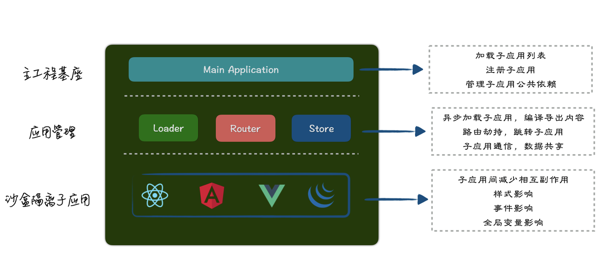
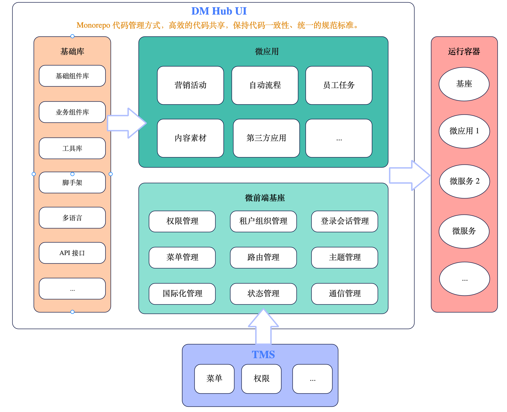

# 微前端改造方案设计

## 1. 需求背景

DM Hub 2.10 新发布了「智能员工任务」模块，部分私有化部署的客户希望这个功能能够部署到他们对应的版本（例如 2.7）中，由于 DM Hub 前端是整体打包的方式，无法针对某一功能模块进行单独的发布部署。而当前解决这个问题的唯一办法就是通过代码迁移的方式，将代码回迁到 2.7 版本中去。但是这样会出现维护两套代码的问题，后续客户要升级到更新的版本，仍然需要重新走一遍代码迁移的流程。

所以 DM Hub 亟需一套架构体系，能统一管理不同团队业务线，可以将一个复杂的单体应用以功能或业务需求垂直的切分成更小的子系统，满足针对任意功能模块进行独立开发、部署、交付的需求，并且更容易的集成其他版本功能或其他系统。具体需求如下：

- 各个模块可以进行增量升级
- 模块之间需求迭代互不阻塞
- 支持配置并动态集成不同版本的模块
- 支持加载第三方应用，包括 JS、HTML 类型的资源入口
- 用户体验上整个系统是单一产品
- 基础库在开发及运行时可以共享
- 模块需要具备缓存 (keep-alive) 能力，应用切换状态不能丢失
- 提供统一的登录会话管理、租户组织切换、插件管理、权限管理、菜单管理、路由管理、主题管理、国际化管理等
- 提供全局的状态管理、模块间的通信能力等

## 2. 架构分析

微前端是一种类似于微服务的架构，是一种由独立交付的多个前端应用组成整体的架构风格，将前端应用分解成一些更小、更简单的能够独立开发、部署、交付的应用，而在用户看来仍然是内聚的单个产品。DM Hub UI 本身是单页面应用结构，所以基于 `基座管理` + `子应用分治` 的微前端方案是一种比较自然的选择。TMS 中注册子应用，DM Hub 运行时基座将会获取注册的子应用列表信息，再通过基座来动态控制子应用的渲染和销毁，并提供集中式的模式来完成应用间的通信和应用的公共依赖管理。

通过基座管理可以将不同的应用聚合起来，它可以给带来以下优势：

- **统一管理子应用。**管理各个应用的加载与运行。
- **开发者可以更专注于业务的开发**。基座会提供配套的登录会话管理、权限管理、菜单管理、路由管理、主题管理等，子应用只需关心业务功能本身的开发。
- **更容易地集成应用**。不管是自己的业务应用、老旧系统、还是外部第三方应用，都可以在极少改动的情况下集成进来。
- **拆分巨石应用，让子应用可以按照“业务聚合”**。让应用更轻量、内聚、更可维护。

TMS 系统提供应用的管理（菜单配置），根据不同用户的需求配置展示对用的应用列表。当 DM Hub UI 基座加载后会获取到应用配置，包括 **应用分组信息**、**子应用名称**、**子应用路由**、**子应用资源路径**（微应用入口文件地址，后续可能是通过版本列表选择对应的文件地址）等，基座会把这些菜单展示到 DM Hub UI 菜单列表中。当点击某一菜单后，基座会监听当前路由的变化，然后开始请求对应子应用的资源路径并进行加载渲染。

以上架构是从 `开发规范` 到 `基础库` 、从 `管理系统` 到 `微前端基座` 、从 `开发调试` 到 `部署运维` 的一整套体系化的方案：

1. **基础库**，将每个应用都重复的工作提取出来，重新设计，并严格管理起来。使之能真正有效地服务业务开发，避免重复造轮子。
2. **开发规范**，提供更丰富的开发规范、指导、最佳实践。
3. **管理系统**，负责微应用的管理。
4. **基座** ，基座是微前端应用集成的一个重要平台，整个微前端的核心，负责管理微应用，并为微应用的开发提供必要的支撑。同时也肩负着管理公共资源、依赖的责任。
5. **微应用**，负责具体业务实现，按照业务聚合和拆分。
6. **运行容器** ，提供一套微前端的运行和部署方案。

## 3. 技术分析与选型

### 3.1 什么是微前端？

微前端这个名词，第一次被提出是在 2016 年年底，**指用来构建能够让多个团队独立交付项目代码的现代 web app 技术，策略以及实践方法**。从定义中可以看出，微前端不是一门具体的技术，而是整合了技术、策略和方法，可能会以脚手架、辅助插件和规范约束这种生态圈形式展示出来，是一种宏观上的**架构**。

现代的前端应用的发展趋势正在变得越来越富功能化，富交互化，也就是传说中的 SPA (单页面应用)；这样越来越复杂的单体前端应用，背后的后端应用则是数量庞大的微服务集群。前端项目，随着时间推进，会变得越来越庞大，越来越难以维护，这种应用也被称为**巨石单体应用**。

微前端概念将微服务这个被广泛应用于服务端的技术范式扩展到前端领域，它摒弃大型单体方式，将前端整体分解为小而简单的块，这些块可以**独立开发、测试和部署**，同时仍然聚合为一个产品出现在客户面前。可以理解微前端是一种将多个**可独立交付**的小型前端应用聚合为一个整体的架构风格。

微前端背后的思想是认为：现代复杂的web app或者网站，通常由很多 **相对独立的功能模块组合而成**，而对这些模块负责的应该是 **相互独立的多个团队**。这些独立的团队由于专业分工不同，会负责着 **特定的业务领域**，以及完成 **特定的开发任务**。这样的团队，通常在人员组成方面囊括了从前端开发到服务端开发，从 UI 实现到数据库设计这样 **端到端** 的 **跨职能人员** 构成。这也符合了我们的业务需求，和现有的开发模式基本符合。

### 3.2 微前端的问题

微前端技术可以帮助我们很好的解决业务上的问题，但是同时也带来技术上的挑战，比如**样式冲突**、**脚本互斥**、**公共依赖加载**、**消息通信**等。

#### 3.2.1 样式冲突

由于在微前端场景下，不同技术栈的子应用会被集成到同一个运行时中，所以我们必须在框架层确保各个子主应用之间不会出现样式互相干扰的问题。例如：一个团队的微应用的样式表为 `h2 { color: black; }`，而另一个团队的微应用则为 `h2 { color: blue; }`，而这两个选择器都附加在同一页面上，就会冲突。

为了避免这个问题，常见的解决方案有：

- 严格的命名约定，例如 BEM；
- CSS Module；
- 各种 CSS-in-JS 库或原子库（Tailwind CSS）；

#### 3.2.2 脚本互斥

每当微应用的 JavaScript 被加载并运行时，它的核心实际上是对全局对象 Window 的修改以及一些全局事件的改变，例如 jQuery 这个 js 运行后，会在 Window 上挂载一个 window.$ 对象，对于其他库 React，Vue 也不例外。为此，需要在加载和卸载每个微应用的同时，尽可能消除这种冲突和影响。

解决这个问题最普遍的做法是采用沙箱机制（SandBox），它可以很好的将全局变量进行隔离，并且允许多实例共存，同时要拥有一套安全策略，用于资源加载限制、LocalStorage 区分、Cookie 读写等。

**常见实现沙箱的方法：**

- 沙箱快照；
- ES6 的 Proxy 代理；

#### 3.2.3 公共依赖加载

如果多个微应用都使用了某个版本的依赖，比如 react、jquery 等，当加载这些子应用的时候就会出现依赖被重复下载加载的问题，这样会导致资源的浪费，甚至增加运行时的应用体积，可能会带来性能上的影响。

#### 3.2.4 消息通信

微前端最常见的问题之一是如何让微应用之间能够相互通信。一般而言，我们建议让微应用之间尽可能少地交流，因为这通常会重新引入我们最初试图避免的那种不适当的耦合代码。也就是说，通常我们只需要**某种程度的跨应用通信**即可。

**常见的通信方式：**

- 使用 `自定义事件通信`，是降低耦合的一种好方法；
- 可以考虑 React 或 Vue 应用中常见的 `全局 state store 机制`；
- `发布-订阅（pub/sub）模式`的通信机制；
- 使用 `地址栏`作为通信机制；

### 3.3 微前端框架

为了解决以上问题，微前端框架就因为这些问题运用而生了。

#### 3.3.1 Single-SPA

[single-spa](https://single-spa.js.org/) 是最早的微前端框架，兼容多种前端技术栈， 是一个将多个单页面应用聚合为一个整体应用的 JavaScript 微前端框架。

single-spa 会在基座应用中注册所有子应用的路由，基座保存各子应用的路由映射关系，充当微前端控制器Controler，当 URL 匹配子应用的路由时激活并挂载子应用，或者当子应用不处于激活状态时，将子应用从页面中移除卸载。

**优点**

- 敏捷性 - 独立开发、独立部署，微应用仓库独立，前后端可独立开发，部署完成后主框架自动完成同步更新；
- 技术栈无关，主框架不限制接入应用的技术栈，微应用具备完全自主权；
- 增量升级，在面对各种复杂场景时，通常很难对一个已经存在的系统做全量的技术栈升级或重构，而微前端是一种非常好的实施渐进式重构的手段和策略；
- 更快交付客户价值，有助于持续集成、持续部署以及持续交付；
- 维护和 bugfix 非常简单，每个团队都熟悉所维护特定的区域；

**缺点**

- 无通信机制
- 不支持 Javascript 沙箱
- 样式冲突
- 无法预加载

[点击在线体验](https://single-spa.surge.sh/)

#### 3.3.2 Qiankun

[Qiankun](https://qiankun.umijs.org/zh) 是一个基于 single-spa ，阿里系开源的微前端框架，旨在帮助大家能更简单、无痛的构建一个生产可用微前端架构系统。

**设计理念：**

- `由于主应用微应用都能做到技术栈无关`，qiankun 对于用户而言只是一个类似 jQuery 的库，你需要调用几个 qiankun 的 API 即可完成应用的微前端改造。
- 同时由于 qiankun 的 HTML entry 及沙箱的设计，使得微应用的接入 `像使用 iframe 一样简单`。
- 微前端的核心目标是 `将巨石应用` 拆解成若干可以 `自治的松耦合微应用`，而 qiankun 的诸多设计均是秉持这一原则，如 HTML entry、沙箱、应用间通信等。这样才能确保微应用真正具备 `独立开发、独立运行` 的能力。

**优点**

- 📦 基于 single-spa 封装，提供了更加开箱即用的 API。
- 📱 **技术栈无关**，任意技术栈的应用均可 使用/接入，不论是 React/Vue/Angular/JQuery 还是其他等框架。
- 💪 **HTML Entry 接入方式**，让你接入微应用像使用 iframe 一样简单。
- 🛡 **样式隔离**，确保微应用之间样式互相不干扰。
- 🧳 **JS 沙箱**，确保微应用之间 全局变量/事件 不冲突。
- ⚡️ **资源预加载**，在浏览器空闲时间预加载未打开的微应用资源，加速微应用打开速度。
- 🔌 **umi 插件**，提供了 [@umijs/plugin-qiankun](https://link.juejin.cn?target=https%3A%2F%2Fgithub.com%2Fumijs%2Fplugins%2Ftree%2Fmaster%2Fpackages%2Fplugin-qiankun) 供 umi 应用一键切换成微前端架构系统。
- 🔥 **社区较为活跃**，维护者也较多，有问题会及时得到响应；

**缺点**

- 可能对一些 jQuery 老项目支持性不是特别好；
- 安全和性能可能会有影响，具体取决于项目；
- 对 eval 的争议，`eval`函数的安全和性能有一些争议；

#### 3.3.3 Micro App

[Micro App](https://micro-zoe.github.io/micro-app/) 是京东出的一款基于 `Web Component` 原生组件进行渲染的微前端框架，不同于目前流行的开源框架，它从组件化的思维实现微前端，旨在降低上手难度、提升工作效率。

它是目前市面上接入微前端成本最低的框架，并且提供了 **JS沙箱**、**样式隔离**、**元素隔离**、**预加载**、**资源地址补全**、**插件系统**、**数据通信** 等一系列完善的功能。Qiankun 微前端框架的优势他都有，并且零依赖。

[点击线上体验](http://www.micro-zoe.com/main-vue2/)

#### 3.3.4 Garfish

[Garfish](https://www.garfishjs.org/) 是由字节跳动开源的一套微前端解决方案，主要用于解决现代 web 应用在前端生态繁荣和 web 应用日益复杂化两大背景下带来的 `跨团队协作、技术体系多样化、应用日益复杂化`等问题，Garfish 已经经过大量的线上应用的打磨和测试，功能稳定可靠。

**框架特性**

- 🌈 **丰富高效的产品特征**
  - Garfish 微前端子应用支持任意多种框架、技术体系接入
  - Garfish 微前端子应用支持「**独立开发**」、「**独立测试**」、「**独立部署**」
  - 强大的预加载能力，自动记录用户应用加载习惯增加加载权重，应用切换时间极大缩短
  - 支持依赖共享，极大程度的降低整体的包体积，减少依赖的重复加载
  - 内置数据收集，有效的感知到应用在运行期间的状态
  - 支持多实例能力，可在页面中同时运行多个子应用提升了业务的拆分力度
- 📦 **高扩展性的核心模块**
  - 通过 Loader 核心模块支持 HTML entry、JS entry 的支持，接入微前端应用简单易用
  - Router 模块提供了路由驱动、主子路由隔离，用户仅需要配置路由表应用即可完成自主的渲染和销毁，无需关心内部逻辑
  - Sandbox 模块为应用的 Runtime 提供运行时隔离能力，能有效隔离 JS、Style 对应用的副作用影响
  - Store 提供了一套简单的通信数据交换机制
- 🎯 **高度可扩展的插件机制**
  - 提供业务插件满足各种定制需求

#### 3.3.5 Bit

由国外 [bit](https://bit.dev/) 开发团队开源的一款跨项目的组件复用平台框架；将独立的组件构建、集成组合到一起去管理；

**优点：**

- 具有传统单体式前端的安全性和健壮性；
- 介接入方式简单、可伸缩性强；
- 通过 简单的解耦代码库、自治团队、小型定义良好的 API、独立的发布管道 和 持续增量升级，增强工作流程；

严格意义上来讲 Bit 与微前端有较大的的出入，所以 Bit 较为适合那种使用组件来开发项目，且技术栈较为统一的项目。

#### 3.3.6 Module Federation

Module Federation 是 Webpack5 提出的概念，Module Federation 用来解决多个应用之间代码共享的问题，更加优雅的实现跨应用的代码共享。

MF 想做的事和微前端想解决的问题是类似的，把一个应用进行拆分成多个应用，每个应用可独立开发，独立部署，一个应用可以动态加载并运行另一个应用的代码，并实现应用之间的依赖共享。

### 3.4 技术分析

DM Hub 经过数年的产品迭代，到目前为止公有云已经发布到 2.10 版本，同时正在进行 2.11 产品的开发，此次方案的设计也是为 2.11 版本的开发与发布做准备。

#### 3.4.1 版本变革

**2.5** 版本及之前，DM Hub 应用市场仅支持 **.html** 形式的插件，并且插件只能通过新标签页的形式打开，相当于在前端只是提供了一个入口。

**2.6** 版本，DM Hub UI 将 `react-router-dom` 升级到了 6.0 版本，将原有的 MPA 改成了 **SPA**，同时支持了 **Webpack Module Federation**（简称 MF） 功能，插件可以额外支持以 **.js** 格式的文件，这种方式的好处在于插件嵌入在 DM Hub 产品的上下文中，从用户体验上无论是插件还是产品模块都是内聚的单一产品。

**2.8** 版本，DM Hub UI 将原有的 multirepo 代码管理模式重构成了 **monorepo** 的形式，将各个功能模块与基础库进行了细致的划分，同时统一基础库和功能模块的代码风格与标准、依赖与版本管理。

#### 3.4.2 框架分析

本次改造的总体目标是 **基于微前端的 SPA 架构**，从 [版本变革](#3.4.1 版本变革) 中看，DM Hub 已经是单页面应用，并且应用市场实现了以 MF 为微前端框架的架构。同时 monorepo 的代码管理方式，也有利于后续模块的单独打包部署。

从现状来看，DM Hub 本身已经在使用 MF，实现以 MF 为微前端框架相对合理一些，但是 MF 也存在很多缺点，比如：

- 不支持路由管理
- 不支持组件之间的通信管理
- 不支持 HTML Entry 接入方式
- 存在样式冲突与脚本互斥
- 与 Webpack 打包工具深度绑定在一起

如果一定要选择 MF，那么需要主动实现这些功能和解决这些问题，增加了额外的开发成本。

基于以上的 [微前端框架](#3.3 微前端框架) 介绍，从多个角度对微前端框架进行了以下对比：

|                   | Single-spa | qiankun          | Micro app              | Garfish          | Bit              | MF         |
| ----------------- | ---------- | ---------------- | ---------------------- | ---------------- | ---------------- | ---------- |
| 框架体积 Minified | 21.1 KB    | 114.7 KB         | 53 KB                  | 135.1 KB         | 2.4 MB           | -          |
| 发布时间          | 2015.9     | 2019.5           | 2021.7                 | 2020.12          | 2017.6           | -          |
| 最后更新时间      | 2023.6     | 2023.7           | 2023.5                 | 2023.6           | 2023.7           | -          |
| Release 版本数量  | 132 个     | 153 个           | 53 个                  | 327 个           | 68 个            | -          |
| GitHub Star 数量  | 12.5 K     | 14.6 K           | 4.4 K                  | 2.1 K            | 16.8 K           | -          |
| NPM 周下载数量    | 151,440    | 21,525           | 1,190                  | 1,828            | 3,634            | -          |
| Issues 数量       | 64 个      | 341 个           | 332 个                 | 7 个             | 86 个            | 22 个      |
| 通信机制          | 自定义事件 | Props + 全局变量 | PostMessage + 全局变量 | Props + 全局变量 | Props + 全局变量 | -          |
| 接入成本          | 高，改造多 | 低，改造少       | 低，改造少             | 低，改造少       | 高，改造多       | 高，改造多 |
| JS 沙箱           | ❌          | ✅ Proxy          | ✅ Proxy                | ✅ Proxy          | ❌                | ❌          |
| 样式隔离          | ❌          | ✅                | ✅                      | ✅                | ❌                | ❌          |
| 预加载            | ✅          | ✅                | ✅                      | ✅                | ✅                | ✅          |
| 静态资源地址补全  | ❌          | ✅                | ✅                      | ✅                | ❌                | ❌          |
| Keep-alive        | ❌          | ✅                | ✅                      | ✅                | ❌                | ❌          |
| 支持 React        | ✅          | ✅                | ✅                      | ✅                | ✅                | ✅          |
| 结论              | 不考虑     |                  |                        | 不考虑           |                  |            |

> **概念介绍**
>
> 1. **预加载**，指在应用尚未渲染时提前加载资源并缓存，从而提升首屏渲染速度。预加载不是同步执行的，它会在浏览器空闲时间，依照开发者传入的顺序，依次加载每个应用的静态资源，以确保不会影响基座应用的性能。
> 2. **通信机制**，指的是基座应用和子应用之间的数据传输与应用之间的数据通信。
> 3. **JS 沙箱**，相对纯净的运行空间，防止对 window 的访问和修改，避免全局变量污染。
> 4. **样式隔离**，应用与应用之间的样式不会被相互影响。
> 5. **元素隔离**，应用之间的元素可以重复，但是不会互相影响。比如两个应用都有 id=root 的元素，但是通过 document.getElementById 方法只会获取到当前应用中的元素。（ShadowDom）
> 6. **资源路径自动补全**，指对子应用相对地址的资源路径进行补全，以确保所有资源正常加载，如：子应用中引用图片`/myapp/test.png`，在最终渲染时会补全为子应用的域名+ 路径：`http://localhost:8080/myapp/test.png`。
> 7. **资源共享**，当多个子应用拥有相同的 js 或 css 资源，可以指定这些资源在多个子应用之间共享，在子应用加载时直接从缓存中提取数据，从而提高渲染效率和性能。
> 8. **Keep-alive**，在应用之间切换时，有时需要保留这些应用的状态，以便恢复用户的操作行为和提升重复渲染的性能，比如筛选条件。

#### 3.4.3 发布方式

**应用跟随产品 release**，不需要单独控制子应用的版本，产品的版本即是应用的版本。比如产品当前的版本是 `2.11`，那么子应用的版本均是 `2.11`。如果部署到 `2.10` 版本中去，只需要构建出 `2.11` 版本应用的最新镜像再部署过去即可。

这里需要注意的是，如果应用依赖的版本在不同产品版本中存在不一致（比如 `2.11` 依赖了 React 18，`2.10` 使用的是 React 17），那么依赖不能进行共享，子应用需要单独把依赖打包进去加载。下面会单独对依赖共享进行介绍。

#### 3.4.4 基础库

如果一个基础库承载太多的功能，比如 `ui-common` ，可能会导致如下问题：

- 基础库的改动会影响所有依赖它的应用，即使改动的这个功能某些应用没有使用到（暂时只能通过依赖关系判断是否影响到某些模块，无法通过应用是否引用了基础库改动的功能判断，也可深入调研是否有解决方法）
- 功能过多管理比较杂乱，比如 api 管理、工具类、业务组件库，甚至存在从未使用的功能
- 子应用构建会先会构建依赖，功能过多会导致整体构建时间变长
- 增加子应用的打包体积（或者使用 Tree Shaking 解决）
- ...

所以应用通用功能提取、基础库的拆分、功能删减（未使用的功能，不通用的功能或者仅在某个应用中使用）、版本发布管理（语义化）也是非常有必要的一个环节。

#### 3.4.5 依赖共享

>  **依赖管理作为会议讨论的要点之一。**

依赖的共享管理主要分为两部分：

- **公共依赖**，比如 react、moment，这些依赖的版本应该要统一，尽量避免不同的模块使用不同的版本，导致无法进行共享或者增加打包体积的问题。（当前大部分已经实现了版本统一，需要查缺补漏）。
- **基础库依赖**，基础库不同版本主要存在于产品不同版本可能依赖了不同的版本，需要制定一个共享策略，比如 2.1.0可以和 2.1.1 共享一个版本，但是 2.2.1 和 2.1.1 就必须各自使用各自的版本。那么就需要要求基础库的版本管理严格遵循 [Semantic Versioning 2.0.0](http://semver.org/lang/zh-CN/) 语义化版本规范。（当然此方案基于子应用不随产品发布会独立发布的情况，否则可以不考虑）

#### 3.4.6 CI/CD 

DM Hub 当前使用的是 Gitlab CI/CD 流程，

## 4. 方案设计

基于 [需求背景](# 1. 需求背景) 中的需求要点，方案设计主要涵盖三个层面：开发、构建部署、运行，具体包括如下要点：

1. **接入微前端框架**，实现微前端的能力，同时需要解决应用之间依赖共享的问题，支持 JS、HTML 文件的打包形式，兼容到 2.6 之前的版本。
2. **开发基座应用**，并且实现上述的基座功能要点（apps/main 作为基座）
3. **划分基础库**，将庞大的基础库按照不同能力进行划分。
4. **Pipeline 调整**，微应用需要独立构建部署，生成独立的镜像。同时支持仅对变动的模块进行增量的构建部署，即同一仓库不同的目录，拥有独立的 Pipeline。
5. d**TMS 调整**，TMS 菜单配置新增*菜单资源路径*，用于加载对应的微应用。

### 4.2 开发

以下的开发方案依赖于发布方式的确认，比如所有应用跟随产品 release，那么应用和依赖无需单独维护版本，跟随产品版本即可。如果子应用存在随时会被发布的情况，那么需要单独维护应用和依赖的版本。

#### 4.2.1 公共依赖的统一

当前 DM Hub 的公共库依赖主要分为两类，跨产品基础组件库和开源公共依赖库。

**统一版本**

跨产品组件库本身不存在业务逻辑，同时会被多个产品比如 DataHub、AIHub 等引用，同时又会被我们开发维护。它的版本不会跟随某一产品的版本发布而发布新版本，完全是独立控制。针对这一类的组件库版本，保持各个应用所引用的版本统一即可，避免出现同一产品引用多个版本，增加打包体积与运行时开销。

- `@prism/ui-components`
- `@prism/ui-core`
- `@prism/ui-icons`

开源公共依赖库比如 react、moment，这些依赖的版本应该要统一，尽量避免不同的模块使用不同的版本，导致无法进行共享或者增加打包体积的问题。当然当前大部分已经实现了版本统一，需要查缺补漏。

**统一技术栈**

#### 4.2.2 基础库划分

当前 DM Hub

#### 4.2.3 依赖共享

#### 4.2.3 接入微前端框架

#### 4.2.3 实现多入口类型的打包策略

#### 路由改造

开发（代码共享、基础设施搭建、依赖管理）、部署（CI/CD，子应用版本发布控制、子应用增量升级）、运行（菜单配置、应用注册接入、加载、卸载）

### 4.3 构建部署

部署的思路有很多，大概有以下几种方式：

- 只使用一个nginx容器，通过监听不同端口，部署多个应用，再在主应用的端口里面添加对应路由代理到子应用 这种方式最简单但是不适合 gitlab-ci/cd 的自动化部署
- 使用多个nginx容器，每个容器暴露一个端口，再通过主应用添加对应路由代理到子应用 这种方式可以实现，但是会在服务器暴露多个端口，安全性会降低，而且外部也可以通过端口直接访问子应用
- 使用多个nginx容器，只暴露主应用的端口，主应用去连通子应用，然后通过nginx代理访问 这种方式最理想，只需要暴露一个端口，所有代理都在容器间，对外是无感的

由于 DM Hub UI 都是基于 Docker 进行部署的方案，所以此次微前端的部署方案也是通过将**主应用**和**子应用**都生成对应的 Docker 镜像放在服务器里，在**主应用`nginx`容器**里配置路径规则转发获取**子应用**资源的请求的方式。

客户端发出路径前缀为`/customer/`的请求，则是请求`Customer`子应用的资源；发出前缀为`/Group/`的请求，则是请求`Group`子应用的资源。这些请求都会由**主应用`nginx`容器**做反向代理处理。

#### Dockfile 调整

#### Ngnix 配置调整

#### 4.3.1 Pipeline 调整

#### 4.3.2 应用版本管理

#### 4.3.2 依赖版本管理

#### 4.3.2 实现应用的增量构建部署

### 4.4 运行

#### 	4.4.1 TMS 调整

讨论目标：

- 微前端框架选择
- 基础库划分
- 版本发布方式
- CI/CD 配置
- 基础设施搭建
- 工作量评估与任务 Sprint 划分

## 5. 方案总结

## 6. 改进事项

## 7. 注意事项

### 7.1 不同版本微应用的部署

2.10 及之前的版本，由于不支持微前端应用的能力，所以无法实现通过功能模块接入高版本模块，但是可以通过插件平台注册的方式引入高版本的模块。主要分为两类：

- 2.6 之前的版本，需要将微应用打包为 HTML 入口的形式。
- 2.6 到 2.10 版本，将微应用打包为 JS 入口的形式。

2.11 及之后的版本，不需要通过插件平台注册，可以通过 TMS 菜单配置的形式引入。

### 7.2 无法直接部署微应用的场景

1. 如果一个微应用的功能除了在自身中实现，同时在其他模块中也有实现，比如自动流程节点的形式，那么除了部署该微应用，同时需要部署其他应用；如果其他应用没有被改造为微应用，那么需要迁移这个应用的代码。

全局变量的隔离对现有应用是否有影响。
