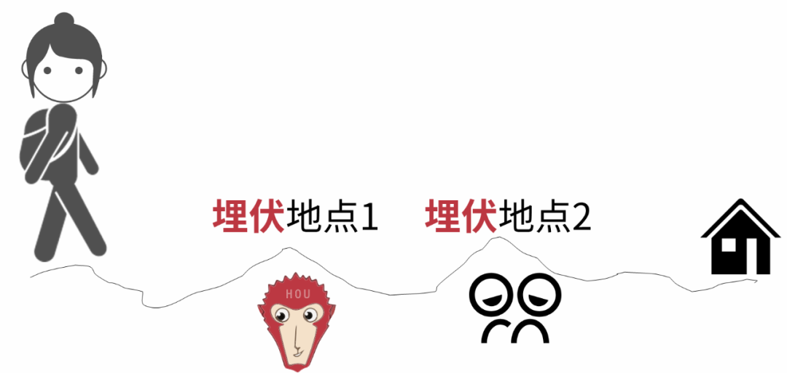

## 1. 什么是数据埋点

在一个企业中，我们要如何去了解用户呢？最直接有效的方式就是了解用户的行为，了解用户在网站中做了什么，呆了多久。而如何去实现这一操作，这就涉及到了数据埋点。

数据埋点，顾名思义就是在应用或网站中埋下标记，收集用户在使用过程中的各种行为数据，如点击、滑动、搜索、购买等。然后对这些数据进一步的进行统计和分析，提供运行的数据支撑，比如访问数（visits），访客数（visitor），停留时长（Time On Site），页面浏览数（Page Views）和跳出率（Bounce Rate）。这些数据可以用于分析用户行为、优化产品功能、改进用户体验、提升转化率等方面，是数据驱动产品优化和增长的重要手段。

具体来说，数据埋点可以帮助数据产品经理和数据分析师了解用户在使用产品过程中的行为轨迹、偏好和需求，从而优化产品功能、设计和推广策略，提高用户留存率、转化率和满意度。

数据埋点也是评估产品效果和用户反馈的重要依据，通过对数据进行深入分析，可以发现用户痛点和需求，提供更精准的产品方案和服务，增强用户黏性和忠诚度。

- UV（Unique visitor）

  通过互联网访问、浏览这个网页的自然人。访问网站的一台电脑客户端为一个访客。`00:00-24:00`内相同的客户端只被计算一次。一天内同个访客多次访问仅计算一个`UV`。

-  IP（Internet Protocol）

  独立 `IP` 是指访问过某站点的 `IP` 总数，以用户的 IP 地址作为统计依据。`00:00-24:00` 内相同 `IP` 地址只被计算一次。

  > **UV 和 IP 的区别**
  >
  > 如：你和你的家人用各自的账号在同一台电脑上登录新浪微博，则 `IP` 数 + 1，`UV` 数 + 2。由于使用的是同一台电脑，所以 `IP` 不变，但使用的不同账号，所以`UV` + 2。

- PV（Page View）

  即页面浏览量或点击量，用户每 1 次对网站中的每个网页访问均被记录 1 个`PV`。用户对同一页面的多次访问，访问量累计，用以衡量网站用户访问的网页数量。

- VV（Visit View）

  用以统计所有访客 1 天内访问网站的次数。当访客完成所有浏览并最终关掉该网站的所有页面时便完成了一次访问，同一访客 1 天内可能有多次访问行为，访问次数累计。

  > **PV 和 VV 的区别**
  >
  > 如：今天10点钟打开了百度，访问了它的三个页面；11点钟又打开了百度，访问了它的两个页面，则PV数 +5，VV数 +2。PV是指页面的浏览次数，VV是指访问网站的次数。

## 2. 数据埋点的方案

### 2.1 代码埋点

代码埋点是指在代码中手动添加埋点代码，通过监控用户行为事件，收集用户数据。

这种方式需要开发人员配合，一般适用于网站或应用开发过程中。代码埋点也称自定义埋点，优点是灵活性高，准确。缺点是维护难。

举例：在电商网站中，可以在商品详情页的购买按钮处添加一个点击事件的埋点，记录用户点击了该按钮的时间、位置和商品信息等数据。

### 2.2 可视化埋点

可视化埋点是指通过可视化工具，如Google Analytics、Mixpanel、Amplitude等，在页面上选择需要埋点的元素，即可自动生成代码，并收集相应的数据。

可视化埋点是较多产商、自研轮子兵家必争之地，希望通过可视化埋点平台为业务提供一站式埋点方案。优点是标准化程度高，缺点是不灵活，覆盖场景有限。

**举例：**在SaaS平台中，可以使用Google Analytics等工具，在注册页面的“提交”按钮处添加一个点击事件的埋点，记录用户的注册行为、来源渠道和注册成功率等数据。

### 2.3 **无（全）埋点**

无（全）埋点是指通过前端技术，自动收集用户的行为数据，无需手动添加埋点代码。这种方式适用于简单的[数据采集](https://cloud.tencent.com/solution/data-collect-and-label-service?from_column=20065&from=20065)需求，例如页面停留时间、滚动深度、搜索关键词等数据。

适用于简单的数据采集，在实际业务上用的不多，一是因为数据上报量级大，二是因为存储成本大，在降本增效大前提下，几乎没有用武之地。

**举例：**在新闻网站中，可以使用无埋点技术，收集用户的页面停留时间、点击量和滚动深度等数据，了解用户对不同新闻类型和内容的兴趣和喜好。

## 3. 数据埋点运行机制

数据埋点机制，主要分为三个环节：**事件检测、参数采集、上报传输。**

### 3.1 事件检测

事件检测，就是检测我们常说的上报时机，例如曝光时机、点击时机、滑动时机等。

以曝光事件为例，我们以检测到什么时机来作为曝光事件参数采集的标志。

自定义埋点、可视化埋点、无埋点在事件检测标准上可以保持一致，但是自定义埋点的事件检测标准更灵活，根据产品和策略需要，元素的曝光时机可以前置到后台请求时机，用假曝光时机代替前端可见的真曝光时机。

### 3.2 参数采集

参数采集，主要是确定参数的采集策略。这个采集策略分成静态和动态两个角度看。

**静态的采集策略是全部采集还是部分采集。**

全部采集就是我们看到的无埋点亦或全埋点，这种方式仅在少数的产品交互和功能不复杂且数据量不大的场景使用，实际上由于成本问题，实践中几乎不会采用这种方式。

可视化埋点和自定义埋点都是部分采集，差异点是采集这个采集动作是通过可视化界面去操作还是开发通过代码去操作。

对于静态的采集策略，应当采取的原则是：按需采集。从需求角度出发，要看什么数据，就采集什么数据，在计算成本和应用效率上找一个平衡。

**动态的采集策略是在交互动作前后，参数的采集策略。**

例如已经曝光过的视频，上下滑动后，是否要重新曝光。例如猜你想搜词条点击后，再扣边返回，是否要重新曝光。例如搜索结果页从综合tab切换到笔记tab，再切回综合tab页面，是否要重新曝光。

动态采集策略的不同常常在关键漏斗转化上数据对不上，上游点击并不等于下游曝光。

### 3.3 上报传输

上报传输，指将采集到的公参和私参传输入库再清洗，这个过程主要是技术选型，包含数据怎么到服务器，服务器怎么到集群等，从分析视角基本上不用太关注。