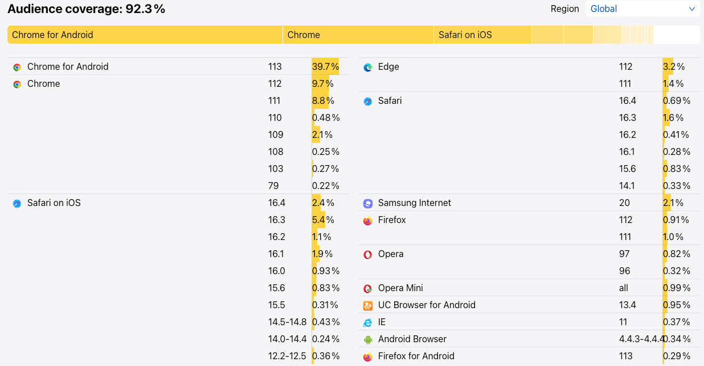

# 浏览器兼容性配置与实践

假如你是某公司产品研发的技术负责人，某一天接到一些客户投诉，说你们的产品无法使用。通过测试发现是客户的浏览器比较老旧，代码未做兼容，导致某些功能无法使用。

这时老板要求你要支持这部分客户的浏览器及其版本，这时你就需要去了解到当前产品支持的浏览器及其最低版本，了解如何针对这些浏览器及其版本进行 Polyfill，并且能够根据具体的需求随时进行调整，还要了解哪些语言特性你不能使用，在开发过程中去避免，这就是本篇文章的重点内容。

## 1. 什么是浏览器兼容性？

由于各大浏览器厂商（如 Google、Mozilla、Apple、Microsoft 等）在实现 Web 标准时，可能会有不同的理解和实现方式，这就可能会导致一段代码在不同的浏览器中会表现出不同的行为。虽然 W3C 和其他组织制定了许多 Web 标准，但在某些领域，这些标准可能不够明确或者存在竞争性的标准，这可能导致浏览器厂商在实现这些标准时产生差异。

另外，随着 Web 技术的不断发展，浏览器也在不断更新和迭代。新版的浏览器常常会支持更多的 Web 特性，但是旧版的浏览器可能会出现无法支持这些新特性。

以上就是导致浏览器差异的主要原因，**不同浏览器以及其不同的版本**可能对 web 标准的实现和支持程度有所差异，因此在开发过程中需要考虑到这些差异，确保网站或应用在各种浏览器环境下都能正常运行，也就是所谓的**浏览器兼容性**。

## 2. 兼容性工具介绍

浏览器的兼容性具体表现在 CSS 与 JavaScript 在不同浏览器与不同版本中所表现出来的差异，所以主要针对 CSS、JavaScript 的兼容性问题进行解决。

当前比较流行的解决方案是通过 BrowsersList 配置目标浏览器，即所支持的浏览器版本。然后在编写代码的时候，相关工具（如 Autoprefixer、Babel 等）会根据目标浏览器的不同自动添加相应的前缀或者使用不同的 Polyfill，更加方便地编写跨浏览器兼容的代码，方便后续维护。同时，我们可以通过 ESLint、StyleLint 读取目标浏览器版本，帮助我们在开发过程中避免去使用无法 Polyfill 的新特性。

在进行具体的方案配置之前，我们先了解一下这些兼容性工具。

### 2.1 BrowsersList

Browserlist 是一个用于配置目标浏览器版本的工具，即我们期望所支持的浏览器及其支持的版本。然后在编写 CSS 和 JavaScript 代码时，根据目标浏览器的不同，相关工具（如 Autoprefixer、Babel、ESLint 等）会自动添加相应的前缀或者使用不同的 Polyfill，以实现浏览器的兼容。

Browserslist 可以帮助我们在浏览器兼容性和包大小之间保持适当的平衡。使用 Browserslist，可以覆盖更广泛的受众，并拥有更小的包大小。

Browserlist 配置的形式有两种，一种是直接在 package.json 中配置 browserslist 字段，如下所示：

```json
{
  "browserslist": [
    "> 0.2%"
  ]
}
```

另外一种形式就是独立的配置文件 .browserslistrc，如下：

```
> 0.2%
```

上面两种配置均表示支持客户使用率大于 0.2% 的浏览器版本，并且统计出这个目标版本的当前全球范围的客户覆盖率 92.3%。使用该配置打包后的代码，会支持以下浏览器及其对应的一些版本，如下图所示：



当然，如果不满足需求，我们还可以进一步的进行配置的调整，非常的灵活，具体可参考：https://browsersl.ist/。

### 2.2 AutoPrefixer

[Autoprefixer](https://github.com/postcss/autoprefixer) 是一个 [PostCSS](https://github.com/postcss/postcss) 插件，根据 BrowsersList 的配置解析并为 CSS 其添加不同浏览器的前缀。[Playground](https://autoprefixer.github.io/)

```css
// 转换前
::placeholder {
  color: gray;
}

// 转换后
::-moz-placeholder {
  color: gray;
}

::placeholder {
  color: gray;
}
```

### 2.3 CSS Polyfills

由于 AutoPrefixer 仅仅适用于给 CSS 添加前缀，不会进行 Polyfills，所以如果使用了浏览器不支持的新特性，还需要工具对其进行 Polyfills，另外某些浏览器下的 CSS 样式可能会有一些 BUG，这时候也需要一些插件进行修复。

- [postcss-preset-env](https://github.com/jonathantneal/postcss-preset-env)，转换新的 CSS 为浏览器可识别的样式，[Playground](https://preset-env.cssdb.org/playground/)
- [Oldie](https://github.com/jonathantneal/oldie), 转换可以被旧版 IE 识别的插件
- [postcss-flexbugs-fixes](https://github.com/luisrudge/postcss-flexbugs-fixes)，用于修复 flexbox BUG 的 postcss 插件

### 2.4 JavaScript Polyfills

JS 的 Polyfills 主要使用的是 Babel 插件 `@babel/preset-env`，也是读取 browserslist 的配置，将某些语法转换为浏览器可识别的。具体可参考 https://babeljs.io/docs/babel-preset-env.html

### 2.5 Lint

上面的工具不能保证所有的新特性都会被 Polyfills，那么针对于这些新的特性，就需要我们在开发过程中去避免使用。

对于 JavaScript，我们可以使用 ESLint 的 [eslint-plugin-compat](https://github.com/amilajack/eslint-plugin-compat) 用于检测代码中是否有不被 browserslist 中所支持的语法特性。

对于 CSS，可以使用 StyleLint 的 [stylelint-no-unsupported-browser-features](https://github.com/ismay/stylelint-no-unsupported-browser-features) 检测代码中是否有不被浏览器支持的属性。

### 2.6 browserslist-useragent-regexp

如果你设置了 browserslist，代码也降级到了该版本，但是客户却不在这个浏览器支持的版本范围之内，这时候我们就需要提示客户当前浏览器版本不被支持，所以就需要使用这个工具。

## 3. 配置与实践

