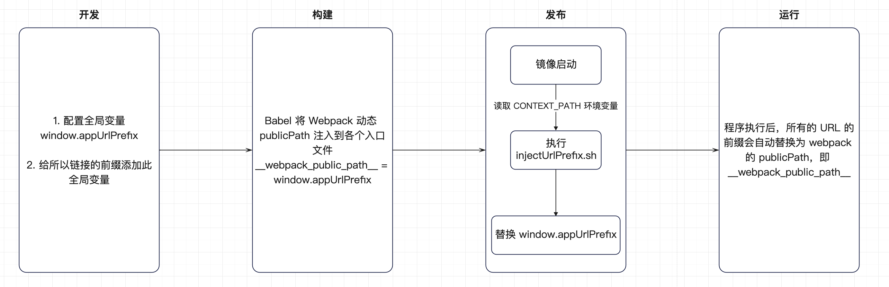

## 1. 背景介绍

为了减少 Nginx 复杂的配置，解决 Nginx 只能等后端的服务（app/appui）启动后才能启动成功，以及支持私有化部署路径前缀配置等问题，DM Hub 2.6 提出把**前端服务的资源都放在统一的路径下面**的方案改造。

> Story: XP-44761、XP-44763
>
> Release: 2.6
>
> Confluence: 97681734、93883894

## 2. 问题现状

### 2.1 方案现状

通过对前端代码的分析，该方案主要是通过 **内容配置** + **Webpack** + **Babel** + **Shell 脚本** 处理进行路径替换的方式，大致步骤如下：

- 配置全局变量 **window.appUrlPrefix**，即在各个 Html 模板文件中写入如下的脚本：

  - `profile.html` 宜家定开的客户详情页

  - `login.html` 登录页

  - `template.html` 其他入口文件的模版 HTML

  ```html
  <script>
    window.appUrlPrefix = "";
  </script>
  ```

- 封装所有 JS 文件（包括 .js、.ts、.tsx）中的链接（非 Hash 路由）前缀为 **window.appUrlPrefix**。主要做法是首先在 window 下创建 `appurl` 全局函数，并且将系统链接都通过此函数包装，并返回一个新的 URL，即给当前的 url 添加上此 `window.appUrlPrefix` 变量的前缀。具体如下：

  ```js
  function appurl(strings: string[], ...expressions) {
    if (strings == undefined) return;
    var s = '';
    for (var i in strings) {
      s += strings[i];
      if (i < expressions.length) s += expressions[i];
    }
    s = (window.appUrlPrefix || '') + s;
    return s;
  }
  
  // 例如：
  ```

- 通过 Bable 插件将 `publicPath.js` 文件通过导入的方式注入到各个入口文件中， `publicPath.js` 的内容如下：

  ```js
  __webpack_public_path__ = window.appUrlPrefix;
  ```

  `__webpack_public_path__` 等同于 `publicPath`，但是优先级更高，webpack 会优先使用该变量值。因为 `publicPath` 配置写在文件中，无法实现动态配置，而这个变量则可以动态的配置。同样也是用于加载资源时，添加前缀。

- 当所有的资源打包完毕，镜像启动时，会执行 `injectUrlPrefix.sh` 脚本，读取服务器中的 `CONTEXT_PREFIX` 的值，并且将打包的所有文件中 `window.appUrlPrefix` 替换为该值。同时会对所有 css 中的图片的引入 url 的前缀都加上此值。

大致的流程图如下：



### 2.2 方案问题

DM Hub 现有的 Context Path 方案不能保证本地开发环境与生产环境的一致性，经常出现代码部署到生产环境时才会发现问题所在。并且后续维护困难，开发难以理解，特此调研此方案的替代方案。