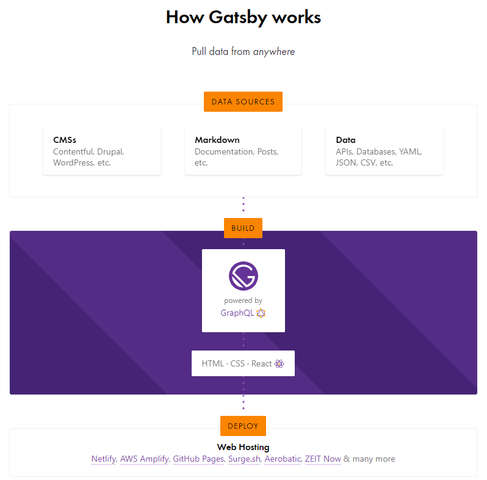

## Gatsby 静态站点生成器

Gatsby 是一个基于 React 的免费、开源框架，用于帮助 开发者构建运行速度极快的 **网站** 和 **应用程序**。

### 1. 静态应用的优势

1. 访问速度快
2.  更利于 SEO 搜索引擎的内容抓取
3. 部署简单

### 2. Gatsby 总览

Gatsby 应用的工作流程主要分为三个部分：Data Sources、Build、Deply。

#### 2.1 Data Sources 数据源

数据源指的就是数据的来源，Gatsby 中的数据是从哪里来的。Gatsby 的数据源是非常丰富的，可以将本地的 Markdown 文件作为数据源，也可以是 APIs、Databases、YAML、JSON、CSV等，也可以是 CMS 内容管理系统中的数据作为数据源。同一个 Gatsby 应用中，可以存在多种数据源。

#### 2.2 Build 开发与构建

在 Gatsby 中有数据层(GraphQL)的概念，当开启开发服务器的时候，Gatsby 会从外部的数据源中获取需要的所有数据，然后把数据统一放到数据层中。当进行应用开发或构建的时候，需要从数据层中获取数据，然后将页面和数据组合生成 HTML 文件。

#### 2.3 Deply 部署

当 Gatsby 将 页面和数据层中的数据 结合 HTML 文件生成完之后，就可以进行部署了。

### 3. Gatsby 的优势

1. 基于 React 和 GraphQL. 结合了 webpack, babel, react-router 等前端领域中最先进工具. 开发人员开发体验好 
2. 采用数据层和UI层分离而不失 SEO 的现代前端开发模式. 对SEO非常友好 
3. 数据预读取, 在浏览器空闲的时候预先读取链接对应的页面内容. 使静态页面拥有 SPA 应用的用户体验, 用户体验好 
4. 数据来源多样化: Headless CMS, markdown, API. 
5. 功能插件化, Gatsby 中提供了丰富且功能强大的各种类型的插件, 用什么装什么.

### 4. Gatsby 的项目的创建

1. 全局安装脚手架工具

`npm install gatsby-cli -g`

2. 创建项目

`gatsby new 项目名称 `

或者

`npx gatsby new 项目名称 `

或者按照指引创建

`npm init gatsby`

3. 启动项目

`gatsby develop 或 npm start `

4. 访问

`localhost:8000`