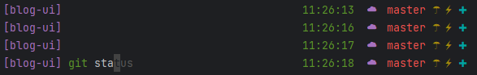
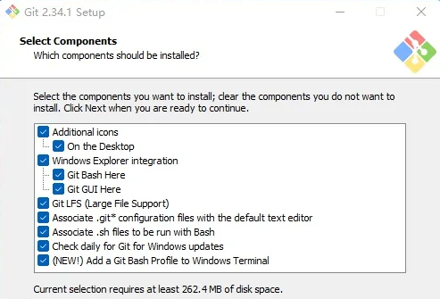
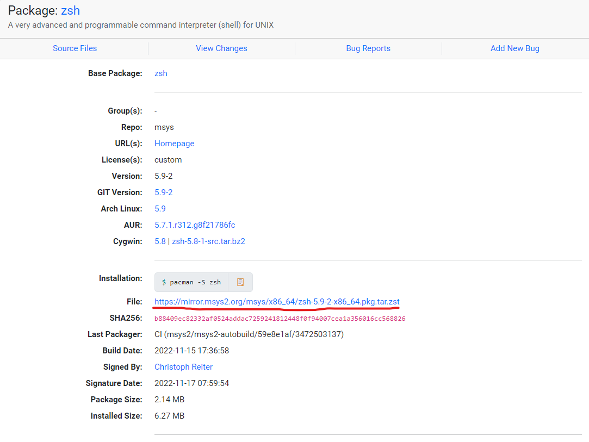
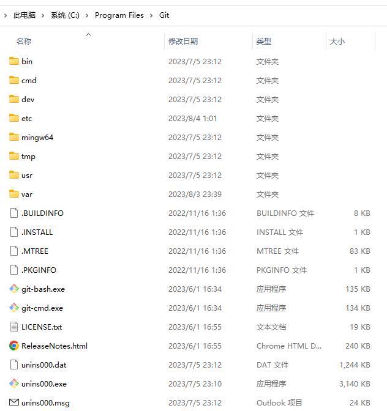
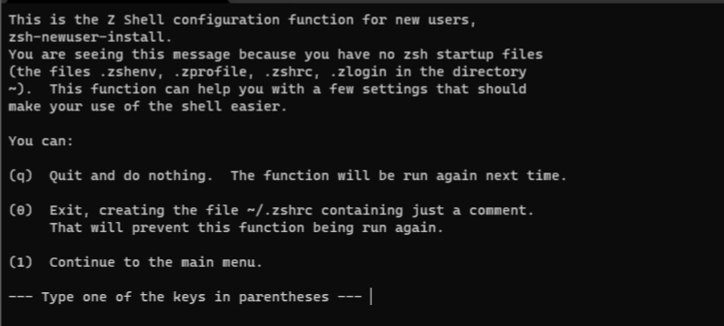
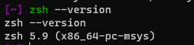
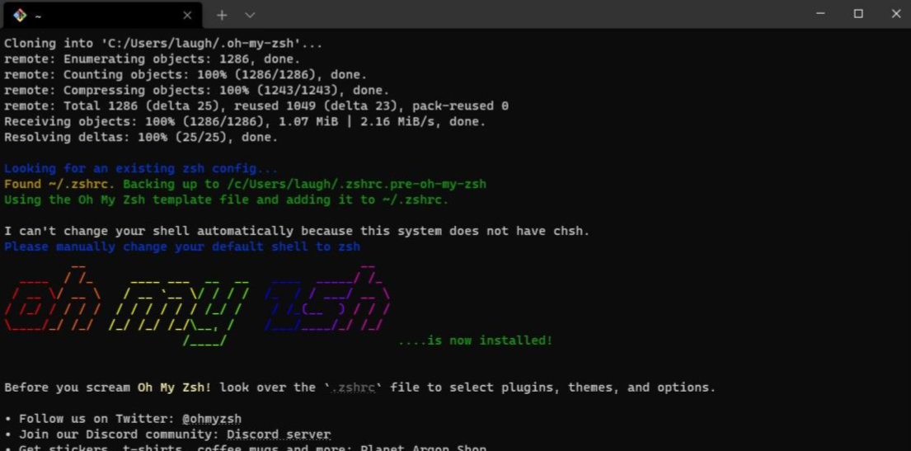
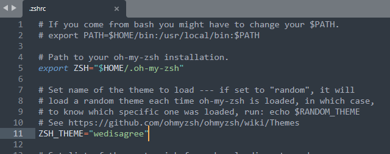

# Windows 命令行的美化与加强

环境：Windows 11 专业版本

终端：Git

Node 管理：nvm-windows

最终效果：关键字高亮、命令提示、主题定制



## 1. 安装 Git，及 Git Bash（非 WSL）

下载 [Git](https://git-scm.com/download/win)，安装时注意勾选`Add a Git Bash Profile to Windows Terminal`即可，安装时自动添加。



## 2. 为 Git Bash 安装 ZSH

### 2.1 zsh 介绍

Z Shell 又称 Zsh， 是一个与 Bash 非常相似的 UNIX shell。

Zsh 是 Bourne shell 的扩展，因此在此之上很多改进。 Zsh 于 1990 年由 Paul Falstad 发布，它具有 Bash、Korn Shell 和 C Shell 共有的一些功能。自 2019 年起，MacOS 的默认 Shell 已从 [Bash](https://zh.wikipedia.org/wiki/Bash) 改为 Zsh。

**ZSH 的特点**：

- 在终端使用时，Zsh 带有自动补全功能。因此，当按下`Tab↹`以自动补全你想运行的任何命令时，它不仅为你自动补全，而且弹出下拉菜单，包含所有其他可能的文件和目录。

  

- 支持内联通配符表达式
- 比 Bash 可配置度更高
- 支持插件和主题

### 2.2 zsh 下载与安装

下载地址：https://packages.msys2.org/package/zsh?repo=msys&variant=x86_64

点击 File 中的地址下载 `.zst` 压缩包。



直接解压至 `Git` 安装的根目录下，如果无法解压可使用 [7-Zip-zstd](https://link.zhihu.com/?target=https%3A//github.com/mcmilk/7-Zip-zstd/releases) 解压，解压后文件结构如图所示：



打开`Git Bash`标签页输入`zsh`，出现下图则代表安装成功，否则检查是否解压至`Git`根目录下，接着进行初始化配置，可搜索配置。



设置成功后，会在用户的根目录下生成一个 `.zshrc` 配置文件，可以通过如下命令查看（或者通过资源管理器查看： c/user/用户名）：

```bash
# 打开根目录
cd ~

# 查看配置文件是否生成
ls -a
```

另外通过 `zsh --version` 可以查看安装的版本。



### 2.3 调整默认启动为 zsh

打开 git 安装目录，在 `Git/etc/bash.bashrc` 文件末尾追加以下内容：

```bash
# Launch Zsh
if [ -t 1 ]; then
exec zsh
fi
```

之后每次启动/新建 `Git Bash`，都会是 `zsh`。

## 3. 为 zsh 安装 oh my zsh

### 3.1 oh my zsh 介绍

**Oh My Zsh** 是基于 **zsh** 命令行的一个扩展工具集，提供了丰富的扩展功能。它基于 **zsh** 命令行，提供了主题配置，插件机制，已经内置的便捷操作。给我们一种全新的方式使用命令行。

### 3.2 下载与安装

官方地址：https://ohmyz.sh/#install

**通过 `CURL` 安装**

```bash
sh -c "$(curl -fsSL https://raw.githubusercontent.com/ohmyzsh/ohmyzsh/master/tools/install.sh)"
```

**通过 `wget` 安装**

```bash
sh -c "$(wget https://raw.githubusercontent.com/ohmyzsh/ohmyzsh/master/tools/install.sh -O -)"
```

安装完成后出现下图内容代表安装成功：



### 3.3 配置主题

主题预览地址：https://github.com/ohmyzsh/ohmyzsh/wiki/Themes

主题目录：`~/.oh-my-zsh/themes`

选择自己喜欢的主题，然后打开 `~/.zshrc` 文件，调整 `ZSH_THEME` 字段的值为主题名称即可，如下：



### 3.4 安装命令提示插件

插件目录：`~/.oh-my-zsh/custom/plugins`

`zsh-autosuggestions`可以快速将历史命令呈现出来，具体可参考[官方说明](https://link.zhihu.com/?target=https%3A//github.com/zsh-users/zsh-autosuggestions)。

具体安装如下：

```bash
cd ~/.oh-my-zsh/custom/plugins

git clone https://github.com/zsh-users/zsh-autosuggestions ${ZSH_CUSTOM:-~/.oh-my-zsh/custom}/plugins/zsh-autosuggestions
```

然后编辑 `.zshrc` 文件，修改 plugins 的值：

```bash
plugins=(git zsh-autosuggestions)
```

最后更新配置文件，重新打开新窗口即可：

```bash
source ~/.zshrc
```

### 3.5 安装命令语法高亮插件

插件地址：https://github.com/zsh-users/zsh-syntax-highlighting

它可以在 zsh 提示符下将命令键入交互式终端时突出显示命令。 这有助于在运行命令之前检查命令，特别是捕获语法错误。

安装命令：

```bash
cd ~/.oh-my-zsh/custom/plugins

git clone https://github.com/zsh-users/zsh-syntax-highlighting.git
echo "source ${(q-)PWD}/zsh-syntax-highlighting/zsh-syntax-highlighting.zsh" >> ${ZDOTDIR:-$HOME}/.zshrc
```

然后编辑 `.zshrc` 文件，修改 plugins 的值：

```bash
plugins=(git zsh-autosuggestions zsh-syntax-highlighting)
```

最后更新配置文件，重新打开新窗口即可：

```bash
source ~/.zshrc
```

### 3.6 其他插件

更多插件可参考：https://github.com/ohmyzsh/ohmyzsh/wiki/Plugins

## 4. 安装 nvm-windows

不同的项目使用的 Node 版本不一样，可能存在不兼容的问题，所以需要一个管理工具可以随意切换 Node 的版本。

 
