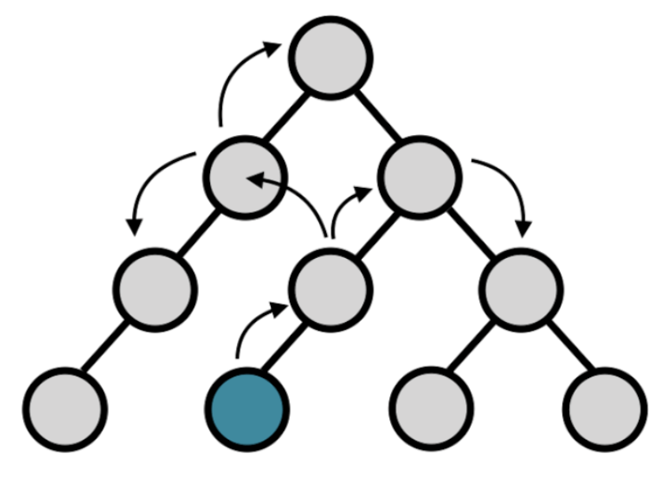
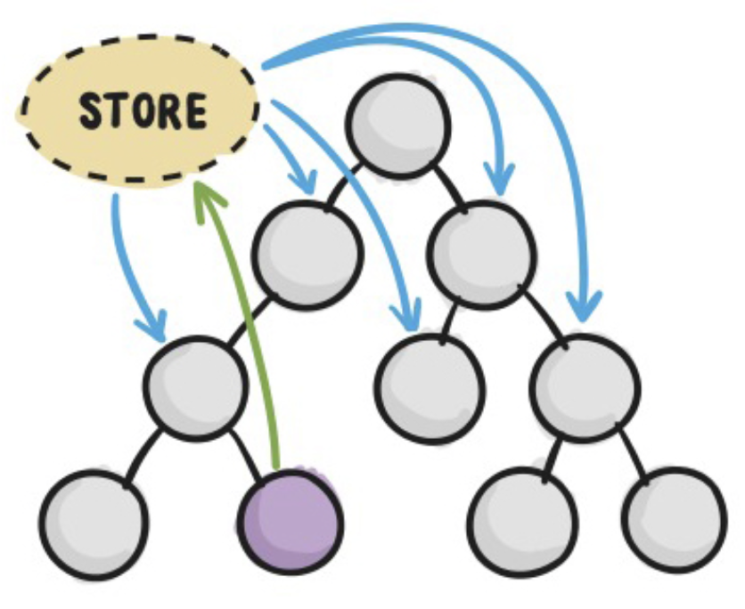

## 1. Redux 核心

### 1.1 Reux 介绍

JavaScript 状态容器（对象），提供可预测的状态管理。在容器中可以保存 DOM 元素的状态，科学化的状态管理方式，通过科学化的状态管理让状态变得更加可维护、更加容易管理。

### 1.2 Redux 核心概念及工作流程

#### 1.2.1 核心概念

- **View**：视图，HTML⻚⾯ 

- **Store**：存储状态的容器JavaScript对象 

- **Actions**: 对象，描述对状态进⾏怎样的操作 

- **Reducers**：函数，操作状态并返回新的状态


#### 1.2.2 工作流程

`View` 不能够直接去操作 `Store` 中的数据，需要通过调用 **dispatch** 方法去触发 `Action`，`Action` 会被 `Reducer` 接收，然后在内部对 `Action` 的属性值进行判断，看下当前需要进行具体的什么操作，然后对某个状态进行操作；当 `Reducer` 操作完成之后，会返回处理完成的状态，然后更新 `Store` 中的状态。当 `Store` 中的状态更新完成之后，会调用 **subscribe** 方法通知同步更新到 `View`。

#### 1.2.3 核心 API


 #### 1.2.4 计数案例

**需求**：实现点击增加按钮，页面上的数值 + 1；点击减少按钮，页面上的数值 -1。

***HTML 代码***

```html
<!DOCTYPE html>
<html lang="en">
  <head>
    <meta charset="UTF-8" />
    <meta name="viewport" content="width=device-width, initial-scale=1.0" />
    <meta http-equiv="X-UA-Compatible" content="ie=edge" />
    <title>Static Template</title>
  </head>
  <body>
    <button type="button" id="incre">增加</button>
    <span id="text">0</span>
    <button type="button" id="decre">减少</button>
  </body>
  <!-- 从 CND 上引入 Reudx 4.1.2 代码 -->
  <script
    src="https://cdnjs.cloudflare.com/ajax/libs/redux/4.1.2/redux.js"
    integrity="sha512-VSziEhiRlxaN8AZfc5UQiEnrcwM3KOp0GRITlYcQ7BCsEPq/VQMApwoZoh8zL69oo/Of+uVt/nygZbJAMst6jA=="
    crossorigin="anonymous"
    referrerpolicy="no-referrer"
  ></script>
</html>
```

***JavaScript 代码***

```javascript
// 1.定义 Actions
const increment = { type: 'increment' };
const decrement = { type: 'decrement' };
// 2.定义初始值
const initialState = {
  count: 0,
};
// 3.创建 Reducer
const reducer = function (state = initialState, action) {
  switch (action.type) {
    // 增加
    case increment.type: {
      return {
        count: state.count + 1,
      };
    }
    // 减少
    case decrement.type: {
      return {
        count: state.count - 1,
      };
    }
    default: {
      return state;
    }
  }
};
// 4. 创建 Store
const store = Redux.createStore(reducer);
// 5. 获取 DOM 节点
const incBtn = document.getElementById('incre');
const decBtn = document.getElementById('decre');
const span = document.getElementById('text');
// 6. 给按钮添加点击事件
incBtn.addEventListener('click', function () {
  store.dispatch(increment);
});
decBtn.addEventListener('click', function () {
  store.dispatch(decrement);
});
// 7. 订阅 Store，当 Store 发生改变，同步更新到 View 中
store.subscribe(function () {
  const state = store.getState();
  span.textContent = state.count;
});
```


## 2. Redux + React

### 2.1 React 不使用 Redux 遇到的问题

在 Redux 中组件通信的数据流是**单向**的，顶层的组件可以通过 props 属性向下层组件传递数据，而下层组件不能向上层组件传递数据，要实现下层组件修改数据，需要上层组件传递修改数据的方法到下层组件。当项目越来越大时，组件之间传递数据会变得越来越困难。



### 2.2 React 中引入 Redux 的好处

使用 Redux 管理数据，由于 Store 独立于组件，使得数据管理独立于组件，解决了组件之间传递数据困难的问题。



### 2.3 React 中的 Redux 工作流程

1. 组件通过 dispatch 方法触发 Action
2. Store 接收 Action 并将 Action 分发给 Reducer
3. Reducer 根据 Action 类型对状态进行更改并将更改后的状态返回给 Store
4. 组件订阅了Store中的状态，Store 中的状态更新会同步到组件


### 2.4 React-Redux 库的作用

为了方便在 React 项目中使用 Redux，让 React 与 Redux 更好的结合起来，这时候需要引入 `react-redux`。

####  2.4.1 connect 方法

`connect`方法主要有以下几点作用：

1. 订阅 Store，当 Store 中的状态发生改变的时候，触发组件的重新渲染；
2. 获取 Store 中的状态，将状态通过组件的 props 属性映射给组件；
3. 获取 Redux 中的 dispatch 方法，用于状态的改变。

```javascript
import { connect } from 'react-redux'

const VisibleTodoList = connect(mapStateToProps, mapDispatchToProps)(TodoList);
```

`connect` 方法接收两个参数 `mapStateToProps` 和 `mapDispatchToProps`：

> `mapStateToProps` 是一个函数，作用是获取 Store 中的 state，转换为组件中的 props 属性。

```javascript
const mapStateToProps = (state) => {
  return {
    todos: state.todos,
  }
}
```

> `mapDispatchToProps` 可以是一个函数，也可以是一个对象；然后将函数的返回值或者对象的属性映射到当前组件的 props 中，用于触发 Store 中 state 的更新。
>
> 如果是一个函数，则可以获取到 Store 中的 `dispatch` 方法和组件中的 props 对象；
>
> 如果是一个对象，则每个键值都对应一个函数，每个函数都是 Action creator。

```javascript
const mapDispatchToProps = (
  dispatch,
  ownProps
) => {
  return {
    onClick: () => {
      dispatch({
        type: 'SET_VISIBILITY_FILTER',
        filter: ownProps.filter
      });
    }
  };
}

const mapDispatchToProps = {
  onClick: (filter) => {
    type: 'SET_VISIBILITY_FILTER',
    filter: filter
  };
}
```

#### 2.4.2 Provider 组件

Provider 组件用于包裹根组件，然后提供 Store 中的 state，让所有的子组件都可以拿到 state。

```react
import { Provider } from 'react-redux'
import { createStore } from 'redux'
import todoApp from './reducers'
import App from './components/App'

const store = createStore(todoApp);

render(
  <Provider store={store}>
    <App />
  </Provider>,
  document.getElementById('root')
);
```

其原理是 React 组件的 `context` 属性，通过将 Store 放在了上下文对象 `context` 上面。然后子组件就可以从 `context` 拿到 Store了。

```javascript
class Provider extends Component {
  getChildContext() {
    return {
      store: this.props.store
    };
  }
  render() {
    return this.props.children;
  }
}

Provider.childContextTypes = {
  store: React.PropTypes.object
}
```


```javascript
class VisibleTodoList extends Component {
  componentDidMount() {
    const { store } = this.context;
    this.unsubscribe = store.subscribe(() =>
      this.forceUpdate()
    );
  }

  render() {
    const props = this.props;
    const { store } = this.context;
    const state = store.getState();
    // ...
  }
}

VisibleTodoList.contextTypes = {
  store: React.PropTypes.object
}
```

## 3. Redux 中间件

### 3.1 什么是 Redux 中间件

中间件的本质是一个函数，通过使用中间可以拓展 Redux 应用程序。

中间件的能力主要体现在对 Action 的能力上。未引入中间件之前，Action 是直接被 Reducer 处理的；引入中间件之后，当组件触发某个 Action 后，Action 会优先被中间件处理，当中间件处理完成后再交给 Reducer 进行处理，本质上就是对 `dispatch` 功能的增强。


### 3.2 开发 Redux 中间件

#### 3.2.1 中间件的模版代码

```javascript
export default store => next => action => {
  // some codes ...0.
  next(action);
};
```

在最外层函数中，接收一个 `store`，通过 `store.getState` 可以获取当前 Store 中的状态，通过 `store.dispatch` 可以触发其他 Action。

在最内层的函数中，接收了一个 `action` 参数，是组件触发的 Action 对象，可以在函数内部判断 Action，来决定进行怎样的处理。

在中间的函数中，接收了一个 `next` 参数，`next` 是一个函数，当中间件的逻辑代码执行完成之后，要调用该 `next` 方法，其目的是为了将当前的 `action` 传递给 Reducer，或者是下一个中间件。

#### 3.2.2 注册中间件

中间件在开发完成之后，需要被注册才能在 Redux 的工作流程中生效。

```javascript
import { createStore, applyMiddleware } from 'redux';
import logger from './middlewares/logger';

createSotre(reducer, applyMiddleware(
  logger,
));
```

#### 3.2.3 中间件开发实例 Thunk

Thunk 是一个支持 Redux 异步操作的中间件，**工作原理**就是当 Action 返回一个函数，在中间件中调用并将 `dispatch` 传递给该函数。这时 Action 返回的函数会接收到 `dispatch`，等待 Action 中的异步操作完成后，在异步操作回调里面再执行该 `dispatch` 触发其他的同步 Action，同时把异步操作的处理结果传递给该同步的 Action，把最终的异步操作的值保存到 Store 中。

**Thunk 的实现代码：**

```javascript
const thunk = (store) => (next) => (action) => {
  // action 是函数则调用，并传递 dispatch
  if (typeof action === "function") {
    const { dispatch } = store;
    return action(dispatch);
  }

  // 同步操作不做处理，直接调用 next 函数
  next(action); // 传递给下一个 middleware 或 Reducer，否则程序无法继续运行下去
};

export default thunk;
```

**异步 Action**

```javascript
export const syncAction = (payload) => ({ type: 'increment', payload });

export const asyncAction = (payload) => (dispatch) => {
  setTimeout(() => {
    dispatch(syncAction(payload));
  }, 2000);
};
```

### 3.3 Redux 常用中间件

#### 3.3.1 redux-thunk

支持在 Redux 的工作流程中执行异步的 Actions。

#### 3.3.2 redux-saga

`redux-sage` 的作用同 `redux-thunk` 一样，都是可以允许在 Redux 的工作流程中加入异步代码。

`redux-sage` 有一个更为强大的特点，可以将异步操作从 Action Creator 文件中抽离出来，放在一个单独的文件中，让异步代码变得更加的可维护。

#### 3.3.3 redux-actions

Redux 工作流程中存在大量的样板代码，读写起来很麻烦，通过使用 `redux-actions` 可以简化 Action 和 Reducer 的处理。

## 4. Redux 核心源码实现

### 4.1 createStore 方法

 `createStore` 方法是 Redux 的核心，用于创建 Redux Store，存放所有 State，并且提供订阅、获取状态、分发动作的方法。

#### 4.1.1 createStore 分析

 `createStore` 接收三个参数 `reducer`、`preloadState`、`enhancer`，分别是：

- **reducer**：一个函数，接收两个参数，分别是当前的 State 和即将执行的 Action，并且返回最新的 State；
- **preloadState**：初始化的 State，可选；
- **enhancer**：一个函数，Redux 的中间件，用于增强 Redux 的能力，可选；

`createStore` 返回一个对象，包括 `getState`、`dispatch`、`subscribe` 方法：

- **getState**：获取 Store 中最新的 State；
- **dispatch**：用于触发 Action，当 Reducer 返回最新的 State 后，通知订阅者获取最新的 State，更新视图；
- **subscribe**：用于外部订阅 Store 中的 State；

#### 4.1.2 createStore 实现

**实现流程**：

1. 当使用者调用 `createStore` 后，`createStore` 内部会根据入参初始化 Store 内部的 `currentState`；
2. 由于 Store 是可以被多次订阅的，所以内部会维护一个存放订阅者的数组 `currentListeners`，每当通过 Store 对象调用 `subscribe`，都表示订阅了当前 Store，增加一个订阅者，存放到 `currentListeners` 数组中。
3. 当视图上调用 `dispatch` 方法，`dispatch` 内部先去调用 `reducer` 方法，并传入当前的 State 和传入 `dispatch` 的 Action。`reducer` 方法会根据不同的 Action 处理相关逻辑并返回最新的 State，这时 Store 会将最新的 State存储起来。接着 `dispatch` 继续循环调用`currentListeners` 中的订阅者，通知订阅者获取最新的 State，并更新到视图上。

**实现代码**：

```javascript
const createStore = (reducer, preloadedState, enhancer) => {
  if (typeof reducer !== "function") {
    throw new Error("reducer 必须是一个函数");
  }

  // Store 对象中存储的对象
  let currentState = preloadedState;
  // 存放订阅 Store 的订阅者函数
  const currentListeners = [];

	// 获取 Store 中最新的状态
  function getState() {
    return currentState;
  }

  // 触发 Action
  function dispatch(action) {
    if (isPlainObject(action)) {
      throw new Error("action 必须是对西那个");
    }

    if (typeof action.type === "undefined") {
      throw new Error("action 对象必须要有 type 属性");
    }

    // 每个 reducer 都会接收一个 state，一个 action，并且返回最新的 state
    currentState = reducer(currentState, action);
    // 循环获取订阅者
    for (const listener of currentListeners) {
      // 调用订阅者
      listener();
    }
  }

	// 订阅 Store 中的状态
  function subscribe(listener) {
    currentListeners.push(listener);
  }

  return {
    getState,
    dispatch,
    subscribe,
  };
};

```

#### 4.1.3 支持中间件 enhancer

`enhancer` 是 `createStore` 的第三个参数，可选参数，如果传递了 `enhancer`，那么必须是一个函数，否则报错。

`enhancer` 的，入参是 `createStore`，返回一个新的 `createStore`，然后 再次调用这个新的  `createStore` 返回一个增强的 Store 对象。

在上面的 `createStore` 第四行后面添加如下代码，支持 enhancer：

```javascript
if (typeof enhancer !== "undefined") {
  if (typeof enhancer !== "function") {
    throw new Error("enhancer 必须是一个函数");
  }
  return enhancer(createStore)(reducer, preloadedState);
}
```

下面是一个实现的 Enhancer：

```javascript
const enhancer = (createStore) => (reducer, preloadedState) => {
  const store = createStore(reducer, preloadedState);
  const dispatch = store.dispatch;
  const _dispatch = (action) => {
    if (typeof action === 'function') {
      return action(dispatch);
    }
    dispatch(dispatch);
  }
  return {
    ...store,
    dispatch: _dispatch,
  }
}
```

### 4.2 applyMiddleware 方法

Redux 中间件的核心作用就是增强 `dispatch` 方法。`applyMiddleware` 其实就是内置的 `enhancer` 函数，目的就是对 Store 进行增强，也就是对 `dispatch` 方法进行增强。

具体代码实现如下：

```javascript
const compose = () => {
  const funcs = [...arguments];
  return (dispatch) => {
    for (let i = funcs.length - 1; i >= 0; i--) {
      dispatch = funcs[i](dispatch);
    }
    return dispatch;
  };
};
```


```javascript
const applyMiddleware = (...middlewares) => {
  return (createStore) => {
    return (reducer, preloadedState) => {
      // 创建 store
      const store = createStore(reducer, preloadedState);
      const miniStore = {
        getState: store.getState,
        dispatch: store.dispatch,
      };
      // 调用中间件的第一层函数
      // 中间件 middleware 的模板：(store) => (next) => (action) => {}
      const chain = middlewares.map((middleware) => middleware(miniStore));
      const dispatch = compose(...chain)(store.dispatch);
      return {
        ...store,
        dispatch,
      };
    };
  };
};
```

### 4.3 bindActionCreators 方法

将 ActionCreator 函数转换为可以直接触发 Action 的函数，也就是说在使用 `bindActionCreators` 方法之前，需要通过 `dispatch` 触发 Action，而通过 `bindActionCreators` 方法调用返回后，可以直接使用其返回的函数触发对应的 Action。

**参数**：

1. `actionCreators` (*Function* or *Object*): 一个 ActionCreator，或者一个 value 是 ActionCreator 的对象。
2. `dispatch` (*Function*): 一个由 Store 实例提供的 `dispatch` 实例提供的 `dispatch` 函数。

**返回值**：

(*Function* or *Object*): 一个与原对象类似的对象，只不过这个对象的 value 都是会直接 dispatch 原 action creator 返回的结果的函数。如果传入一个单独的函数作为 `actionCreators`，那么返回的结果也是一个单独的函数。

在使用 `bindActionCreators` 之前的代码是这样：

```react
import React from 'react';
import { bindActionCreators } from 'redux';
import { connect } from 'react-redux';
import * as TodoActionCreators from './TodoActionCreators'

const TodoList = (props) => {
    const { dispatch } = props;
    
    React.useEffect({
        const action = TodoActionCreators.addTodo('Use Redux');
    	dispatch(action);
    }, []);

    return <div>do something</div>;
}

const mapStateToProps = (state) => ({
  todos: state.todos,
});

export default connect(mapStateToProps)(TodoList);
```

使用之后：

```jsx
import React from 'react';
import { bindActionCreators } from 'redux';
import { connect } from 'react-redux';
import * as TodoActionCreators from './TodoActionCreators'

const TodoList = (props) => {
    const { addTodo } = props;
    
    React.useEffect({
        addTodo();
    }, []);

    return <div>do something</div>;
}

const mapStateToProps = (state) => ({
  todos: state.todos,
});

const mapDispatchToProps = (dispatch) =>
  bindActionCreators(TodoActionCreators, dispatch);

export default connect(mapStateToProps, mapDispatchToProps)(TodoList);
```

从上面例子可以看出，使用前后的区别主要在是否需要使用 `dispatch` 及创建 Action 的区别，`bindActionCreators` 的具体实现：

```javascript
function bindActionCreators(actionCreators, dispatch) {
    const boundActionCreators = {};
    for(let key in actionCreators) {
        boundActionCreators[key] = function() {
            dispatch(actionCreators[key]());
        }
    }
    return boundActionCreators;
}
```

### 4.4 combineReducers 方法

`combineReducers ` 主要作用就是把一个由多个不同 Reducer 函数组合的对象，合并成一个最终的 Reducer 函数。通常在应用变的复杂的情况下，需要把 Reducer 函数拆分为多个单独的函数，每个函数取负责管理 State 的一部分。

 **参数**：

1. `reducers` (*Object*): 一个对象，它的值（value）对应不同的 reducer 函数，这些 reducer 函数后面会被合并成一个。

**返回值**：

(*Function*)：一个调用 `reducers` 对象里所有 reducer 的 reducer，并且构造一个与 `reducers` 对象结构相同的 state 对象。

具体实现如下：

```javascript
function combineReducers(reducers) {
  // 1. 检查 reducer 类型，必须是函数
  for (let key in reducers) {
    if (typeof reducers[key] !== "function") {
      throw new Error('reducer 必须是一个函数');
    }
  }

  // 2. 调用各个 reducer，然后将状态存储在 store 中
  return function (state, action) {
    const nextStates = {};
    for (let key in reducers) {
      const prevState = state[key];
      const reducer = reducers[key];
      nextStates[key] = reducer(prevState, action);
    }
    return nextStates;
  }
}
```

