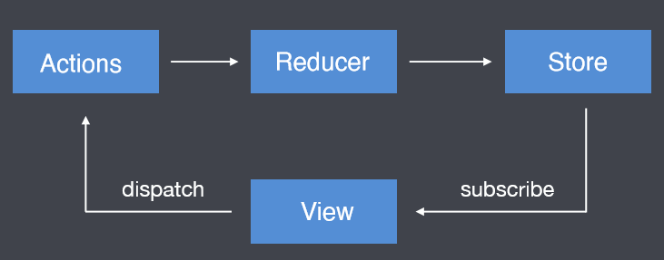
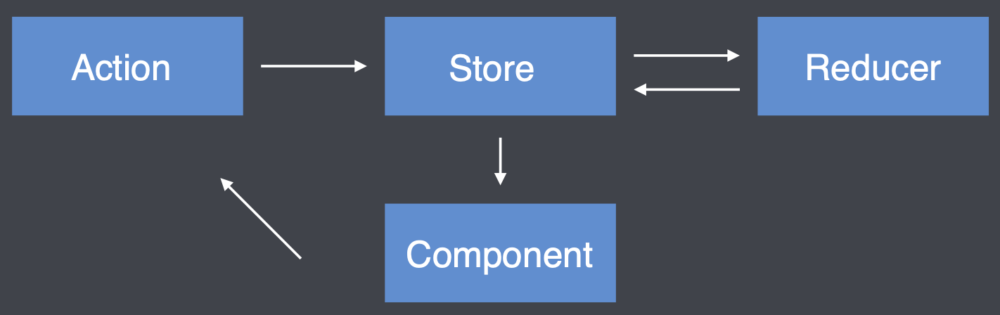

## 1. Redux 核心

### 1.1 Reux 介绍

JavaScript 状态容器（对象），提供可预测的状态管理。在容器中可以保存 DOM 元素的状态，科学化的状态管理方式，通过科学化的状态管理让状态变得更加可维护、更加容易管理。

### 1.2 Redux 核心概念及工作流程

#### 1.2.1 核心概念

- **View**：视图，HTML⻚⾯ 

- **Store**：存储状态的容器JavaScript对象 

- **Actions**: 对象，描述对状态进⾏怎样的操作 

- **Reducers**：函数，操作状态并返回新的状态



#### 1.2.2 工作流程

`View` 不能够直接去操作 `Store` 中的数据，需要通过调用 **dispatch** 方法去触发 `Action`，`Action` 会被 `Reducer` 接收，然后在内部对 `Action` 的属性值进行判断，看下当前需要进行具体的什么操作，然后对某个状态进行操作；当 `Reducer` 操作完成之后，会返回处理完成的状态，然后更新 `Store` 中的状态。当 `Store` 中的状态更新完成之后，会调用 **subscribe** 方法通知同步更新到 `View`。

#### 1.2.3 核心 API


 #### 1.2.4 计数案例

**需求**：实现点击增加按钮，页面上的数值 + 1；点击减少按钮，页面上的数值 -1。

***HTML 代码***

```html
<!DOCTYPE html>
<html lang="en">
  <head>
    <meta charset="UTF-8" />
    <meta name="viewport" content="width=device-width, initial-scale=1.0" />
    <meta http-equiv="X-UA-Compatible" content="ie=edge" />
    <title>Static Template</title>
  </head>
  <body>
    <button type="button" id="incre">增加</button>
    <span id="text">0</span>
    <button type="button" id="decre">减少</button>
  </body>
  <!-- 从 CND 上引入 Reudx 4.1.2 代码 -->
  <script
    src="https://cdnjs.cloudflare.com/ajax/libs/redux/4.1.2/redux.js"
    integrity="sha512-VSziEhiRlxaN8AZfc5UQiEnrcwM3KOp0GRITlYcQ7BCsEPq/VQMApwoZoh8zL69oo/Of+uVt/nygZbJAMst6jA=="
    crossorigin="anonymous"
    referrerpolicy="no-referrer"
  ></script>
</html>
```

***JavaScript 代码***

```javascript
// 1.定义 Actions
const increment = { type: 'increment' };
const decrement = { type: 'decrement' };
// 2.定义初始值
const initialState = {
  count: 0,
};
// 3.创建 Reducer
const reducer = function (state = initialState, action) {
  switch (action.type) {
    // 增加
    case increment.type: {
      return {
        count: state.count + 1,
      };
    }
    // 减少
    case decrement.type: {
      return {
        count: state.count - 1,
      };
    }
    default: {
      return state;
    }
  }
};
// 4. 创建 Store
const store = Redux.createStore(reducer);
// 5. 获取 DOM 节点
const incBtn = document.getElementById('incre');
const decBtn = document.getElementById('decre');
const span = document.getElementById('text');
// 6. 给按钮添加点击事件
incBtn.addEventListener('click', function () {
  store.dispatch(actions.increment);
});
decBtn.addEventListener('click', function () {
  store.dispatch(actions.decrement);
});
// 7. 订阅 Store，当 Store 发生改变，同步更新到 View 中
store.subscribe(function () {
  const state = store.getState();
  span.textContent = state.count;
});
```


## 2. React + Redux

### 2.1 React 不使用 Redux 遇到的问题

在 Redux 中组件通信的数据流是**单向**的，顶层的组件可以通过 props 属性向下层组件传递数据，而下层组件不能向上层组件传递数据，要实现下层组件修改数据，需要上层组件传递修改数据的方法到下层组件。当项目越来越大时，组件之间传递数据会变得越来越困难。


### 2.2 React 中引入 Redux 的好处

使用 Redux 管理数据，由于 Store 独立于组件，使得数据管理独立于组件，解决了组件之间传递数据困难的问题。


### 2.3 React 中的 Redux 工作流程

1. 组件通过 dispatch 方法触发 Action
2. Store 接收 Action 并将 Action 分发给 Reducer
3. Reducer 根据 Action 类型对状态进行更改并将更改后的状态返回给 Store
4. 组件订阅了Store中的状态，Store 中的状态更新会同步到组件



### 2.4 React-Redux 库的作用

为了方便在 React 项目中使用 Redux，让 React 与 Redux 更好的结合起来，这时候需要引入 `react-redux`。

####  2.4.1 connect 方法

`connect`方法主要有以下几点作用：

1. 订阅 Store，当 Store 中的状态发生改变的时候，触发组件的重新渲染；
2. 获取 Store 中的状态，将状态通过组件的 props 属性映射给组件；
3. 获取 Redux 中的 dispatch 方法，用于状态的改变。

```javascript
import { connect } from 'react-redux'

const VisibleTodoList = connect(mapStateToProps, mapDispatchToProps)(TodoList);
```

`connect` 方法接收两个参数 `mapStateToProps` 和 `mapDispatchToProps`：

> `mapStateToProps` 是一个函数，作用是获取 Store 中的 state，转换为组件中的 props 属性。

```javascript
const mapStateToProps = (state) => {
  return {
    todos: state.todos,
  }
}
```

> `mapDispatchToProps` 可以是一个函数，也可以是一个对象；然后将函数的返回值或者对象的属性映射到当前组件的 props 中，用于触发 Store 中 state 的更新。
>
> 如果是一个函数，则可以获取到 Store 中的 `dispatch` 方法和组件中的 props 对象；
>
> 如果是一个对象，则每个键值都对应一个函数，每个函数都是 Action creator。

```javascript
const mapDispatchToProps = (
  dispatch,
  ownProps
) => {
  return {
    onClick: () => {
      dispatch({
        type: 'SET_VISIBILITY_FILTER',
        filter: ownProps.filter
      });
    }
  };
}

const mapDispatchToProps = {
  onClick: (filter) => {
    type: 'SET_VISIBILITY_FILTER',
    filter: filter
  };
}
```

#### 2.4.2 Provider 组件

Provider 组件用于包裹根组件，然后提供 Store 中的 state，让所有的子组件都可以拿到 state。

```react
import { Provider } from 'react-redux'
import { createStore } from 'redux'
import todoApp from './reducers'
import App from './components/App'

const store = createStore(todoApp);

render(
  <Provider store={store}>
    <App />
  </Provider>,
  document.getElementById('root')
);
```

其原理是 React 组件的 `context` 属性，通过将 Store 放在了上下文对象 `context` 上面。然后子组件就可以从 `context` 拿到 Store了。

```javascript
class Provider extends Component {
  getChildContext() {
    return {
      store: this.props.store
    };
  }
  render() {
    return this.props.children;
  }
}

Provider.childContextTypes = {
  store: React.PropTypes.object
}
```


```javascript
class VisibleTodoList extends Component {
  componentDidMount() {
    const { store } = this.context;
    this.unsubscribe = store.subscribe(() =>
      this.forceUpdate()
    );
  }

  render() {
    const props = this.props;
    const { store } = this.context;
    const state = store.getState();
    // ...
  }
}

VisibleTodoList.contextTypes = {
  store: React.PropTypes.object
}
```


### 2.5 Redux 在 React 中的使用

#### 2.4.1 创建 Store 和 Reducer

1. 创建 Store 需要使用 createStore 方法, 方法执行后的返回值就是 Store, 方法需要从 redux 中引入；
2. createStore 方法的第一个参数需要传递 reducer；
3. reducer 是一个函数, 函数返回什么, store 中就存储什么， 函数名称自定义。

```javascript
import { createStore } from 'redux';

const reducer = function(state, action) {
  return { state.count + 1 };
}
const store = createStore(reducer);
```

#### 2.4.2 组件获取 Store 中的数据

1. 将 store 中的数据放在 Provider 组件中，Provider 组件是存储共享数据的地方；
2. 组件使用 connect 方法获取数据并将数据通过 props 传递进组件；
3. 组件更改 Store 中的数据。
